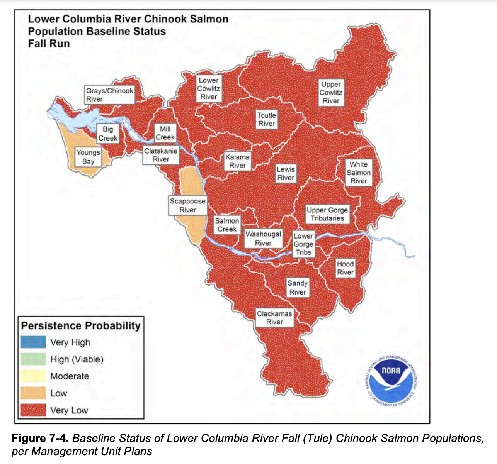
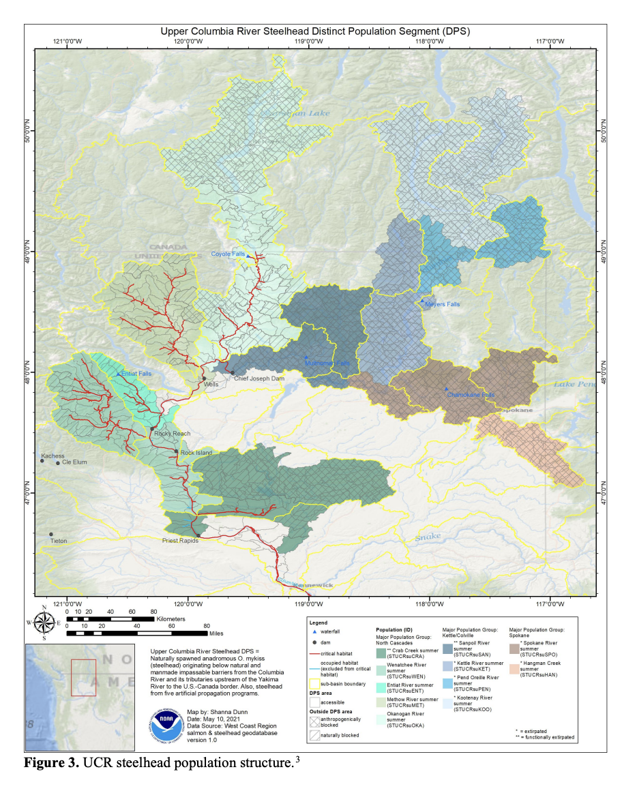

```{r message=FALSE}
library(tidyverse)
options(dplyr.summarise.inform = FALSE)
```

For this lab you will use multivariate auto-regressive state-space (MARSS) to analyze multivariate salmon data from the Columbia River. These data are noisy and gappy. They are estimates of total spawner abundance and might include hatchery spawners.

## Teams

1. Salmon, coho (Oregon Coast ESU) `esu[7]`
2. Salmon, Chinook (Snake River spring/summer-run ESU) `esu[2]`
3. Steelhead (Snake River Basin DPS) `esu[11]`

```{r, results = "asis", echo=FALSE}
# Set up names and shuffle
set.seed(123)
names_str <- "Anna, Brian, Nicole, Matheus, Lilac, Mary, Ben, Emma, Tina"
names <- strsplit(names_str, ",\\s*")[[1]]
shuffled <- sample(names)
teams <- split(shuffled, ceiling(seq_along(shuffled) / 3))
for (i in seq_along(teams)) {
  cat(sprintf("- **Team %d**: %s  \n", i, paste(teams[[i]], collapse = ", ")))
}
```


## WA and OR Endangered and Threatened salmon spawner data

These data are from the [Coordinated Assessments Partnership (CAP) ](https://www.streamnet.org/cap/about-cap/) and downloaded using the [rCAX R client](https://nwfsc-cb.github.io/rCAX/) for the CAX (the CAP database) API. The data are saved in `Lab-2/Data_Images/columbia-river.rda`. See `Lab-2/Data_Images/setup_data_2025.R` for the script to create the data.

```{r load-data}
load("Data_Images/esa-salmon.rda")
```

The data set has data for endangered and threatened ESU (Evolutionary Significant Units) and DPS (Distinct Population Segments) in the Washington and Oregon.
```{r esus}
esu <- unique(esa.salmon$esu_dps)
esu
```

```{r echo=FALSE, out.width="50%", fig.cap="Figure from ESA recovery plan for Lower Columbia River Coho salmon, Lower Columbia River Chinook salmon, Columbia River Chum salmon, and Lower Columbia River steelhead. 2013. NMFS NW Region.  https://repository.library.noaa.gov/view/noaa/16002"}

```

### Data structure

The dataset has the following columns
```{r data-structure}
colnames(esa.salmon)
```
* species: Chinook, Coho, Steelhead, Chum, Sockeye
* esu_dps: name of the ESU
* majorpopgroup: biological major group
* commonpopname: common population name, generally a stream or river
* run: run-timing
* spawningyear: the year that the spawners were counted on the spawning grounds
* value: total (natural-born and hatchery-born) spawners on the spawning ground. Generally some type of redd-count expansion or some other stream count of spawners. Redd = a gravel nest.

### Data plots

Let's load one ESU and make a plot. Create a function.
```{r plot-function}
plotesu <- function(esuname){
  df <- esa.salmon %>% subset(esu_dps %in% esuname)
ggplot(df, aes(x=spawningyear, y=log(value), color=majorpopgroup)) + 
  geom_point(size=0.2, na.rm = TRUE) + 
  theme(strip.text.x = element_text(size = 3)) +
  theme(axis.text.x = element_text(size = 5, angle = 90)) +
  facet_wrap(~esapopname) +
  ggtitle(paste0(esuname, collapse="\n"))
}
```

```{r}
plotesu(esu[7])
```

```{r}
plotesu(esu[11])
```

```{r}
plotesu(esu[2])
```


```{r plot-runs}
df <- esa.salmon %>% subset(species == "Chinook salmon")
ggplot(df, aes(x=spawningyear, y=log(value), color=run)) + 
  geom_point(size=0.2, na.rm = TRUE) +
  theme(strip.text.x = element_text(size = 3)) +
  theme(axis.text.x = element_text(size = 5, angle = 90)) + 
  facet_wrap(~esapopname)
```

## Tasks for each group

1. Create estimates of spawner abundance for all missing years and provide estimates of the decline from the historical abundance.

2. Evaluate support for the major population groups. Are the populations in the groups more correlated than outside the groups?

3. Evaluate the evidence of correlation of salmon returns with climate indices. *We will talk about how to do this on the Tuesday after lab.*


### Tips

**Simplify**

If your ESU has many populations, start with a smaller set of 4-7 populations.

**Assumptions**

You can assume that `R="diagonal and equal"` and `A="scaling"`. Assume that "historical" means the earliest years available for your group.

**States**

Your abundance estimate is the "x" or "state" estimates. You can get this from
```
fit$states
```
or 
```
tsSmooth(fit)
```
where `fit` is from `fit <- MARSS()`

**plotting**

Estimate of the mean of the spawner counts based on your x model.
```
autoplot(fit, plot.type="fitted.ytT")
```

**diagnostics**
```
autoplot(fit, plot.type="residuals")
```

### Address the following in your methods

* Describe your assumptions about the x and how the data time series are related to x.

   - How are the x and y (data) related? 1 x for 1 y or will you assume 1 x for all y or 1 x for each major population group? How will you choose? 
   - What will you assume about the U for the x's?
   - What will you assume about the Q matrix?
   
* Write out your assumptions as different models **in matrix form**, fit each and then compare these with AIC or AICc.

* Do your estimates differ depending on the assumptions you make about the structure of the data, i.e. you assumptions about the x's, Q, and U.

## Sample code

Here I show how I might analyze the Upper Columbia Steelhead data.

```{r echo=FALSE, out.width="50%", fig.cap="Figure from 2022 5-Year Review: Summary & Evaluation of Upper Columbia River Spring-run Chinook Salmon and Upper Columbia River Steelhead. NMFS. West Coast Region. https://doi.org/10.25923/p4w5-dp31"}

```

Set up the data. We need the time series in a matrix with time across the columns.

Load the data.
```{r}
load("Data_Images/esa-salmon.rda")
```

Wrangle the data.
```{r}
library(dplyr)
esunum <- which(esu == "Steelhead (Upper Columbia River DPS)")
esuname <- esu[esunum]

dat <- esa.salmon %>% 
  subset(esu_dps == esuname) %>% # get only this ESU
  mutate(log.spawner = log(value)) %>% # create a column called log.spawner
  select(esapopname, spawningyear, log.spawner) %>% # get just the columns that I need
  pivot_wider(names_from = "esapopname", values_from = "log.spawner") %>% 
  column_to_rownames(var = "spawningyear") %>% # make the years rownames
  as.matrix() %>% # turn into a matrix with year down the rows
  t() # make time across the columns
# MARSS complains if I don't do this
dat[is.na(dat)] <- NA
```

Clean up the row names
```{r}
tmp <- rownames(dat)
tmp <- stringr::str_replace(tmp, "Steelhead [(]Upper Columbia River DPS[)]", "")
tmp <- stringr::str_replace(tmp, "River - summer", "")
tmp <- stringr::str_trim(tmp)
rownames(dat) <- tmp
```

Specify a model
```{r}
mod.list1 <- list(
  U = "unequal",
  R = "diagonal and equal",
  Q = "unconstrained"
)
```

Fit the model. In this case, a BFGS algorithm is faster.
```{r}
library(MARSS)
fit1 <- MARSS(dat, model=mod.list1, method="BFGS")
```

Hmmmmm, the Q variance is so high that it perfectly fits the data. That doesn't seem right.
```{r}
autoplot(fit1, plot.type="fitted.ytT")
```

Let's look at the corrplot. Interesting. The Methow and Entiat are almost perfectly correlated while the Entiat and Wenatchee are somewhat correlated. That makes sense if you look at a map.
```{r}
library(corrplot)
Q <- coef(fit1, type="matrix")$Q
corrmat <- diag(1/sqrt(diag(Q))) %*% Q %*% diag(1/sqrt(diag(Q)))
corrplot(corrmat)
```

I need to use the EM algorithm (remove `method="BFGS"`) because the BFGS algorithm doesn't allow constraints on the Q matrix.
```{r}
mod.list2 <- list(
  U = "unequal",
  R = "diagonal and equal",
  Q = "equalvarcov"
)
fit2 <- MARSS(dat, model=mod.list2, control = list(maxit=1000))
```

```{r}
autoplot(fit2, plot.type="fitted.ytT")
```


Now I want try something different. I will treat the Methow-Okanogan as one state and the Entiat-Wenatchee as another. I'll let these be correlated together. Interesting, these two are estimated to be perfectly correlated.
```{r}
mod.list3 <- mod.list1
mod.list3$Q <- "unconstrained"
mod.list3$Z <- factor(c("ew", "mo", "mo", "ew"))
fit3 <- MARSS(dat, model = mod.list3)
autoplot(fit3, plot.type="fitted.ytT")
```

Finally, let's look at the AIC values. Fit1 was very flexible and can put a line through the data so I know I have at least one model in the set that can fit the data. Well, the most flexible model is the best. At this point, I'd like to look just at data after 1980 or so. I don't like the big dip that happened in the Wenatchee River. I'd want to talk to the biologists to find out what happened, especially because I know that there might be hatchery releases in this system.
```{r}
aic <- c(fit1$AICc, fit2$AICc, fit3$AICc)
aic-min(aic)
```

### Including cycling

Let's just look at the data after 1987 to eliminate that string of NAs in the 3 rivers.

```{r}
dat87 <- dat[,colnames(dat)>1987]
```

Let's look the acf to look for evidence of cycling. Due to the nature of their life-cycle where they tend to return back to their spawning grounds after a certain numbers of years, we might expect some cycling although steelhead aren't really known for this (unlike sockeye, chinook and pink).

Well no obvious cycles.

```{r}
par(mfrow=c(2,2))
for(i in 1:4){
  acf(dat87[i,], na.action=na.pass, main=rownames(dat87)[i])
}
```

But let's go through how we might include cycles. We are going to include cycles with frequency 3, 4, and 5, choosen to reflect steelhead returning after 3, 4 or 5 years.

```{r}
TT <- dim(dat87)[2] #number of time steps
covariates <- rbind(
  forecast::fourier(ts(1:TT, freq=3), K=1) |> t(),
  forecast::fourier(ts(1:TT, freq=4), K=1) |> t(),
  forecast::fourier(ts(1:TT, freq=5), K=1) |> t()
)
```

Now let's fit a model with these covariates. Let's analyze the populations separately, so Q is diagonal.
```{r}
mod.list4 <- list(
  Q = "unconstrained",
  U = "unequal",
  R = "diagonal and equal",
  D = "unconstrained",
  d = covariates
)
```
  
```{r acf-entiat}
fit4.87 <- MARSS(dat87, model=mod.list4)
```

Let's plot the estimates. `broom::tidy()` will get a data frame with the terms, estimates and CIs.
```{r}
library(broom)
# get all the parameter estimates for D
df <- tidy(fit4.87) %>%
  subset(stringr::str_sub(term,1,1)=="D")
# add a column with the river names
df$river <- as.factor(rep(rownames(dat87),nrow(covariates)))
# add a column for the lag or frequency
lags <- stringr::str_split(rownames(covariates), "-") %>% lapply(function(x){x[[2]]}) %>% unlist()
df$lag <- rep(lags, each=nrow(dat87))
# add column for the type of fourier
df$type <- rep(rownames(covariates), each=nrow(dat87))
```

We can then plot this. Interesting. Some support for 5 year cycles.
```{r}
ggplot(df, aes(x=type, y=estimate, col=lag)) + 
  geom_point() +
  geom_errorbar(aes(ymin=conf.low, ymax=conf.up), width=.2, position=position_dodge(.9)) +
  geom_hline(yintercept = 0) +
  facet_wrap(~river) +
  ggtitle("The cycle estimates with CIs")
```

Let's compare some other models.
```{r}
# No cycles
mod.list <- list(
  Q = "unconstrained",
  U = "unequal",
  R = "diagonal and equal"
)
fit1.87 <- MARSS(dat87, model=mod.list, silent=TRUE)
# Only lag 5 cycles
mod.list <- list(
  Q = "unconstrained",
  U = "unequal",
  R = "diagonal and equal",
  D = "unconstrained",
  d = covariates[5:6,]
)
fit5.87 <- MARSS(dat87, model=mod.list, silent=TRUE)
# Cycles in the process
# which doesn't really make sense for salmon since the cycles are age-structure cycles 
# which act like cycles in the observations
mod.list <- list(
  Q = "unconstrained",
  U = "unequal",
  R = "diagonal and equal",
  C = "unconstrained",
  c = covariates
)
fit6.87 <- MARSS(dat87, model=mod.list, silent=TRUE)
```

Hmm model without cyles is much better (lower AICc). Even if we only have the 5 year cycles (`covariates[5:6,]`), the AICc is larger than for the models with cycles.
```{r}
aic <- c(fit1.87$AICc, fit4.87$AICc, fit5.87$AICc, fit6.87$AICc)
aic-min(aic)
```

## Resources

Chapter 7 MARSS models. ATSA Lab Book. <https://atsa-es.github.io/atsa-labs/chap-mss.html>

Chapter 8 MARSS models with covariate. ATSA Lab Book. <https://atsa-es.github.io/atsa-labs/chap-msscov.html>

Chapter 16 Modeling cyclic sockeye <https://atsa-es.github.io/atsa-labs/chap-cyclic-sockeye.html>
