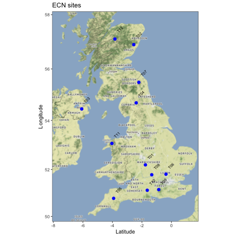

```{r setup, include=FALSE}
knitr::opts_chunk$set(echo = TRUE, cache=FALSE, message = FALSE, warning = FALSE)
```

# Grading

This was a more open-ended homework. Grading was 3/5 if you made a solid attempt at questions 1-8 but didn't do anything extra (extra plots, more analysis, tables, discussion of what is going on). Anything extra you did (including for question 1-8) added points. Most tried some of the optional questions and got 4/5 points. A couple students did did 4+ optional or additional analyses plus delved deeper into questions 1-8 (5/5 points). 

The following are examples of 'extra' analyses:

* Trying the optional analyses
* Coming up with your own additional analyses
* Trying different model structures (like different R or Q) and comparing those with model selection criteria (AIC)
* Adding tables of model comparisons (models w AIC)
* Adding extra types of residual diagnostics besides residual plots, histograms and ACFs
* More indepth discussion of your results in the main questions

RMarkdown equation tips

* `$$  $$` is a shortcut for `\begin{equation} \end{equation}`. Use one or the other but not both.
* `bmatrix` in the amsmath package has a limit of 10 columns in matrices. You can change this by including a line in your YAML at the top of your document to change the default.

    ```
    ---
    title: "My Title"
    author: My Name
    header-includes:
       - \setcounter{MaxMatrixCols}{20}
    output:
       pdf_document: default
       html_document: default
    ---
    ```


## The data and packages

```{r}
load("ECNNO2.RData")
```

Load the packages. 
```{r}
library(MARSS)
library(ggplot2)
library(ggmap)
library(tidyr)
library(dplyr)
```

These are the site locations and names. Note that the site numbers do not indicate how close the sites are to each other.

```{r echo=FALSE, eval=FALSE}
library(ggmap)
png(filename="N02.png")
ylims=c(min(ECNmeta$Latitude)-1,max(ECNmeta$Latitude)+1)
xlims=c(min(ECNmeta$Longitude)-2,max(ECNmeta$Longitude)+2.2)
base = ggmap::get_map(location=c(xlims[1],ylims[1],xlims[2],ylims[2]), zoom=7, maptype="terrain-background")
map1 = ggmap::ggmap(base)
map1 + geom_point(data=ECNmeta, aes(x=Longitude, y=Latitude), color="blue", cex=2.5) +
  labs(x="Latitude", y="Longitude", title="ECN sites") +
  geom_text(data=ECNmeta, aes(Longitude, Latitude),
    label=ECNmeta$SiteCode, 
    nudge_x = 0.35, nudge_y = 0.35, size=2.75, angle=45,
    check_overlap = FALSE
  ) +
  theme_bw()
dev.off()
```


There are 23 years of monthly data for each site and at each site there are 1-3 samples (tubes) taken.
```{r echo=FALSE}
p <- ggplot(ECNNO2, aes(x=Date, y=Value)) +
  geom_line(aes(color=TubeID)) +
  facet_wrap(~SiteCode) +
  theme(axis.text.x = element_text(angle = 90)) +
  xlab("") + ylab("NO2 (micrograms/m3)") +
  ggtitle("N02 in UK")
p
```

The winter NO$_2$ is higher and more variable than summer (coal plants?). You'll focus on the winter average data for the first part of the homework and the monthly data for the second part of the homework.

```{r echo=FALSE}
p <- ggplot(subset(ECNNO2, TubeID=="E1" & Month%in%c("Jan", "Jul")), aes(Date, Value)) +
  geom_line(aes(color=Month)) +
  theme(axis.text.x = element_text(angle = 90)) +
  ggtitle("NO2 is higher in winter") +
  facet_wrap(~SiteCode)
p
```

# Part 1

## Data for part 1

```{r}
dat = ECNNO2 %>% 
  subset(Month %in% c("Nov", "Dec", "Jan")) %>% 
  subset(TubeID=="E1") %>% 
  group_by(Year, SiteCode, TubeID) %>% 
  summarize(log.mean = log(mean(Value, na.rm=TRUE)))
# replace NaN with NA
dat[is.na(dat)] <- as.numeric(NA)
```

Make this into a matrix.
```{r}
datwide <- pivot_wider( 
    dat,
    names_from = Year,
    values_from = log.mean
  )
# make into a matrix
datmat <- as.matrix(datwide[,3:23])
rownames(datmat) <- datwide$SiteCode
```

## Questions for part 1

1. Fit a stochastic level (random walk with drift) to estimate one regional NO$_2$ trend from the 11 observations. So 1 $x$ and 11 $y$. All $y$ are observing the same $x$. You will need to set Z and R. You can leave everything else at the default values. So your MARSS() call will look like

```{r results="hide"}
mod.list1 <- list(Z = matrix(1, 11, 1), 
                     R = "diagonal and unequal")
fit1 <- MARSS(datmat, model=mod.list1)
```

This model has an AICc value of `r fit1$AICc`. 

```{r}
autoplot(fit1, plot.type = "xtT")
```

2. What structure(s) did you assume for the $\mathbf{R}$ matrix (the observation variance covariance matrix)? What do the different structures mean in terms of how the observation errors are related across sites.

* `R="diagonal and equal"` The observation errors independent with equal variance.
* R="diagonal and unequal" The observation errors independent with different variances.
* R="unconstrained" The observation errors can be correlated and have different variance and covariances.
* R="equalvarcov" The observation errors can be correlated with equal variance and one covariance.

We can fit each and see which is most supported.
```{r Q4, results="hide"}
Z <- matrix(1, 11, 1)
fit1b <- MARSS(datmat, model=list(Z=Z, R="diagonal and equal"))
fit1c <- MARSS(datmat, model=list(Z=Z, R="unconstrained"))
fit1d <- MARSS(datmat, model=list(Z=Z, R="equalvarcov"))
```

And then look at the table.
```{r}
df <- data.frame(
  R=c("diagonal and unequal","diagonal and equal",
      "unconstrained", "equalvarcov"), 
  AICc=c(fit1$AICc, fit1b$AICc, fit1c$AICc, fit1d$AICc)
)
knitr::kable(df)
```


3. Do basic diagnostics (ACF, normality tests) on the innovations residuals. Any obvious problems? 

Not too bad but T03 especially seems to have a trend issue (residuals are not temporally stationary). T11 has some outliers.

```{r}
resids <- residuals(fit1)
```

You can use `plot(fit1)` and get some basic residuals plots but let's make them ourselves.


### Plot the residuals

```{r}
ggplot(resids, aes(x=t, y=.resids)) + geom_point() +
  stat_smooth() + geom_hline(yintercept=0) +
  facet_wrap(~.rownames)
```

### Plot the histograms

```{r}
ggplot(resids, aes(x=.resids)) +
  geom_histogram() +
  facet_wrap(~.rownames) +
  ylab("") + xlab("Residuals") + 
  geom_vline(xintercept = 0)
```

### Plot QQ plots

```{r}
par(mfrow = c(3,4), mar=c(2,2,2,2))
sites <- rownames(datmat)
for(i in sites){
  tmp <- subset(resids, .rownames==i)$.resids
  qqnorm(tmp, main = i, pch =16, xpd = NA, xlab="", ylab="")
  qqline(tmp)
}
```

### Plot ACFs

```{r}
par(mfrow = c(3,4), mar=c(2,2,3,2))
sites <- rownames(datmat)
for(i in sites){
  tmp <- subset(resids, .rownames==i)$.resids
  acf(tmp, na.action=na.pass, main=i)
}
```

### Residuals versus Fitted

```{r}
ggplot(resids, aes(x = .fitted, y = .resids)) + geom_point() +
  facet_wrap(~ .rownames, scales = "free") + xlab("Fitted values") + ylab("Residuals") +
  geom_hline(yintercept=0)
```

4. Model the data as 3 regions, each with its own NO$_2$ trend. Those are the states or $x$.

* Region 1 = T01, T05, T06, T08, T09, T10
* Region 2 = T04, T07, T12
* Region 3 = T03, T11

The key here is setting up the $\mathbf{Z}$ matrix (0s and 1s) and then making that in R.

The $\mathbf{Z}$ will look like

$$ \mathbf{Z} = 
\begin{matrix}
T01 \\ 
T03 \\ 
T04 \\
T05 \\
T06 \\
T07 \\
T08 \\
T09 \\
T10 \\
T11 \\
T12
\end{matrix}
\begin{bmatrix}
1&0&0 \\ 
0&0&1 \\ 
0&1&0 \\
1&0&0 \\
1&0&0 \\
0&1&0 \\
1&0&0 \\
1&0&0 \\
1&0&0 \\
0&0&1 \\
0&1&0
\end{bmatrix} $$


```{r}
Z <- matrix(0, 11, 3)
Z[c(1,4,5,7,8,9),1] <- 1
Z[c(3, 6, 11),2] <- 1
Z[c(2, 10),3] <- 1 
```

We have to decide what to assume about $\mathbf{Q}$. Let's start with independent with different variances.
```{r results="hide"}
mod.list2 <- list(Z = Z, 
                     R = "diagonal and unequal")
fit2 <- MARSS(datmat, model=mod.list2)
```
The AICc for this model is quite a bit larger: `r fit2$AICc`.

Let's try an unconstrained $\mathbf{Q}$.
```{r results="hide"}
mod.list3 <- list(Z = Z, 
                  R = "diagonal and unequal",
                  Q = "unconstrained")
fit3 <- MARSS(datmat, model=mod.list3)
```
The AICc for this model is smaller `r fit3$AICc`.

If we look at the $\mathbf{Q}$ variance-covariance matrix we can see why the independent assumption was bad.
```{r}
require(corrplot)
Qmat <- coef(fit3, type="matrix")$Q
M <- cov2cor(Qmat)
corrplot(M)
```

The states for this model are similar but have different trends.
```{r}
plot(fit3, plot.type="xtT")
```

5. What structure(s) did you assume for the $\mathbf{Q}$ matrix (process or state variance)? What does that imply about how the underlying NO$_2$ trends are related yearly? Your `MARSS()` model will look like so.
```
MARSS(datmat, model=list(R=..., Z=..., Q=...))
```

See comments above.

**Some ideas for OPTIONAL extra analyses**

* OPTIONAL. Go back to question 1 and the model with 1 state. Instead of assuming that all $y$ observe the same $x$, assume they can observed a 'stretched' $x$ so $y_{i,t} = z_i x_t + v_t$. Fit that model and look at the estimated $\mathbf{Z}$ matrix. What does it say? Is it more supported than a model without 'stretching'?

    Note you will need to remove the mean from the data and set `A="zero"` to fit a model where you estimate $\mathbf{Z}$.
    
    ```
    newdat <- zscore(datmat, mean.only=TRUE)
    MARSS(newdat, model=list(R=.., Z=..., A="zero"))
    ```

The idea here is that we have the $x$ scale 1 to 1 to one $y$ (let's say the first) and then use $z_i$ to scale the $x$ for the other $y$. This gets us $y_{i,t} = z_i x_t + v_{i,t}$.

The $\mathbf{Z}$ matrix for this model is an 11-row, 1-column matrix as before, but now each entry is $z$, not 1, to model the "stretching". Note you could have also fit this by estimating $z_1$. It would work but it's just that one of the $z$ is underdetermined and should be fixed.

$$ \mathbf{Z} = \begin{bmatrix}
1 \\
z_3 \\
z_4 \\
z_5 \\
z_6 \\
z_7 \\
z_8 \\
z_9 \\
z_{10} \\
z_{11} \\
z_{12} \\
\end{bmatrix} $$

```{r}
Z2 <- matrix(list(1),11,1)
Z2[2:11,] <- paste0("z",3:12)
```

```{r results="hide"}
mod.list4 <- list(Z = Z2, 
                  R = "diagonal and unequal",
                  A = "zero")
datmat2 <- zscore(datmat, mean.only=TRUE)
fit4 <- MARSS(datmat2, model=mod.list4)
```

Note, we cannot compare AICcs because datmat2 and datmat are different. datmat2 has the mean subtracted off. But we can fit model 1 to datmat2 and then compare AICcs.

```{r results="hide"}
mod.list5 <- list(Z = matrix(1,11,1), 
                  R = "diagonal and unequal",
                  A = "zero")
fit5 <- MARSS(datmat2, model=mod.list4)
```

* OPTIONAL. Try fitting with lm(), a Arima() or another linear non-state-space model with a polynomial trend in year to try to capture the time-varying trend. How are the results similar or different? You might be able to just include a year effect as a factor too.

Instead of this, I just took the mean of the data and smoothed the data. It looks fairly similar to the state for fit1. The offset is because the MARSS model makes $x$ match $y_1$.

```{r}
df <- data.frame(y = apply(datmat, 2, mean, na.rm=TRUE),
                 t = 1:21)
plot(smooth.spline(df$y), type="l", ylim=c(1.5,3.2))
lines(fit1$states[1,])
points(df$y)
```

```{r}
M <- cor(t(datmat), use="complete.obs")
corrplot::corrplot(M, order = "hclust", addrect = 5)
```

```{r results="hide"}
fit <- MARSS(datmat, model=list(R="diagonal and unequal", Q="unconstrained"))
Qmat <- coef(fit, type="matrix")$Q
rownames(Qmat) <- colnames(Qmat) <- rownames(datmat)
M <- cov2cor(Qmat)
corrplot(M, order = "hclust", addrect = 3)
```


## Part 2

Data for part 2 is `datmat2` below. What the code is doing: take the ECNNO2 monthly data, get just tube E1, make a column with Year-Mon, remove the unneeded columns, pivot wider, make into a matrix.
```{r}
datwide <- ECNNO2 %>%
  subset(TubeID=="E1") %>%
  mutate(Year.Mon=paste(Year, Month, sep="-")) %>%
  select(-Year, -Month, -TubeID, -Date) %>%
  pivot_wider( 
    names_from = Year.Mon,
    values_from = Value
  ) 
# make into a matrix
datmat2 <- as.matrix(datwide[,-1])
# deal with NaN
datmat2[is.na(datmat2)] <- NA
# log the data
datmat2[datmat2==0] <- NA
datmat2 <- log(datmat2)
rownames(datmat2) <- datwide$SiteCode
```

6. Repeat question 1 (one underlying NO$_2$ trend) for the monthly data. [Model seasonality as a Fourier series](https://atsa-es.github.io/atsa-labs/sec-msscov-season.html) where the seasonality is in the process errors (the $x$).

Create covariate
```{r}
TT <- dim(datmat2)[2] # time steps
period <- 12
cos.t <- cos(2 * pi * seq(TT)/period)
sin.t <- sin(2 * pi * seq(TT)/period)
covariate <- rbind(cos.t, sin.t)
```

Fit model
```{r results="hide"}
fit.seas1 <- MARSS(datmat2, model=list(Z = matrix(1, 11, 1), 
                                R = "diagonal and unequal",
                                C = "unconstrained",
                                c = covariate))
```

Let's look at the state. It is cyclic as we expect.
```{r}
plot(fit.seas1, plot.type="xtT")
```

Let's see if we have

### Plot ACFs

There are problems. This model is not capturing all the seasonality.

```{r}
par(mfrow = c(3,4), mar=c(2,2,3,2))
resids <- residuals(fit.seas1)
sites <- rownames(datmat)
for(i in sites){
  tmp <- subset(resids, .rownames==i)$.resids
  acf(tmp, na.action=na.pass, main=i)
}
```

7. Fit the same model but where the seasonality is in the observation errors. Allow the seasonality to be different for each site.

```{r results="hide"}
fit.seas2 <- MARSS(datmat2, model=list(Z = matrix(1, 11, 1), 
                                R = "diagonal and unequal",
                                D = "unconstrained",
                                d = covariate))
```

### Plot ACFs

Much better but we still see the 11-12 month signal in the residuals.

```{r}
par(mfrow = c(3,4), mar=c(2,2,3,2))
resids <- residuals(fit.seas2)
sites <- rownames(datmat)
for(i in sites){
  tmp <- subset(resids, .rownames==i)$.resids
  acf(tmp, na.action=na.pass, main=i)
  lines(c(12,12),c(.5,1), col=2)
}
```

### Seasonality same

Let's also try a model where the seasonality is in the observation but is the same across sites.

The D will be

$$
\begin{bmatrix}
D_s&D_c\\
D_s&D_c\\
D_s&D_c\\
D_s&D_c\\
D_s&D_c\\
D_s&D_c\\
D_s&D_c\\
D_s&D_c\\
D_s&D_c\\
D_s&D_c\\
D_s&D_c
\end{bmatrix}
$$

```{r results="hide"}
fit.seas3 <- MARSS(datmat2, model=list(Z = matrix(1, 11, 1), 
                                R = "diagonal and unequal",
                                D = matrix(c("Ds", "Dc"), 11, 2, byrow=TRUE),
                                d = covariate))
```

```{r}
par(mfrow = c(3,4), mar=c(2,2,3,2))
resids <- residuals(fit.seas3)
sites <- rownames(datmat)
for(i in sites){
  tmp <- subset(resids, .rownames==i)$.resids
  acf(tmp, na.action=na.pass, main=i)
  lines(c(12,12),c(.5,1), col=2)
}
```

### Each site unique

Let's also try a model with the 3 regions and seasonality. 


```{r results="hide"}
fit.seas4 <- MARSS(datmat2, model=list(Z = Z, 
                                R = "diagonal and unequal",
                                Q = "unconstrained",
                                D = "unconstrained",
                                d = covariate))
```

8. Which one fits better (based on AICc)? How do these models treat seasonality differently?

The first model has the seasonality in the underlying state and the seasonality is the same for each site. The second one has the seaonality in the observation and the seasonality is different for each site.


And then look at the table.
```{r}
df <- data.frame(
  model=c("season in one state", "season in observation. all different", "season in observation. one season", "season in observation. all different. 3 states"), 
  AICc=c(fit.seas1$AICc, fit.seas2$AICc, fit.seas3$AICc, fit.seas4$AICc)
)
knitr::kable(df)
```


**Ideas for OPTIONAL extra analyses**

* OPTIONAL. Use the model from question 8. Adapt the code for [Figure 8.2](https://atsa-es.github.io/atsa-labs/sec-msscov-season.html) in the lab manual to look at the seasonal effects for each site. Where is the seasonality the strongest (biggest difference between winter and summer)?

Make seasonal effects matrix
```{r}
D.est1 <- coef(fit.seas2, type="matrix")$D
# The time series of net seasonal effects
seasonality.1 <- D.est1 %*% covariate[,1:12]
rownames(seasonality.1) <- rownames(datmat)
colnames(seasonality.1) <- month.abb

matplot(t(seasonality.1),type="l",bty="n",xaxt="n",ylab="Fourier", col=c(2:3,1,4:11), lwd=3, lty=c(2:3,1,4:11))
axis(1,labels=month.abb, at=1:12,las=2,cex.axis=0.75)
legend("top", legend=rownames(datmat), col=c(2:3,1,4:11), bty="n", lwd=3, cex=0.6, seg.len=4, lty=c(2:3,1,4:11))
```
The sites with the strongest winter versus summer difference are near London plus T04. T04 is quite odd since it is not near cities or coal plants. It is up north in the Lake District.

```{r}
par(mfrow=c(1,2))
jan.jul.diff <- sort(seasonality.1[,1]-seasonality.1[,7])
p <- barplot(jan.jul.diff, main="Jan - Jul Difference", ylim=c(0,1))
locs <- which(names(jan.jul.diff) %in% c("T08","T10","T06","T09"))
text(p[locs], rep(.3,4), rep("London",4), srt=90)
locs <- which(names(jan.jul.diff) %in% c("T04"))
text(p[locs], rep(.3,1), rep("Lake District",1), srt=90)

mean.vals <- sort(apply(datmat, 1, mean, na.rm=TRUE))
p <- barplot(mean.vals, main="Mean values")
locs <- which(names(mean.vals) %in% c("T08","T10","T06","T09"))
text(p[locs], rep(1.3,4), rep("London",4), srt=90)
locs <- which(names(mean.vals) %in% c("T04"))
text(p[locs], rep(.75,1), rep("Lake District",1), srt=90)
```

Make seasonal effects matrix
```{r}
D.est1 <- coef(fit.seas2, type="matrix")$D
# The time series of net seasonal effects
seasonality.1 <- D.est1 %*% covariate[,1:12]
rownames(seasonality.1) <- rownames(datmat)
colnames(seasonality.1) <- month.abb

matplot(t(seasonality.1),type="l",bty="n",xaxt="n",ylab="Fourier", col=c(2:3,1,4:11), lwd=3, lty=c(2:3,1,4:11))
axis(1,labels=month.abb, at=1:12,las=2,cex.axis=0.75)
legend("top", legend=rownames(datmat), col=c(2:3,1,4:11), bty="n", lwd=3, cex=0.6, seg.len=4, lty=c(2:3,1,4:11))
```

* OPTIONAL. Use the model from question 8. Structure your $\mathbf{D}$ matrix into the 3 regions so that each region has the same seasonal effect (same $\mathbf{D}$ values).

* Region 1 = T01, T05, T06, T08, T09, T10
* Region 2 = T04, T07, T12
* Region 3 = T03, T11

In this case the D is
$$
\begin{bmatrix}
D_{s,1}&D_{c,1}\\
D_{s,3}&D_{c,3}\\
D_{s,2}&D_{c,2}\\
D_{s,1}&D_{c,1}\\
D_{s,1}&D_{c,1}\\
D_{s,2}&D_{c,2}\\
D_{s,1}&D_{c,1}\\
D_{s,1}&D_{c,1}\\
D_{s,1}&D_{c,1}\\
D_{s,3}&D_{c,3}\\
D_{s,2}&D_{c,2}
\end{bmatrix}
$$
Set up your D like so

```{r}
D <- matrix("", 11, 2)
D[c(1,4,5,7,8,9),] <- c("Ds1", "Dc1")
D[c(3, 6, 11),] <- c("Ds2", "Dc2")
D[c(2, 10),] <- c("Ds3", "Dc3")
```

Fit the model
```{r}
fit.seas6 <- MARSS(datmat2, model=list(Z = matrix(1, 11, 1), 
                                R = "diagonal and unequal",
                                D = D,
                                d = covariate))
```

Make seasonal effects matrix
```{r}
D.est <- matrix(coef(fit.seas6)$D, 3, 2)
# The time series of net seasonal effects
seasonality.2 <- D.est %*% covariate[,1:12]
rownames(seasonality.2) <- c("Region 1", "Region 2", "Region 3")
colnames(seasonality.2) <- month.abb

matplot(t(seasonality.2),type="l",bty="n",xaxt="n",ylab="Fourier", lty=1:3, lwd=3, col=1:3)
axis(1,labels=month.abb, at=1:12,las=2,cex.axis=0.75)
legend("top", lty=1:3, legend=c("Region 1", "Region 2", "Region 3"), cex=1, col=1:3, bty="n", lwd=3)
```


* OPTIONAL. Try some other approaches for modeling seaonsality such as monthly factors or polynomials. Any difference in the seasonal pattern?

### Month as factor

We need to create a covariate matrix with a row for each month. If t=i in datmat is month j, then the j-th row, i-th column will be a 1. This is a little tricky since you would have had to guess that you need to set A equal to zero, just like you have to do in a linear regression with factors.

```{r results="hide"}
c.fac <- matrix(diag(1,12),12, ncol(datmat2))
rownames(c.fac) <- month.abb
mod.list <- list(Z = matrix(1, 11, 1), 
                     R = "diagonal and unequal",
                     D = "unconstrained",
                     d = c.fac,
                     A = "zero")
fit.seas7 <- MARSS(datmat2, model=mod.list)
```

Make seasonal effects matrix. I will remove the mean so we can compare the seasonality without the mean of the data.
```{r}
D.est <- coef(fit.seas7, type="matrix")$D
seasonality.7 <- D.est %*% c.fac[,1:12]
seasonality.7 <- zscore(seasonality.7, mean.only=TRUE)
rownames(seasonality.7) <- rownames(datmat2)
colnames(seasonality.7) <- month.abb

matplot(t(seasonality.7),type="l",bty="n",xaxt="n",ylab="Effect", col=c(2:3,1,4:11), lwd=3, lty=c(2:3,1,4:11))
axis(1,labels=month.abb, at=1:12,las=2,cex.axis=0.75)
title("Each month as a factor")
legend("top", legend=rownames(datmat), col=c(2:3,1,4:11), bty="n", lwd=3, cex=0.6, seg.len=4, lty=c(2:3,1,4:11))
```

It doesn't substantially change our conclusions about seasonality.
```{r echo=FALSE}
par(mfrow=c(1,2))
jan.jul.diff <- sort(seasonality.7[,1]-seasonality.7[,7])
p <- barplot(jan.jul.diff, main="Jan - Jul Difference", ylim=c(0,1))
locs <- which(names(jan.jul.diff) %in% c("T08","T10","T06","T09"))
text(p[locs], rep(.3,4), rep("London",4), srt=90)
locs <- which(names(jan.jul.diff) %in% c("T04"))
text(p[locs], rep(.3,1), rep("Lake District",1), srt=90)

mean.vals <- sort(apply(datmat, 1, mean, na.rm=TRUE))
p <- barplot(mean.vals, main="Mean values")
locs <- which(names(mean.vals) %in% c("T08","T10","T06","T09"))
text(p[locs], rep(1.3,4), rep("London",4), srt=90)
locs <- which(names(mean.vals) %in% c("T04"))
text(p[locs], rep(.75,1), rep("Lake District",1), srt=90)
```

### Month as polynomial

Let's try a 3rd order polynomial. We need to create a covariate matrix with a row for month, month$^2$ and month$^3$. However these would be correlated so I will use the `poly()` function to create 3rd polynomial covariates that are orthogonal.

```{r results="hide"}
mon <- rep(1:12, 23)
c.poly <- t(poly(mon, 3))
rownames(c.poly) <- c("m1", "m2", "m3")
mod.list <- list(Z = matrix(1, 11, 1), 
                     R = "diagonal and unequal",
                     D = "unconstrained",
                     d = c.poly)
fit.seas8 <- MARSS(datmat2, model=mod.list)
```

Make seasonal effects matrix. 
```{r}
D.est <- coef(fit.seas8, type="matrix")$D
seasonality.8 <- D.est %*% c.poly[,1:12]
rownames(seasonality.8) <- rownames(datmat2)
colnames(seasonality.8) <- month.abb

matplot(t(seasonality.8),type="l",bty="n",xaxt="n",ylab="Effect", col=c(2:3,1,4:11), lwd=3, lty=c(2:3,1,4:11))
axis(1,labels=month.abb, at=1:12,las=2,cex.axis=0.75)
title("3rd order polynomial")
legend("top", legend=rownames(datmat), col=c(2:3,1,4:11), bty="n", lwd=3, cex=0.6, seg.len=4, lty=c(2:3,1,4:11))
```

### Compare across models

There are differences in our conclusions regarding the degree of seasonality (winter-summer percent difference). Percent difference because we are working on logged data.
It doesn't substantially change our conclusions about seasonality.
```{r echo=FALSE}
par(mfrow=c(1,3))
jan.jul.diff <- sort(seasonality.8[,1]-seasonality.8[,7])
p <- barplot(jan.jul.diff, main="Polynomial", ylim=c(0,1))
locs <- which(names(jan.jul.diff) %in% c("T08","T10","T06","T09"))
text(p[locs], rep(.3,4), rep("London",4), srt=90)
locs <- which(names(jan.jul.diff) %in% c("T04"))
text(p[locs], rep(.3,1), rep("Lake District",1), srt=90)

jan.jul.diff <- sort(seasonality.7[,1]-seasonality.7[,7])
p <- barplot(jan.jul.diff, main="Factor", ylim=c(0,1))
locs <- which(names(jan.jul.diff) %in% c("T08","T10","T06","T09"))
text(p[locs], rep(.3,4), rep("London",4), srt=90)
locs <- which(names(jan.jul.diff) %in% c("T04"))
text(p[locs], rep(.3,1), rep("Lake District",1), srt=90)

jan.jul.diff <- sort(seasonality.1[,1]-seasonality.1[,7])
p <- barplot(jan.jul.diff, main="Fourier", ylim=c(0,1))
locs <- which(names(jan.jul.diff) %in% c("T08","T10","T06","T09"))
text(p[locs], rep(.3,4), rep("London",4), srt=90)
locs <- which(names(jan.jul.diff) %in% c("T04"))
text(p[locs], rep(.3,1), rep("Lake District",1), srt=90)


```