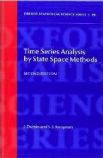
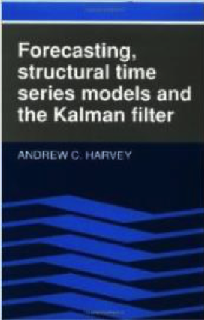
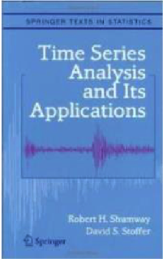

```{r setup, include=FALSE}
knitr::opts_chunk$set(echo = FALSE)
library(kableExtra)
set.seed(123)
```

## Week 3: State-Space Model

Weeks 1-3.5: building blocks for analysis of multivariate time-series data with observation error, structure, and missing values

Week 3.5+: putting this all together to start analyzing ecological data sets

<hr>

* Matrix math (multivariate)
* Properties of time series data
* AR and MA models:   $x(t) = b_1 x_{t-1} + b_2 x_{t-2} + e(t)$
* State-space models (observation error and missing values)
* Model evaluation and selection

## Univariate linear state-space model

$$x_t = x_{t-1}+u+w_t,  \,\,\, w_t \sim N(0,q)$$
$$y_t = x_t + v_t, \,\,\, v_t \sim N(0,r)$$
The $x$ model is the classic “random walk”.  $y$ are the observatons.  This model is a random walk observed with (Gaussian) error.  

## Univariate linear state-space model

$$x_t = x_{t-1}+u+w_t,  \,\,\, w_t \sim N(0,q)$$
$$y_t = x_t + v_t, \,\,\, v_t \sim N(0,r)$$

There are many textbooks on this class of model.  It is used in extensively in economics and engineering.

<center>
  
</center>


