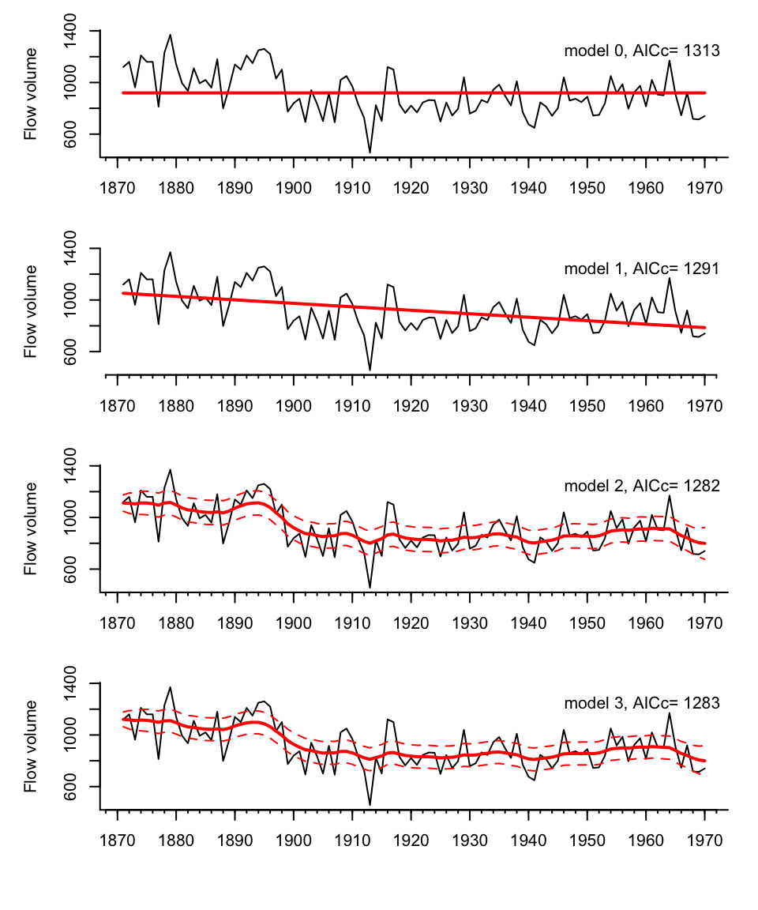

```{r setup, include=TRUE, echo=FALSE}
knitr::opts_chunk$set(echo = FALSE)
library(kableExtra)
set.seed(123)
```

## Dickey-Fuller test with 'ur.df'

```{r echo=TRUE}
x <- cumsum(rnorm(100, 0.02, 0.2))
plot(x)
```

## Dickey-Fuller stationarity test

$x_t = \phi x_{t-1} + \mu + a t + e_t$

$x_t - x_{t-1} = \gamma x_{t-1} + \mu + a t + e_t$

Test is for unit root is whether $\gamma = 0$. 

* Standard linear regression test statistics won't work since the response variable is correlated with our explanatory variable. 
* `ur.df()` reports the critical values we want in the summary info or `attr(test,"cval")`.

##

```{r echo=TRUE, results='hide'}
library(urca)
test <- ur.df(x, type="trend", lags=0)
summary(test)
```

```
Value of test-statistic is: -3.1375 4.6773 4.9583 

Critical values for test statistics: 
      1pct  5pct 10pct
tau3 -4.04 -3.45 -3.15
phi2  6.50  4.88  4.16
phi3  8.73  6.49  5.47
```

##

```{r echo=TRUE}
attr(test, "teststat")
```

```{r echo=TRUE}
attr(test,"cval")
```

##

The `tau3` is the one we want. This is the test that $\gamma=0$ which would mean that $\phi=0$ (random walk).

$x_t = \phi x_{t-1} + \mu + a t + e_t$

$x_t - x_{t-1} = \gamma x_{t-1} + \mu + a t + e_t$

The hypotheses reported in the output are

* `tau` (or `tau2` or `tau3`): $\gamma=0$
* `phi` reported values: are for the tests that $\gamma=0$ and/or the other parameters $a$ and $\mu$ are also 0.

Since we are focused on the random walk (non-stationary) test, we focus on the `tau`  (or `tau2` or `tau3`) statistics and critical values


## Univariate state-space models

Autoregressive state-space models fit a random walk AR(1) through the data.  The variability in the data contains both process and non-process (observation) variability.

```{r, echo=FALSE, fig.align="center"}
library(MARSS)
set.seed(123)
n <- 20
x <- cumsum(rnorm(n,0,sqrt(0.02)))
y <- x+rnorm(n,0,.1)
plot(y,pch="X",type="b",ylab="log(N)",xlab="",bty="L")
fit <- MARSS(y, silent=TRUE)
lines(fit$states[1,],col="blue",lwd=2)
```


## PVA example

One use of univariate state-space models is “count-based” population viability analysis (chap 7 HWS2014)

```{r wilddogs, echo=FALSE,out.width = '70%',fig.align="center"}
knitr::include_graphics("images/wild_dogs.jpg")
```

##

Imagine you were tasked with estimating the probability of the population going extinct (N=1) within certain time frames (10, 20, years).

```{r}
plot(wilddogs[,1], log(wilddogs[,2]), type="b", ylab="log count", xlab="")
```

## How might we approach our forecast?

* Fit a model
* Simulate with that model many times
* Count how often the simulation hit N=1 (logN=0)

```{r echo=FALSE}
par(mfrow=c(1,3))
plot(wilddogs[,1], log(wilddogs[,2]), type="b", ylab="log count", xlab="")
title("random walk with drift")
plot(wilddogs[,1], log(wilddogs[,2]), type="b", ylab="log count", xlab="")
abline(lm(log(wilddogs[,2]) ~ wilddogs[,1]), col="red")
title("linear trend plus error")
fit3 <- MARSS(log(wilddogs[,2]), silent=TRUE)
plot(wilddogs[,1], log(wilddogs[,2]), type="b", ylab="log count", xlab="")
lines(wilddogs[,1], fit3$states[1,], col="red")
title("state-space")
```


## How you model your data has a large impact on your forecasts


```{r, echo=FALSE}
set.seed(123)
fit1 <- MARSS(log(wilddogs[,2]), model=list(R=matrix(0)), silent=TRUE)
fit2 <- MARSS(log(wilddogs[,2]), model=list(Q=matrix(0)), silent=TRUE)
fit3 <- MARSS(log(wilddogs[,2]), silent=TRUE)

par(mfrow=c(3,1),mar=c(2,2,2,2))
plot(wilddogs,type="l",bty="L",col="red",xlim=c(1970,2010),ylim=c(0,150))
fit1$par$x0<-fit1$states[,22,drop=FALSE]
for(i in 1:5){
  fr <- MARSSsimulate(fit1,tSteps=20)$sim.data
yrs <- (wilddogs[22,"Year"]):(wilddogs[22,"Year"]+20)
lines(yrs,c(wilddogs[22,"Count"],exp(fr)))
}
title("Process only")
plot(wilddogs,type="l",bty="L",col="red",xlim=c(1970,2010),ylim=c(0,150))
fit2$par$x0<-fit2$states[,22,drop=FALSE]
for(i in 1:10){
  fr <- MARSSsimulate(fit2,tSteps=20)$sim.data
yrs <- (wilddogs[22,"Year"]):(wilddogs[22,"Year"]+20)
lines(yrs,c(wilddogs[22,"Count"],exp(fr)))
}
title("Observation only lm()")
plot(wilddogs,type="l",bty="L",col="red",xlim=c(1970,2010),ylim=c(0,150))
fit3$par$x0<-fit3$states[,22,drop=FALSE]
for(i in 1:10){
  fr <- MARSSsimulate(fit3,tSteps=20)$sim.data
yrs <- (wilddogs[22,"Year"]):(wilddogs[22,"Year"]+20)
lines(yrs,c(wilddogs[22,"Count"],exp(fr)))
}
title("Both observation and process error")

```

<!--

## How can we separate process and non-process variance?

Wouldn’t these two variances be impossible to separate?

```{r, echo=FALSE, fig.align="center"}
plot(y,pch="X",type="b",ylab="log(N)",xlab="",bty="L")
fit <- MARSS(y, silent=TRUE)
lines(fit$states[1,],col="blue",lwd=2)
```

## They have different temporal patterns.

```{r, fig.align="center"}
set.seed(22245)
op <- par(mfcol=c(2,3),mar=c(2,2,2,2))
for(i in 1:3){
  x <- cumsum(rnorm(20, -.02, .05))
  plot(x, ylab="", xlab="", bty="L", type="l")
  if(i==1) title("process is autocorrelated")
  y <- rnorm(20, 0, .1)
  plot(y, ylab="", xlab="", bty="L", type="l")
  if(i==1) title("observation error is not")
}
```

-->

## Stochastic level models

Flat level 

$$x = u$$
$$y_t = x + v_t$$

Linear level 

$$x_t = u + c \times t$$
$$y_t = x_t + v_t$$

Stochastic level 

$$x_t = x_{t-1} + u + w_t$$
$$y_t = x_t + v_t$$

## Nile River example

```{r nile, echo=FALSE,out.width = '60%',fig.align="center"}

```

## Kalman filter and smoother

The **Kalman filter** is an algorithm for computing the expected value of the $x_t$ conditioned on the data up to $t-1$ and $t$ and the model parameters.

$$x_t = b x_{t-1}+u+w_t,  \,\,\, w_t \sim N(0,q)$$

$$y_t = z x_t + a + v_t, \,\,\, v_t \sim N(0,r)$$

The **Kalman smoother** computes the expected value of the $x_t$ conditioned on all the data.


## Diagnostics

**Innovations residuals** = 

data at time $t$ minus model predictions given data up to $t-1$

$$\hat{y_t} = E[Y_{t}|y_{t-1}]$$

```
residuals(fit)
```

Standard diagnostics

* ACF
* Normality


## `MARSS package`

We will be using the MARSS package to fit univariate and multivariate state-space models. 

$$\mathbf{x}_t = \mathbf{B}x_{t-1} + \mathbf{U} + \mathbf{w}_t, \,\,\, \mathbf{w}_t \sim MVN(0,\mathbf{Q})$$
$$\mathbf{y}_t = \mathbf{Z}\mathbf{x}_{t} + \mathbf{A} + \mathbf{v}_t, \,\,\, \mathbf{v}_t \sim MVN(0,\mathbf{R})$$

##

The main function is `MARSS()`:

```
fit <- MARSS(data, model=list())
```

data are a univariate vector, univariate ts or a matrix with time going along the columns.

model list is a list with the structure of all the parameters.

## Univariate example

  
$$x_t = x_{t-1} + u + w_t, \,\,\, w_t \sim N(0,q)$$
$$y_t = x_{t} + v_t, \,\,\, v_t \sim N(0,r)$$

Write where everything bold is a matrix.

$$x_t = \mathbf{B}x_{t-1} + \mathbf{U} + w_t, \,\,\, w_t \sim MVN(0,\mathbf{Q})$$
$$y_t = \mathbf{Z}x_{t} + \mathbf{A} + v_t, \,\,\, v_t \sim MVN(0,\mathbf{R})$$

```
mod.list <- list(
  B = matrix(1), U = matrix("u"), Q = matrix("q"),
  Z = matrix(1), A = matrix(0), R = matrix("r"),
  x0 = matrix("x0"),
  tinitx = 0
)
```

## Let's see some examples
