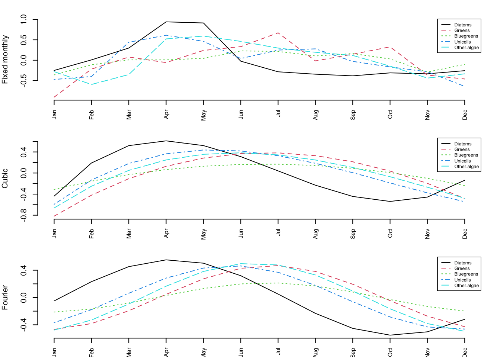
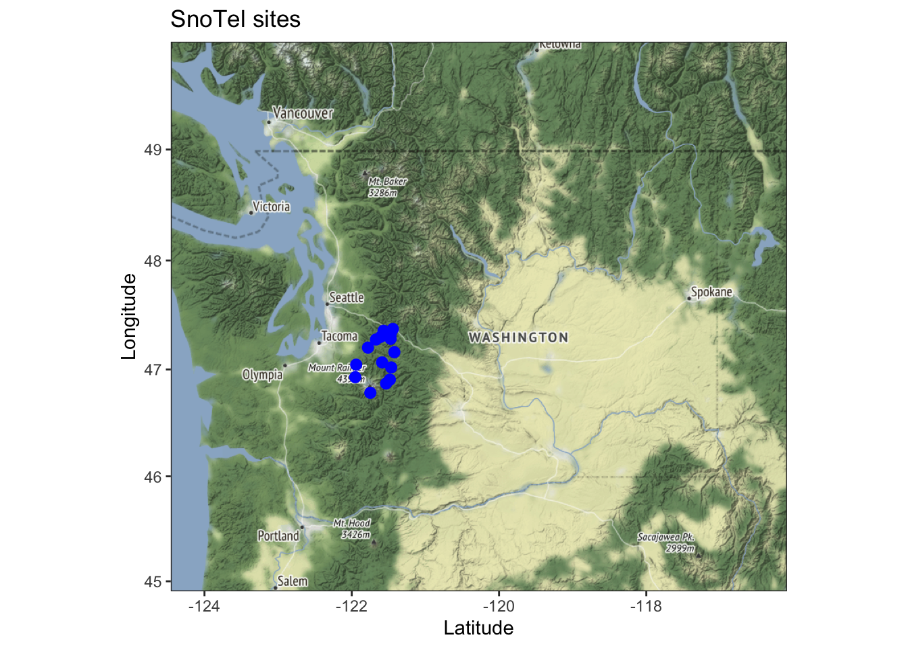

```{r setup, include=FALSE}
library(kableExtra)
set.seed(123)
options(htmltools.dir.version = FALSE, servr.daemon = TRUE)
knitr::opts_chunk$set(fig.height=5, fig.align="center")
```

## Topics for today

### Covariates

* Why include covariates?

* Multivariate linear regression on time series data

* Covariates in MARSS models

* Seasonality in MARSS models
    
* Missing covariates


## Why include covariates in a model?

* You want to forecast something using covariates
* We are often interested in knowing the cause of variation
* Covariates can explain the process that generated the patterns
* Covariates can help deal with problematic observation errors
* You are using covariates to model a changing system
* You want to get rid of trends or cycles

## Lake WA plankton and covariates

```{r covariates, echo=FALSE, out.width = '80%'}
#url <- "https://atsa-es.github.io/atsa/Lectures/Week%204/images/msscov-plank-plot.png"
knitr::include_graphics(here::here("Lectures", "Week 4", "images", "msscov-plank-plot.png"))
```

## Covariates in time series models

* Multivariate linear regression for time series data
* Linear regression with ARMA errors
* ARMAX - process errors driven by covariates
* MARSS models with covariates = process and observation errors affected by covariates
  * aka Vector Autoregressive Models with covariates and observation error
* Covariates in general state-space models

## Multivariate linear regression for time series data

Can you do a linear regression with time series data (response and predictors)? Yes, but you need to be careful.  Read Chapter 5 in [Hyndman and Athanasopoulos 2018]( https://otexts.com/fpp2/regression.html)

* Diagnostics that need to be satisfied
    * Residuals are temporally uncorrelated
    * Residuals are not correlated with the predictor variables
* Be careful regarding spurious correlation if both response and predictor variables have trends

## Autocorrelated response and predictor variables

<!-- Imagine that your data looked like so where the line is the data and the color represents your covariate.  

```{r echo=FALSE, fig.height=4}
colfunc<-colorRampPalette(c("red","yellow","springgreen","royalblue"))
plot(rep(1,20),col=(colfunc(50)), pch=19,cex=2,ylim=c(0,10))
dat <- sin((10:30)*pi/20)*3+5
lines(dat)
points(dat)
```


Why are the data correlated? It is only because of the covariate?

-->

Both response and predictors have a seasonal trend

```{r echo=FALSE, out.width="70%"}
TT <- 10*12
sc <- sin(2*pi*(1:TT)/12) + cos(2*pi*(1:TT)/12)
plot(1:TT, sc+rnorm(TT,0,0.5), type="l", ylab="values", xlab="t", ylim=c(-3,10))
lines(-sc+rnorm(TT,0,0.5)+6, col="red")
title("both covariate and response are seasonal")
```

## Linear regression with autocorrelated errors

The `xreg` argument in `Arima()` and `arima()` allows you to fit linear regressions with autocorrelated errors.  Read Chapter 9 in [Hyndman and Athanasopoulos 2018](https://otexts.com/fpp2/dynamic.html) on Dynamic Regression.

A linear regression with autocorrelated errors is for example:

$$y_t = \alpha + \mathbf{D} \mathbf{d}_t + \nu_t$$

$$\nu_t = \theta_1 \nu_{t-1} + \theta_2 \nu_{t-2} + e_t$$

## Fitting in R

### `Arima()`

```
fit <- Arima(y, xreg=d, order=c(1,1,0))
```

### `auto.arima()`

```
fit <- auto.arima(y, xreg=x)
```

### LOTS of packages have options for auto-correlated errors

## Example from Hyndman and Athanasopoulos 2018

```{r, echo=FALSE, message=FALSE, fig.height=4}
library(fpp2)
autoplot(uschange[,1:2], facets=TRUE) +
  xlab("Year") + ylab("") +
  ggtitle("Quarterly changes in US consumption
    and personal income")
```

## A simple regression has problems

```{r out.width="70%"}
y <- uschange[,"Consumption"]; d <- uschange[,"Income"]
fit <- lm(y~d)
checkresiduals(fit)
```

## Let `auto.arima()` find best model

```{r out.width="70%"}
fit <- auto.arima(y, xreg=d) # It finds a ARMA(1,0,2) is best.
checkresiduals(fit)
```

## Collinearity

This a big issue.  If you are thinking about stepwise variable selection, do a literature search on the issue.  Read the chapter in [Holmes 2018: Chap 6](https://fish-forecast.github.io/Fish-Forecast-Bookdown/6-1-multivariate-linear-regression.html) on catch forecasting models using multivariate regression for a discussion of

* Stepwise variable regression in R
* Cross-validation for regression models
* Penalized regression in R
    * Lasso
    * Ridge
    * Elastic Net
* Diagnostics

## ARMAX

ARMAX models are different. In this case, the covariates affect the amount the auto-regressive process changes each time step.

You can think of this as

* covariates affect the process errors (good bad years)

$$x_t = b x_{t-1}+ \underbrace{\boxed{\mathbf{C} \mathbf{c}_t + w_t}}_{\text{process error}}$$

* covariates drive the drift, aka $\mathbf{u}$

$$x_t = b x_{t-1}+ \underbrace{\boxed{\mathbf{C} \mathbf{c}_t}}_{\text{drift "u"}} + w_t$$
<!-- where $w_t$ can be moving average process. $w_t = e_t + \theta e_{t-1}$. -->

## Covariates in MARSS models

This is a state-space model that allows you to have the covariate affects process error and affect observation errors.

$$\mathbf{x}_t = \mathbf{B} \mathbf{x}_{t-1} + \mathbf{u} +\mathbf{C} \mathbf{c}_t + \mathbf{w}_t$$
$$\mathbf{y}_t = \mathbf{Z} \mathbf{x}_{t} + \mathbf{a} + \mathbf{D} \mathbf{d}_t + \mathbf{v}_t$$


## Example - univariate state-space models

$$x_t = b x_{t-1}+ u + \mathbf{C} \mathbf{c}_t + w_t$$
$$y_t = x_t + \mathbf{D} \mathbf{d}_t + v_t$$

Now we can model how covariates affect the hidden process.

## Example - univariate state-space models

$$x_t = x_{t-1} + u + \boxed{\mathbf{C} \mathbf{c}_t} + w_t$$
$$y_t = x_t + v_t$$

Random walk with drift. How does covariate affect the drift term?

Example. You have tag data on movement of animals in the ocean. How does water temperature affect the speed (jump length) of the movement.

## Example - univariate state-space models

$$x_t = x_{t-1}+ u + w_t$$
$$y_t = x_t + \boxed{\mathbf{D} \mathbf{d}_t + v_t}$$


How does covariate affect observation error relative to our stochastic trend. 

Example. You are tracking population size using stream surveys. Turbidity affects your observation error.


## Multivariate Example - Covariates in state process

$$\mathbf{x}_t = \mathbf{x}_{t-1}+\mathbf{u}+\boxed{\mathbf{C}\mathbf{c}_t}+\mathbf{w}_t$$

$$\mathbf{y}_t = \mathbf{x}_{t} + \mathbf{v}_t$$


$\mathbf{C}\mathbf{c}_t$ The covariate is in $\mathbf{c}_t$ and the effect is in matrix $\mathbf{C}$.  

Example. lat/lon movement data so $\mathbf{x}$ and $\mathbf{y}$ are 2 dimensional (our lat and lon values). 


## Multivariate Example - Covariates in state process

$$\begin{bmatrix}x_1 \\ x_2\end{bmatrix}_t = \begin{bmatrix}x_1 \\ x_2\end{bmatrix}_{t-1} + \begin{bmatrix}C_a & C_b \\ C_a & C_b\end{bmatrix}\begin{bmatrix}temp \\ TP\end{bmatrix}_t + \begin{bmatrix}w_1 \\ w_2\end{bmatrix}_t$$

The model for $x_t$ in site 1 (or species 1) is:

$$x_{1,t}=x_{1,t-1}+C_a \times temp_t + C_b \times TP_t + w_{1,t}$$
There is an effect of the prior $x_t$ and an effect of temperature and phosporous.

## The structure of $\mathbf{C}$

The structure of $\mathbf{C}$ can model different effect structures

**Effect of temp and TP is the same**

$$\begin{bmatrix}C & C \\ C & C\end{bmatrix}\begin{bmatrix}temp \\ TP\end{bmatrix}_t$$

##

**Effect of temperature and TP is different but the same across sites, species, whatever the row in $\mathbf{x}$ is**

$$\begin{bmatrix}C_a & C_b \\ C_a & C_b\end{bmatrix}\begin{bmatrix}temp \\ TP\end{bmatrix}_t$$

##

**Effect of temperature and TP is different across sites or whatever the row in $\mathbf{x}$ is**

$$\begin{bmatrix}C_{a1} & C_{b1} \\ C_{a2} & C_{b2}\end{bmatrix}\begin{bmatrix}temp \\ TP\end{bmatrix}_t$$

##

**Effect of temperature is the same across sites but TP is not**

$$\begin{bmatrix}C_{a} & C_{b1} \\ C_{a} & C_{b2}\end{bmatrix}\begin{bmatrix}temp \\ TP\end{bmatrix}_t$$

## Multivariate Example - Covariates in observation process

eg, vegetation obscures individuals, temperature affects behavior making animals more or less visible

$$\mathbf{y}_t = \underbrace{\boxed{\mathbf{Z}\mathbf{x}_{t}}}_{\text{hidden state}}+\underbrace{\mathbf{a}}_{\text{scaling term}}+\underbrace{\boxed{\mathbf{D}\mathbf{d}_t+\mathbf{v}_t}}_{\text{observation error}}$$

## Covariates in the observation process

$$\begin{bmatrix}y_1 \\ y_2 \\y_3\end{bmatrix}_t = \begin{bmatrix}1 & 0 \\ 1 & 0 \\ 0 & 1\end{bmatrix}\begin{bmatrix}x_1 \\ x_2\end{bmatrix}_{t} + \begin{bmatrix}0 \\ a_2 \\0\end{bmatrix} + \begin{bmatrix}D_a & D_b \\ D_a & D_b \\D_a & D_b\end{bmatrix}\begin{bmatrix}temp \\ wind\end{bmatrix}_t + \begin{bmatrix}v_1 \\ v_2 \\v_3\end{bmatrix}_t$$
In this case the covariate does not affect the _state_ $x$.  It affects the observation of the state.

##

The model for $y_t$ in site 1 is:

$$y_{1,t}=x_{1,t}+D_a \times temp_t + D_b \times wind_t + v_{1,t}$$

## The structure of $\mathbf{D}$

The structure of $\mathbf{D}$ can model many different structures of the effects.

**Effect of temp and wind is the same across sites 1 & 2 but different for site 3.  In site 3, temp has an effect but wind does not**

$$\begin{bmatrix}D_a & D_b \\ D_a & D_b \\ D_c & 0\end{bmatrix}\begin{bmatrix}temp \\ wind\end{bmatrix}_t$$


## Why include covariates in the process?

* We want to understand how covariates drive the hidden process.

* We want to test hypotheses for what caused a perturbation or change in the dynamics.

* We want to forecast using covariates.

* We want to model the _autocorrelation in the process errors_ using the known driver.

* We want to remove seasonality or cycles


## Why include covariates in a observation?

**Auto-correlated observation errors**

* Model your $v_t$ as a AR-1 process. hard numerically with a large multivariate state-space model

* If know what is causing the auto-correlation, include that as a covariate. Easier.

**Correlated observation errors across sites or species (y rows)**

* Use a $\mathbf{R}$ matrix with off-diagonal terms. really hard numerically

* If you know or suspect what is causing the correlation, include that as a covariate. Easier.

**We want to remove seasonality or cycles**

"hard numerically" = you need a lot of data

## Let's work through an example

`lec_07_covariates.R` in the Fish550 repo

Follows [Chapter 8](https://atsa-es.github.io/atsa-labs/chap-msscov.html) in the ATSA lab book


## Seasonality

```{r chinookplot, echo=FALSE}
library(atsalibrary)
data(chinook, package="atsalibrary")
par(mfrow=c(1,2))
dat <- ts(subset(chinook.month, State=="WA")$log.metric.tons, start=1990, frequency=12)
dat <- window(dat, end=c(2000,12))
plot(dat, ylab="log metric tons")
title("WA chinook landings")
dat <- ts(subset(chinook.month, State=="OR")$log.metric.tons, start=1990, frequency=12)
dat <- window(dat, end=c(2000,12))
plot(dat, ylab="log metric tons")
title("OR chinook landings")
```

## Seasonality

* Different approaches to modeling seasonality
   * Factors
   * Polynomials
   * Sines and cosines (Fourier series)

## Monthly factors in $\mathbf{x}$

Introduce 12 covariates: January, February, etc. If $t$ is in January the January covariate is 1 otherwise it is 0.

$$x_t = x_{t-1} +\underbrace{\mathbf{C} \mathbf{c}_t}_{\text{drift}} + w_t$$
$$\mathbf{C} \mathbf{c}_t = \alpha_m$$
where $m$ is the month at time step $t$, so we have a different drift term each month.

## Monthly factors

$$
\begin{array}{c}
\begin{matrix}
\\ \\
\end{matrix} \\
\begin{matrix}
\text{WA}\\
\text{OR}
\end{matrix}
\end{array}
\begin{array}{c}
\begin{matrix}
\text{month effects}\\
\text{a 2 by 12 matrix}
\end{matrix} \\
\begin{bmatrix}
C_1 & C_2 & C_3 & \dots & C_{12}\\
C_1 & C_2 & C_3 & \dots & C_{12}\end{bmatrix}
\end{array}
\begin{array}{c}
\begin{matrix}
\text{covariates}\\
\text{a 12 by T matrix}
\end{matrix}\\
\begin{bmatrix}
1 & 0 & 0 & \dots & 0\\ 
0 & 1 & 0 & \dots & 0\\ 
0 & 0 & 1 & \dots & 0\\
\vdots & \vdots & \vdots & \vdots \\ 
0 & 0 & 0 & \dots & 1\end{bmatrix} \\
\begin{matrix}
1 & 2 & 3 & \dots & T
\end{matrix} 
\end{array}
\begin{array}{c}
\begin{matrix}
\\ \\
\end{matrix} \\
\begin{matrix}
\text{Jan}\\
\text{Feb}\\
\text{Mar}\\
\vdots\\
\text{Dec}
\\
\text{month}
\end{matrix}
\end{array}
$$

##

```{r}
TT <- nrow(chinook.month)/2
covariate <- matrix(0, 12, TT)
monrow <- match(chinook.month$Month, month.abb)[1:TT]
covariate[cbind(monrow,1:TT)] <- 1
covariate[,1:14]
```

##

WA and OR have different month effects.

```{r}
C <- matrix(paste0(month.abb,rep(1:2,each=12)), 2, 12, byrow = TRUE)
C[,1:6]
```

WA and OR have same month effects.

```{r}
C <- matrix(month.abb, 2, 12, byrow = TRUE)
C[,1:6]
```

## Season as a 3rd order polynomial

Introduce 3 covariates: $m$, $m^2$ and $m^3$ where $m$ is month (1 to 12).

$$x_t = x_{t-1} + \mathbf{C} \mathbf{c}_t + w_t$$

$$\mathbf{C} \mathbf{c}_t = \beta_1 m + \beta_2 m^2 + \beta_3 m^3$$
where $m$ is month at time $t$.

## Season as polynomial

$$
\begin{array}{c}
\begin{matrix}
\\ \\
\end{matrix} \\
\begin{matrix}
\text{WA}\\
\text{OR}
\end{matrix}
\end{array}
\begin{array}{c}
\begin{matrix}
\text{month effects}\\
\text{a 2 by 3 matrix}
\end{matrix} \\
\begin{bmatrix}
C_1 & C_2 & C_3\\
C_1 & C_2 & C_3\end{bmatrix}
\end{array}
\begin{array}{c}
\begin{matrix}
\text{covariates}\\
\text{a 3 by T matrix}
\end{matrix}\\
\begin{bmatrix}
1 & 2 & 3 & \dots & 12 & 1 & \dots\\ 
1^2 & 2^2 & 3^2 & \dots & 12^2 & 1^2 & \dots\\ 
1^3 & 3^3 & 3^3 & \dots & 12^3 & 1^3 & \dots\\
\end{bmatrix} \\
\begin{matrix}
1 & 2 & 3 & \dots & 12 & 13 & \dots & T
\end{matrix} 
\end{array}
\begin{array}{c}
\begin{matrix}
\\ \\
\end{matrix} \\
\begin{matrix}
m\\
m^2\\
m^3\\
\text{step}
\end{matrix}
\end{array}
$$

##

```{r}
TT <- nrow(chinook.month)/2
monrow <- match(chinook.month$Month, month.abb)[1:TT]
covariate <- rbind(monrow, monrow^2, monrow^3)
rownames(covariate) <- c("m", "m2", "m3")
covariate[,1:14]
```

##

WA and OR have different seasonal pattern.

```{r}
C <- matrix(paste0(c("m", "m2", "m3"),".",rep(1:2,each=3)), 2, 3, 
            byrow = TRUE)
C
```

WA and OR have same seasonal pattern.

```{r}
C <- matrix(c("m", "m2", "m3"), 2, 3, byrow = TRUE)
C
```

## Season as a Fourier series

* Fourier series are paired sets of sine and cosine waves
* They are commonly used in time series analysis in the frequency domain


## Season as a Fourier series

Introduce 2 covariates: $sin(2\pi t/p)$, $cos(2\pi t/p)$ where $p$ is period (12 for monthly) and $t$ is the time step (1 to $T$).

$$x_t = x_{t-1} + \mathbf{C} \mathbf{c}_t + w_t$$

$$\mathbf{C} \mathbf{c}_t = \beta_1 sin(2\pi t/p) + \beta_2 cos(2\pi t/p)$$
where $p$ is 12 (for monthly).

##

```{r echo=FALSE}
TT <- nrow(chinook.month)/2
covariate <- rbind(sin(2*pi*(1:TT)/12), cos(2*pi*(1:TT)/12))
plot(covariate[1,1:50], type="l", ylab="covariate", xlab="t", ylim = c(-2, 2))
lines(covariate[2,1:50], col="red")
lines((matrix(c(2, 0.5), 1, 2) %*% covariate)[1,1:50], col="blue", lwd=4)

title("covariates sines and cosines")
```

## forecast `fourier()` function

You can also use the `fourier()` function in the forecast package to create your covariates.

```{r}
x <- ts(1:TT, freq=12)
covariate <- forecast::fourier(x, K=1) |> t()
```

This makes it easy to create a longer fourier series to model non-symmetric or multi-modal seaonal cycles.

```{r}
x <- ts(1:TT, freq=12)
covariate2 <- forecast::fourier(x, K=2) |> t()
```

##

```{r echo=FALSE}
plot(covariate2[1,1:50], type="l", ylab="covariate", xlab="t", ylim = c(-2, 2))
lines(covariate2[2,1:50], col="red")
lines(covariate2[3,1:50], col="green")
lines(covariate2[4,1:50], col="red", lwd=2, lty=2)
lines((matrix(c(0.4, 0.5, 1, 1), 1, 4) %*% covariate2)[1,1:50], col="blue", lwd=6)

title("K=2 for fourier transform and now we can have 2 peaks")
```

## Season as a Fourier series (K=1)

$$
\begin{array}{c}
\begin{matrix}
\\ \\
\end{matrix} \\
\begin{matrix}
\text{WA}\\
\text{OR}
\end{matrix}
\end{array}
\begin{array}{c}
\begin{matrix}
\text{ }\\
\text{ }
\end{matrix} \\
\begin{bmatrix}
C_1 & C_2\\
C_1 & C_2\end{bmatrix}
\end{array}
\begin{array}{c}
\begin{matrix}
\text{covariates}\\
\text{a 2 by T matrix}
\end{matrix}\\
\begin{bmatrix}
sin\left(\frac{2\pi 1}{12}\right) & sin\left(\frac{2\pi 2}{12}\right) &  \dots & sin\left(\frac{2\pi T}{12}\right)\\ 
cos\left(\frac{2\pi 1}{12}\right) & cos\left(\frac{2\pi 2}{12}\right) &  \dots & cos\left(\frac{2\pi T}{12}\right)
\end{bmatrix}
\end{array}
\begin{array}{c}
\begin{matrix}
\\ \\
\end{matrix}
\end{array}
$$

##

```{r out.width="70%"}
TT <- nrow(chinook.month)/2
covariate <- rbind(sin(2*pi*(1:TT)/12), cos(2*pi*(1:TT)/12))
plot(covariate[1,1:50], type="l")
lines(covariate[2,1:50], col="red")
title("covariates sines and cosines")
```

##

WA and OR have different seasonal pattern.

```{r}
C <- matrix(paste0(c("s", "c"),".",rep(1:2,each=2)), 2, 2, byrow = TRUE)
C
```

WA and OR have same seasonal pattern.

```{r}
C <- matrix(c("s", "c"), 2, 2, byrow = TRUE)
C
```

## Example Section 8.6

**[Seasonality of Lake WA plankton](https://atsa-es.github.io/atsa-labs/sec-msscov-season.html)**

{width=75%}

## Cyclic salmon

**[Chapter 16](https://atsa-es.github.io/atsa-labs/chap-cyclic-sockeye.html)**


## Missing covariates

**SNOTEL Example Chapter 11**

https://atsa-es.github.io/atsa-labs/example-snotel-data.html

{width=70%}

## Snow Water Equivalent (snowpack)

February snowpack estimates

{width=75%}

## Use MARSS models Chapter 11

* Accounts for correlation across sites and local variability

{width=75%}
