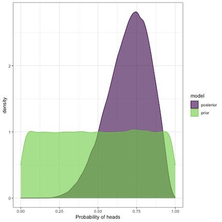

```{r setup, include=FALSE}
knitr::opts_chunk$set(echo = FALSE, warning=FALSE, 
                      message=FALSE, results='hide',
                      fig.align = 'center')
library(ggplot2)
library(bayesplot)
library(rstan)
library(atsar)
library(broom.mixed)
library(datasets)
library(MARSS)
library(dplyr)
library(brms)
library(lubridate)
```

## Overview of today's material

* Bayesian estimation
* Overview of Stan 
* Manipulating and plotting Stan output
* Examples of time series models

## Review of models we've used so far

### Models
* Regression
* ARMA models
* State Space Models
* Dynamic Linear Models
* Dynamic Factor Analysis
* Multivariate time series models)

## Why Bayesian?

* Complex hierarchical models  
    + Non-linear models
    + Hierarchical or shared parameters
    + Non-normal data
    + Prior information
    
* Inference: what’s the probability that the data are less than some threshold?   

* No bootstrapping!
     + We get credible intervals for parameters and states simultaneously

## Bayesian logic

* Conditional probability

$$P({\theta}|\textbf{y})P(\textbf{y})=P(\theta)P(\textbf{y}|\theta)$$  

$$P({\theta}|\textbf{y})=\frac{P(\theta)P(\textbf{y}|\theta)}{P(\textbf{y})}$$ 

* ${P(\textbf{y})}$ is a normalizing constant that we often don't have to worry about

## Bayesian logic
* Parameters are random, data are fixed

* $$P({\theta}|\textbf{y})=P(\theta)P(\textbf{y}|\theta)$$  

* $P({\theta}|\textbf{y})$ is the posterior   

* $P(\textbf{y}|\theta)$ is the likelihood  

* $P(\theta)$ is the prior  


## Bayesian logic 

{height=10%}
  
## Bayesian logic

* Difference between posterior and prior represents how much we learn by collecting data
* Experiment {H, H, T, H, H, T, H, H}
{height=60%}

## Bayesian mechanics

* MLE seeks to find the combination of parameters that maximize the likelihood (e.g. find absolute best point)

* Bayesian estimation uses integration to find the combination of parameters that are best *on average*

## Bayesian mechanics in practice


  
## Estimation 

* Goal of Bayesian estimation in drawing samples from the posterior $P({\theta}|\textbf{y})$

* For very simple models, we can write the analytical solution for the posterior

* But for 99% of the problems we work on, need to generate samples via simulation

* Markov chain Monte Carlo 

## Estimation

  


## Estimation

  

## Estimation

  

## Estimation

  

## Estimation

* Thousands of proposals later, we have a MCMC chain

```{r echo=FALSE}
df = data.frame(id=1:1000, x=rnorm(1000))
ggplot(df,aes(id,x)) + geom_line(col="red") + 
  xlab("") + ylab("Parameter") + theme_bw()
```

## Estimation: best practices

* Run 3-4 MCMC chains in parallel 

* Discard first ~ 10-50% of each MCMC chain as a 'burn-in'

* Optionally apply MCMC thinning to reduce autocorrelation  


## Lots of algorithms for sampling

* Metropolis, Metropolis-Hastings

* Sampling - Imporance - Resampling (SIR)

* No-U-Turn Sampler (NUTS)

* [Monahan et al. 2016, Faster estimation of Bayesian models in ecology using Hamiltonian Monte Carlo](https://besjournals.onlinelibrary.wiley.com/doi/abs/10.1111/2041-210X.12681)

## What is Stan?  

* Powerful, cross-platform and cross-language (R, Julia, Matlab, etc) that allows users to write custom code that can be called directly from R

* Estimation can be fully or approximate Bayesian inference, or maximum a posteriori optimization (BFGS)

* Useful links:
    + [Stan homepage](https://mc-stan.org/)
    + [Stan manual](https://mc-stan.org/users/documentation/)
    + [rstan](https://cran.r-project.org/web/packages/rstan/index.html)

## Options for using Stan in this class

* Write your own code (based on examples in the manual, etc)

* Use an existing package  

* Use our bundled code to get started with simple models (we'll start here)

## Existing packages: rstanarm and brms

* Both packages very flexible, and allow same syntax as basic lm/glm or lmer models, e.g.

```{r echo=TRUE, eval=FALSE}
rstan::stan_lm
rstan::stan_glm
rstan::stan_glmer
```

* Vignettes
[brms](http://paul-buerkner.github.io/brms/)
[rstanarm](http://mc-stan.org/rstanarm/articles/rstanarm.html)

## Existing packages: rstanarm and brms

* Very flexible
`brms` includes autocorrelated errors, non-normal data, 
non-linear smooths (GAMs), etc. 

* Limitations related to this class:
* allows multivariate data, but not multivariate time series models
[brms example](https://cran.r-project.org/web/packages/brms/vignettes/brms_multivariate.html)

## Existing packages: rstanarm and brms

`brms` offers notation that should be very familiar to run many classes of models, 

```{r, echo=TRUE, eval=FALSE}
brms::brm(y ~ x * z + (1|group), data=d)
brms::brm(y01 ~ x * z + (1|group), data=d, family = binomial("logit"))
brms::brm(bf(y ~ s(x)), data=d)
```
* smooths can also be of 2-d models (e.g. spatial models)

## Existing packages: rstanarm and brms

`brms` allows ARMA correlation structures that we're familiar with, 

```{r, echo=TRUE, eval=FALSE}
data("LakeHuron")
LakeHuron <- as.data.frame(LakeHuron)
fit <- brm(x ~ arma(p = 2, q = 1), data = LakeHuron)
```
* also includes spatial models (car, sar)
* does not include these in the context of state space models

## Example: linear regression in brms

```{r, echo=FALSE}
data(airmiles)
df = data.frame(year = 1937:1960,airmiles=airmiles)
```
```{r, fig.height=4, echo=FALSE}
ggplot(df,aes(year,log(airmiles))) + geom_point() + 
  geom_line() + 
  theme_bw() + 
  ggtitle("Passenger Miles on Commercial US Airlines") + 
  xlab("Year")
```

## Example: linear regression and AR(1) models in brms

* Regression  
```{r echo=TRUE, warning=FALSE, message=FALSE, results="hide", cache=TRUE}
lm_fit = brms::brm(log(airmiles) ~ year, data=df)
```

* Question: how would we change the code to be an AR(1) model?

```{r echo=TRUE, warning=FALSE, message=FALSE, results="hide", cache=TRUE}
lm_ar= brms::brm(log(airmiles) ~ arma(p = 1, q = 0), data=df)
```

* Defaults to 4 MCMC chains, 2000 iterations, 1000 burn-in

## Example: linear regression and AR(1) models in brms

* `lm_ar` is a "brmsfit" object and has a bunch of convenient plotting functions

```{r, fig.height=3, echo=TRUE}
plot(lm_ar)
```

## Example: linear regression and AR(1) models in brms

* Pairs plots 

```{r, echo=TRUE, fig.height=3.5}
pairs(lm_ar)
```

## Example: linear regression and AR(1) models in brms

* Posterior predictive checks

```{r, echo=TRUE, fig.height=3.5}
pp_check(lm_ar)
```

## Example: linear regression and AR(1) models in brms

* Shinystan

```{r, echo=TRUE, eval=FALSE}
shinystan::launch_shinystan(lm_ar)
```

## Example: linear regression and AR(1) models in brms

* Additional functionality / diagnostics in `bayesplot`

```{r, echo=TRUE, fig.height=3.5}
mcmc_areas(lm_ar,c("sigma","b_Intercept","ar[1]"))
```

## Plotting with Stan output
These plots only the tip of the iceberg for plotting. For more great examples of the kinds of plots avaialable, see these vignettes:

* [Examples on Stan](https://mc-stan.org/users/interfaces/bayesplot)

* [Jonah Gabry's introduction to bayesplot](https://cran.r-project.org/web/packages/bayesplot/vignettes/plotting-mcmc-draws.html)

* [Matthew Kay's introduction to bayesplot and tidybayes](https://cran.r-project.org/web/packages/tidybayes/vignettes/tidybayes.html)

## Customized models and code for this class

* We'll need to install these packages to run Stan,  
```{r, eval=FALSE, echo=TRUE}
install.packages("rstan", repos = "https://cloud.r-project.org")
install.packages("devtools", repos = "https://cloud.r-project.org")
```

* And then we can install our custom package for the class with bundled Stan time series models

```{r, eval=FALSE, echo=TRUE}
devtools::install_github(repo="atsa-es/atsar")
library("atsar")
```

## Models included

* `atsar` package includes:
* RW, AR and MA models (with and without drift)
* DLMs (intercept, slope, both)
* State space RW and AR models
* Flexible families for each model

## More time series models: application to NEON EFI Aquatics challenge

* Daily temperature and oxygen data available from Barco Lake in Florida

```{r echo=FALSE, fig.height=4}
neon = readRDS("neon_aquatics.rds")
neon = dplyr::filter(neon, siteID=="BARC") %>% 
  dplyr::arrange(time)

# This is key here - I added the forecast horizon on the end of the data for the forecast period
full_time <- tibble(time = seq(min(neon$time), max(neon$time), by = "1 day"))
  
# Join the full time with the site_data_var so there aren't gaps in the time column
neon <- left_join(full_time, neon) %>% 
    dplyr::rename(date=time)
neon$year = year(neon$date)
neon = dplyr::filter(neon,year>=2019)
ggplot(neon, aes(date, oxygen)) + 
  geom_point() + 
  theme_bw() + 
  xlab("Time") + 
  ylab("Oxygen")
```

## 'atsar' package: random walk and AR(1) models

This model should be familiar, 

$$E\left[ { Y }_{ t } \right] =E\left[ { Y }_{ t-1 } \right] +{ e }_{ t-1 }$$
* Note that the use of the argument `model_name` and `est_drift`. By not estimating drift, we assume the process is stationary with respect to the mean
```{r echo=TRUE, cache=TRUE, eval=FALSE}
rw = fit_stan(y = neon$oxygen, 
              est_drift = FALSE, model_name = "rw") 
```

## 'atsar' package: univariate state space models

* Specify the MCMC parameters
```{r echo=TRUE, cache=TRUE, eval=FALSE}
rw = fit_stan(y = neon$oxygen, 
              est_drift = FALSE, 
              model_name = "rw",
              mcmc_list = list(n_mcmc = 2000, n_burn = 500, 
                               n_chain = 3, n_thin = 1)) 
```

## 'atsar' package: univariate state space models

State equation: 
$${ x }_{ t }={ \phi x }_{ t-1 }+{ \varepsilon  }_{ t-1 }$$
where ${ \varepsilon  }_{ t-1 } \sim Normal(0, q)$

Observation equation:
$${ Y }_{ t } \sim Normal(x_{t}, r)$$

* Let’s compare models with and without the AR parameter $\phi$ in the process model

## 'atsar' package: univariate state space models

We can first run the model with $\phi$,
```{r cache=TRUE, echo=TRUE}
ss_ar = fit_stan(y = neon$oxygen, 
        est_drift=FALSE, model_name = "ss_ar",
        mcmc_list = list(n_mcmc = 2000, n_chain = 1, n_thin = 1,n_burn=1000))
```

then without,

```{r cache=TRUE, echo=TRUE}
ss_rw = fit_stan(y = neon$oxygen, 
        est_drift=FALSE, model_name = "ss_rw",
        mcmc_list = list(n_mcmc = 2000, n_chain = 1, n_thin = 1,n_burn=1000))
```


```{r echo=FALSE}
saveRDS(ss_ar,"ss_ar.rds")
saveRDS(ss_rw,"ss_rw.rds")
```


## 'atsar' package: univariate state space models

Did the models converge? 
  
  * One quick check is to look at the value of R-hat for each parameter (generally should be small, < 1.1 or < 1.05)
```{r echo=TRUE, results='markup'}
rw_summary <- summary(ss_rw, pars = c("sigma_process","sigma_obs"), 
                      probs = c(0.1, 0.9))$summary
print(rw_summary)
```

## 'atsar' package: univariate state space models

* Calculate maximum Rhat across all parameters,

```{r echo=TRUE, results='markup'}
rhats <- summary(ss_rw)$summary[,"Rhat"]
print(max(rhats))
```

* Reminder: we only ran one chain / 2000 iterations, so overall not bad!

## 'atsar' package: univariate state space models
* Tidy summaries from Stan output:
Using the `broom.mixed` package, we can also extract some tidy summaries of the output 
```{r, echo=TRUE, results='markup'}
coef = broom.mixed::tidy(ss_ar)
head(coef)
```

## 'atsar' package: univariate state space models

* We can use this to look at predictions versus our data

```{r, echo=FALSE, results='markup', fig.height=4}
coef = broom.mixed::tidy(ss_ar)
coef = coef[grep("pred",coef$term),]
coef$Time = seq(1,nrow(coef))
coef$y = neon$oxygen
ggplot(coef, aes(Time, y)) + 
  geom_ribbon(aes(ymin=estimate-std.error, ymax=estimate+std.error),alpha=0.3) +
  theme_bw()
```

## 'atsar' package: univariate state space models

* We can use this to look at predictions versus our data

```{r, echo=FALSE, results='markup', fig.height=4}
coef = broom.mixed::tidy(ss_ar)
coef = coef[grep("pred",coef$term),]
coef$Time = seq(1,nrow(coef))
coef$y = neon$oxygen
ggplot(coef, aes(Time, y)) + 
  geom_ribbon(aes(ymin=estimate-std.error, ymax=estimate+std.error),alpha=0.3) +
  theme_bw() + 
  geom_point(aes(Time,y),col="red")
```

## 'atsar' package: univariate state space models

* We can use this to look at predictions versus our data

```{r, echo=FALSE, results='markup', fig.height=4}
coef = broom.mixed::tidy(ss_ar)
coef = coef[grep("pred",coef$term),]
coef$Time = seq(1,nrow(coef))
coef$y = neon$oxygen
ggplot(coef, aes(estimate, y)) + 
  geom_point(alpha=0.4,col="red") +
  theme_bw() + 
  geom_abline(aes(intercept=0,slope=1))
```

##'atsar' package: raw samples

* tidy() functions great at summarizing
* fit_stan() returns 'stanfit' object that we can use `rstan::extract()` on to get raw posterior draws, by chain

```{r, eval=FALSE, echo=TRUE}
pars = extract(ss_ar)
```

* returns list of parameters we can access directly, e.g.
```{r, eval=FALSE, echo=TRUE}
summary(pars$sigma_process)
```

##'atsar' package: model selection

* Best practice is to use Leave One Out Information Criterion (LOOIC) in `loo` package
* We can compare the LOOIC from the 2 models (AR vs RW)
```{reval=FALSE}
loo_ar = (loo::loo(ss_ar))
loo_rw = (loo::loo(ss_rw))
```

## 'atsar' package: DLMs

* For comparison to MARSS, we'll use Mark's example of logit-transformed survival from the Columbia River. We can think about setting the DLM up in the slope or the intercept. For this first example, we'll do the latter. 

```{r fig.height=1.5}
ggplot(SalmonSurvCUI, aes(year, logit.s)) + geom_line() + geom_point() + 
  theme_bw()
```

## 'atsar' package: DLMs

* Fit DLM with random walk in intercept
```{r cache=TRUE, echo=TRUE}
mod = fit_stan(y = SalmonSurvCUI$logit.s, 
               model_name="dlm-intercept",
               mcmc_list = list(n_mcmc = 2000, 
                                n_chain = 1, n_thin = 1,n_burn=1000))
```

```{r echo=FALSE}
saveRDS(mod, "dlm-intercept.rds")
```


* Fit DLM with random walk in slope

```{r cache=TRUE, echo=TRUE, eval=FALSE}
mod_slope = fit_stan(y = SalmonSurvCUI$logit.s, 
        x = SalmonSurvCUI$CUI.apr, 
        model_name="dlm-slope",
        mcmc_list = list(n_mcmc = 2000, 
                                n_chain = 1, n_thin = 1,n_burn=1000))
```

## 'atsar' package: DLMs

Let's look at predictions using the `rstan::extract()` function
```{r}
pars = rstan::extract(mod)
names(pars)
```

## 'atsar' package: DLMs

Let's look at predictions using the `rstan::extract()` function
```{r echo=FALSE}
pars = rstan::extract(mod)
df = data.frame("Time"=1:42,
                y = SalmonSurvCUI$logit.s,
                pred = apply(pars$pred,2,mean),
                lower=apply(pars$pred,2,quantile,0.025),
                upper=apply(pars$pred,2,quantile,0.975))
ggplot(df, aes(Time, pred)) + 
  geom_ribbon(aes(ymin=lower, ymax=upper),alpha=0.3) +
  theme_bw() + 
  geom_line() + 
  geom_point(aes(Time,y),col="red")
```

## Extra extensions

* `family` argument in `fit_stan` allows to have flexible families
* e.g., fit a Poisson or binomial DLM with 

```{r eval=FALSE, echo=TRUE}
mod = fit_stan(y = SalmonSurvCUI$logit.s, 
               model_name="dlm-intercept",
               family="binomial")
mod = fit_stan(y = SalmonSurvCUI$logit.s, 
               model_name="dlm-intercept",
               family="poisson")
```


## Summary

* Bayesian implementation of time series models in Stan can do everything that MARSS can do and more!

* Very flexible language, great developer community 

* Widely used by students in SAFS / UW / QERM / etc

* Please come to us with questions, modeling issues, or add to code in our packages to make them better!

