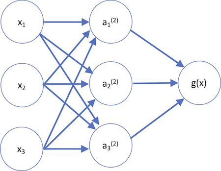

```{r setup, include=FALSE}
knitr::opts_chunk$set(echo = FALSE, warning=FALSE, 
                      message=FALSE, results='hide',
                      fig.align = 'center')
library(ggplot2)
library(MARSS)
library(dplyr)
library(forecast)
library(lubridate)
library(waterData)
library(tsDyn)
library(viridis)
```

## Overview of today's material

* Gaussian process models

* Neural network models

* Empirical dynamic modeling

## Borrowing information from neighbors

Last week, we discussed exponential smoothing

* Exponential smoothing usually borrows information from past data for forecasting
* Generalized additive models (GAMs) usually borrow information from both future and past data
* Several other approaches that borrow information from neighboring points

## Borrowing information from neighbors

GAMs estimate the *trend* using a smooth function, 

$$E\left[ Y \right] ={ B }_{ 0 }+f(x)$$
where like regression, we assume $Y\sim Normal\left( E\left[ Y \right] ,\sigma  \right)$

* The smooth function approximates the trend at a smaller subset of locations (aka *knots*)
* The density and location of the knots can affect how 'wiggly' the function is

## Borrowing information from neighbors

* The smooth function $f(x)$ is generated by some underlying series of functions
* Basis splines ("B-splines") might be a common choice

* `bs()` function lets us create the basis matrix $\textbf{B}$

```{r eval=FALSE}
splines::bs(x, degree = 3)
```

* In addition to degree, we specify where to evaluate these functions at (1:100 here)

## Borrowing information from neighbors

```{r echo=FALSE}
x <- seq(0, 100, by=1)
spl <- splines::bs(x,df=3)
df = data.frame(x = rep(x,ncol(spl)),
    "b" = sort(rep(1:ncol(spl),nrow(spl))), "y" = c(spl))
p1 = ggplot(df, aes(x, y,group=b,col=b)) + 
  geom_line(size=1.2) + theme_bw() + 
  xlab("X") + ylab("Value") + 
  scale_color_viridis(end=0.8) + 
  theme(legend.position = "none")
spl <- splines::bs(x,df=6)
df = data.frame(x = rep(x,ncol(spl)),
    "b" = sort(rep(1:ncol(spl),nrow(spl))), "y" = c(spl))
p2 = ggplot(df, aes(x, y,group=b,col=b)) + 
  geom_line(size=1.2) + theme_bw() + 
  xlab("X") + ylab("Value") + 
  scale_color_viridis(end=0.8) + 
  theme(legend.position = "none")
gridExtra::grid.arrange(p1, p2)
```

## Borrowing information from neighbors

* $\textbf{B}$ matrix generated as first step

* $E[Y] = b_{0} \cdot \ \textbf{x} + \textbf{B}\cdot \textbf{b}$

```{r echo=FALSE}
set.seed(123)
y = cumsum(rnorm(100))
df = data.frame(x = 1:100, y = 0.3+ y / (1.5*max(y)),b=4)
p2 + geom_point(data=df, aes(x, y),col="red",alpha=0.7,size=2)
```

## Borrowing information from neighbors

```{r eval=FALSE}
fit = mgcv::gam(y ~ s(x,bs="bs",k=6), data=df)
```

```{r echo=FALSE}
set.seed(123)
y = cumsum(rnorm(100))
df = data.frame(x = 1:100, y = 0.3+ y / (1.5*max(y)), b=NA)
fit = mgcv::gam(y ~ s(x,bs="bs",k=6), data=df)
df$pred = c(fit$fitted.values)

ggplot(df, aes(x, pred)) + geom_line() + theme_bw() + xlab("x") + 
  ylab("Predicted") + geom_point(aes(x, y),col="red",alpha=0.7,size=2)
```


## Borrowing information from neighbors

* Spacing knots: evenly distributed? 
+ For data that are regularly spaced in time, this probably isn't a big deal

* Cubic spline (default) on the 'airmiles' dataset (n = 23), a function estimated at 10 equally spaced locations (grey vertical lines).

```{r echo =FALSE, fig.height=3.5, fig.width=3.5}
data(airmiles)
df = data.frame("y"=airmiles, "t"=1937:1960)
gam_mod = mgcv::gam(y ~ s(t, bs='cr'), data=df)
df$pred = predict(gam_mod)
knots = data.frame("x"=gam_mod$smooth[[1]]$xp)
ggplot(df, aes(t,y)) + geom_point(col="red") +
  geom_line(aes(t,pred)) + 
  geom_vline(data=knots, aes(xintercept=x), col="grey70") + 
  theme_bw() + xlab("Time") + ylab("Airmiles")
```

* This fit looks pretty reasonable

## Borrowing information from neighbors

* What if data are more gappy?
* Knot locations no longer equally spaced - weighted more toward the locations of data points. 
* Greater spacing between knots = less flexibility, more uncertainty (you can look at the 'se.fit' part of predict output)

```{r echo =FALSE, fig.height=3.5, fig.width=3.5}
data(airmiles)
df = data.frame("y"=airmiles, "t"=1937:1960)
df = dplyr::filter(df,t %in% c(1950:1953,1955:1959)==FALSE)
gam_mod = mgcv::gam(y ~ s(t, bs='cr'), data=df)
df$pred = predict(gam_mod)
knots = data.frame("x"=gam_mod$smooth[[1]]$xp)
ggplot(df, aes(t,y)) + geom_point(col="red") +
  geom_line(aes(t,pred)) + geom_vline(data=knots, aes(xintercept=x), col="grey70") + 
  theme_bw() + xlab("Time") + ylab("Airmiles")
```

## Borrowing information from neighbors

Recapping, GAMs are estimating the underlying *trend* using a smooth function, 

$$E\left[ Y \right] ={ B }_{ 0 }+f(x)$$

* It's important to note that this underlying trend function $f(x)$ is modeling the **mean**
* Smooths are very flexible (with respect to # knots, locations, smooth type). See 'mgcv' and 'gamm'

We're going to leave GAMs alone for now, but there's lots of great references out there. Examples:

* Gavin Simpson's work with GAMs and time series [here](https://www.biorxiv.org/content/10.1101/322248v1)
* Simon Wood's [book](https://www.amazon.com/Generalized-Additive-Models-Introduction-Statistical/dp/1498728332/ref=asc_df_1498728332/?tag=hyprod-20&linkCode=df0&hvadid=312065538926&hvpos=1o1&hvnetw=g&hvrand=11863417304955012193&hvpone=&hvptwo=&hvqmt=&hvdev=c&hvdvcmdl=&hvlocint=&hvlocphy=9033315&hvtargid=pla-305424873573&psc=1)

## Gaussian processes for time series

Similarities between GAMs and GP models:

* GAMs and GP predictive models use reduced dimensionality (knots) to constrain flexibility

Differences:

* GAMs use smooth functions & knot locations to constrain how neighbors affect mean
* GP models use covariance function to control how much neighbors can influence eachother based on how far apart they are

## Gaussian processes for time series

We have some function we want to approximate
```{r echo=FALSE}
set.seed(123)
df=data.frame(y = cumsum(rnorm(100)), x=1:100)
g = mgcv::gam(y ~ s(x), data=df)
df$fitted = g$fitted.values
ggplot(df, aes(x, fitted)) + geom_line() + 
  theme_bw() + xlab("x") + ylab("Value") + 
  geom_point(aes(x,y),col="red",alpha=0.6)
```

## Gaussian processes for time series

We could use GP to estimate the latent values at all observed locations
* What are the downsides to this?
```{r echo=FALSE}
set.seed(123)
df=data.frame(y = cumsum(rnorm(100)), x=1:100)
g = mgcv::gam(y ~ s(x), data=df)
df$fitted = g$fitted.values
ggplot(df, aes(x, fitted)) + geom_line() + 
  theme_bw() + xlab("x") + ylab("Value") + 
  geom_point(aes(x,y),col="red",alpha=0.6) + 
  geom_point(aes(x,fitted),col="blue",alpha=0.6)
```

## Gaussian processes for time series

Instead, consider estimating them at a subset of points and extrapolating (aka Kriging)

* these locations are called the *knots*
* extrapolating to other locations = *predictive process model*

```{r}
set.seed(123)
df=data.frame(y = cumsum(rnorm(100)), x=1:100)
g = mgcv::gam(y ~ s(x), data=df)
df$fitted = g$fitted.values
df$fitted2 = NA
df$fitted2[seq(1,100,by=5)] = df$fitted[seq(1,100,by=5)]
ggplot(df, aes(x, fitted)) + geom_line() + 
  theme_bw() + xlab("x") + ylab("Value") + 
  geom_point(aes(x,y),col="red",alpha=0.6) + 
  geom_point(aes(x,fitted2),col="blue",alpha=0.6,size=2)
```

## Gaussian processes for time series

Lots of applications in Fisheries and Ecology

* Munch et al. 2005 [link](http://citeseerx.ist.psu.edu/viewdoc/download?doi=10.1.1.137.6285&rep=rep1&type=pdf)
* Munch et al. 2018 [link](https://onlinelibrary.wiley.com/doi/full/10.1111/faf.12304)

Especially with applications to spatial models 

* Latimer et al. 2009 [link](https://onlinelibrary.wiley.com/doi/full/10.1111/j.1461-0248.2008.01270.x)
* Finley et al. 2017 [link](https://arxiv.org/abs/1702.00434)
* Gelfand et al. 2018 [link](https://www.sciencedirect.com/science/article/pii/S2211675316300033)
* Anderson et al. 2018 [link](https://esajournals.onlinelibrary.wiley.com/doi/pdf/10.1002/ecy.2403)
* Shelton et al. 2014 [link](http://www.nrcresearchpress.com/doi/10.1139/cjfas-2013-0508#.XHLYt89KiM4)
* Ward et al. 2018 [link](https://www.ncbi.nlm.nih.gov/pubmed/30121848)

## Gaussian processes for time series

Several options for estimating *f(x)* at knot locations

* Common choice is random effects

Gaussian Process models use the covariance function, $\Sigma$

* e.g. Assume the random effects are MV Normal, e.g. $w \sim MVNormal(u, \Sigma)$

## Gaussian processes for time series

We could estimate elements of $\Sigma$ as unconstrained matrix (e.g. 'unconstrained' in MARSS)

* but that's a lot of parameters! ~ m*(m+1)/2

We could try to zero out some elements of $\Sigma$

* but this will cause problems: if ${x}_{1}$ and ${x}_{2}$ are correlated, and ${x}_{1}$ and ${x}_{3}$ are correlated, ${x}_{2}$ and ${x}_{3}$ have to be correlated too

## Gaussian processes for time series

Instead, we'll use a covariance function (aka kernel). Common choices are 

* Exponential 
* Squared-exponential (Gaussian)
* Matern
* Anisotropic functions

## Gaussian processes for time series

For example with the exponential function,

$${ \Sigma}_{i,j}={\sigma}^{2}exp\left( -{ d }_{ i,j }/\tau  \right)$$

* ${\sigma}^{2}$ is the variance parameter (estimated)

* ${ d }_{ i,j }$ is the distance between points, e.g. $|{x}_{i}-{x}_{j}|$

* distance could be distance in time, space, etc

* $\tau$ is a scaling parameter (estimated)

## Gaussian processes for time series

Question:

**For our exponential function, how do $\sigma$ and $\tau$ control 'wiggliness'?**

## Gaussian processes for time series

**For our exponential function, how do $\sigma$ and $\tau$ control 'wiggliness'?**

* Larger values of $\sigma$ introduce more variability between $f(x)$ at knot locations

* Larger values of $\tau$ will make the 'exp(...)' term closer to 1

## Gaussian processes for time series

Revisiting univariate state space models, what are some reasons the AR process is used?

$$x_t = x_{t-1}+w_t,  \,\,\, w_t \sim N(0,q)$$

$$y_t = x_t + v_t, \,\,\, v_t \sim N(0,r)$$ 
* Mechanism may be AR or RW **BUT** also
* AR process is just one flavor of constraining estimation
* Convenience / estimation of $q$ and $r$

## Gaussian processes for time series

Any of the univariate SS or multivariate models (DFA, MARSS) can be modified by swapping out an AR latent process for a GP one!

Example: Gaussian process DFA

* Simulated trend via AR process looks like this


## Gaussian processes for time series

Using a GP-DFA estimation model, we can see our ability to recover the process improve from 4 to 10 to 25 knots. 4 knots:


## Gaussian processes for time series

Using a GP-DFA estimation model, we can see our ability to recover process improve from 4 to 10 to 25 knots. 10 knots:


## Gaussian processes for time series

Using a GP-DFA estimation model, we can see our ability to recover the process improve from 4 to 10 to 25 knots. 25 knots:


## Neural network time series models

Neural networks widely used in lots of fields. Becoming more widely used in fisheries / ecology:

Ward et al. 2014 [link](https://onlinelibrary.wiley.com/doi/abs/10.1111/j.1600-0706.2014.00916.x)  
Coro et al. 2016 [link](https://academic.oup.com/icesjms/article/73/10/2552/2647120)  
Joseph et al. 2020 [link](https://onlinelibrary.wiley.com/doi/abs/10.1111/ele.13462)  

* Special applications to time series or data that are sequentially structured

## Neural network time series models

Some NNet jargon:

* *Inputs* are predictors (including lagged data)

* *Hidden layer* are the latent variables / process

* *Neurons* control dimensionality of hidden layer (a collection of hidden neurons = hidden layer)

* *Output* is the predictions vailidated against observable data

## Neural network time series models

Neural networks offer an advantage over many approaches we've seen in that they're non-linear

Example: 

* We have a number of predictors for our time series. These are the inputs 

${ X }_{ 1 }$, ${ X }_{ 2 }$, ${ X }_{ 3 }$

* The neuron takes the inputs, and uses a function $f(...)$ to generate predictions. $f(...)$ is known as the *activation function* and is non-linear (sigmoid/logistic, exponential, etc)


## Neural network time series models

* $x_{1}, ..., x_{3}$ is data / input layer
* $a_{1}, ..., a_{3}$ is the hidden layer 
* $g(x)$ is the output function


## Neural network time series models

Just like regression, the nueron estimates coefficients (aka *weights*) for each of the predictors.

$E[Y] = f({ b }_{ 0 } + { b }_{ 1 }*{ X }_{ 1 } + { b }_{ 2 }*{ X }_{ 2 } + { b }_{ 3 }*{ X }_{ 3 })$

Note: ${ b }_{ 0 }$ is sometimes called the bias -- but is similar to intercept in regression

## Neural network time series models

* We need to estimate the coefficents between each layer


## Neural network time series models
* Estimate coefficients between input and hidden layer
$a_{1} = f(\theta_{1,1}x_{1} + \theta_{1,2}x_{2} + \theta_{1,3}x_{3})$  
$a_{2} = f(\theta_{2,1}x_{1} + \theta_{2,2}x_{2} + \theta_{3,3}x_{3})$  
$a_{3} = f(\theta_{3,1}x_{1} + \theta_{3,2}x_{2} + \theta_{3,3}x_{3})$  

* f() is logistic/sigmoid function

## Neural network time series models
* And again between hidden layer and output
$g(x) = f(b_{2}a_{1} + b_{2}a_{2} + b_{3}a_{3})$  

* f() is logistic/sigmoid function

## Neural network time series models

Implementation in R

*We'll talk about examples in 2 packages

* *forecast*, *tsDyn*

## Neural network time series models

First the forecast package -- function *nnetar*

* This package implements NNet models with *autoregression*, where this is defined as lagged values of the response time series *Y*

* Rob Hyndman has some great tutorials / vignettes for more in-depth info. [more on nnetar here](https://otexts.com/fpp2/nnetar.html)

## Neural network time series models

We'll apply this to daily flow data from the Cedar River

```{r echo=FALSE, fig.height=3.5, fig.width=7}
dat = importDVs(staid = "12119000")
dat = dat[which(year(date(dat$dates)) == 2018),]
ggplot(dat, aes(dates,val)) + geom_point() + 
  ylab("Flow") + theme_bw()
```

## Neural network time series models

Using the 'nnetar' function, there's several important arguments to consider

```{r echo=TRUE, eval=FALSE}
mod = nnetar(y=dat$val, p=..., size=...)
```

* p represents the *embedding dimension* or number of lags to include

* size represents the dimension of the hidden layer (# neurons)

Each of these has defaults, but we'll do a couple sensitivities


## Neural network time series models

First, let's look at varying the number of lagged predictors

```{r echo=TRUE}
mod_1 = nnetar(y=dat$val, p=1, size=1)
mod_5 = nnetar(y=dat$val, p=5, size=1)
mod_15 = nnetar(y=dat$val, p=15, size=1)
```


## Neural network time series models

Even with embedding dimension = 1, predictions are pretty good

```{r}
dat$pred = mod_1$fitted
ggplot(dat, aes(dates,val)) + geom_point() + 
  ylab("Flow") + 
  geom_line(aes(dates,pred), col="blue")
```

## Neural network time series models

Only very slight differences here -- slight ones in Feb/March for example

```{r echo=FALSE}
dat$pred_1 = mod_1$fitted
dat$pred_5 = mod_5$fitted
ggplot(dat, aes(dates,val)) + geom_point() + 
  ylab("Flow") + 
  geom_line(aes(dates,pred_1), col="blue") +
  geom_line(aes(dates,pred_5), col="purple")
```

## Neural network time series models

Ok, now a sensitivity to the size of the hidden layer

```{r echo=TRUE}
mod_1 = nnetar(y=dat$val, p=1, size=1)
mod_5 = nnetar(y=dat$val, p=1, size=5)
mod_15 = nnetar(y=dat$val, p=1, size=15)
```

## Neural network time series models

Again, the fit with 1 neuron looks pretty good

```{r echo=FALSE}
dat$pred_1 = mod_1$fitted
ggplot(dat, aes(dates,val)) + geom_point() + 
  ylab("Flow") + 
  geom_line(aes(dates,pred_1), col="blue")
```

## Neural network time series models

And there only appear to be slight differences as we add more neurons

```{r echo=FALSE}
dat$pred_1 = mod_1$fitted
dat$pred_5 = mod_5$fitted
ggplot(dat, aes(dates,val)) + geom_point() + 
  ylab("Flow") + 
  geom_line(aes(dates,pred_1), col="blue") +
  geom_line(aes(dates,pred_5), col="purple")
```

## Neural network time series models

Selecting the size of the network and number of lags (embedding dimension) can be tricky. Many estimation routines will do this for you. 

* nnetar will do this for you

For our flow data for example, we can not specify *p* or *size*

```{r echo=TRUE}
mod = nnetar(y=dat$val)
```

## Neural network time series models

Output here is as NNAR(p,k) with *p* equal to the embedding dimension, and *k* the hidden nodes
```{r echo=TRUE, results='markdown'}
mod
```

## Neural network time series models

Models are trained on 1-step ahead forecasts

* but this can be customized

Weights are randomized from lots of starting values and forecasts averaged

Point forecasts can be used from the fitted object as before, 
```{r echo=TRUE, eval=FALSE}
f = forecast(mod, h = 10)
```

## Neural network time series models

Alternative estimation routines also exist in 'tsDyn' package

```{r echo=TRUE, eval=FALSE}
nnetTs(x, m, d = 1, steps = d, size)
```
Just like 'nnetar', 

* *m* is embedding dimension
* *size* is dimension of neural network


## Empirical dynamic modeling for time series

Simplex [link](https://www.nature.com/articles/344734a0)

S-Map [link](https://royalsocietypublishing.org/doi/10.1098/rsta.1994.0106)

Convergent cross-mapping [link](http://science.sciencemag.org/content/338/6106/496)

Hao Ye's Vignette [link](https://cran.r-project.org/web/packages/rEDM/vignettes/rEDM-tutorial.html)
Yair Daon's Vignette [link](https://cran.r-project.org/web/packages/rEDM/vignettes/rEDM-algorithms.pdf)
Owen Petchey's Vignette [link](https://www.zora.uzh.ch/id/eprint/129395/1/Simplex_projection_walkthrough.pdf)

## Empirical dynamic modeling for time series

These tools generally represent nearest neighbor forecasting (projecting) routines

* Like NNets, there is a lag (embedding dimension) that needs to be chosen

* Also need to specify the number of nearest neighbors (default Simplex = E+1)

## Empirical dynamic modeling for time series

First, the embedding dimension. We'll start with a lag / embedding dimension of $E$ = 5

```{r}
set.seed(123)
r = rnorm(25)
y = c(r,r,r,r,r[1])+rnorm(101,0,0.1)
plot(y, type="l",
     ylab="")
points(96:100,y[96:100],col="blue", pch=16,cex=1.2)
```

## Empirical dynamic modeling for time series

Or we could use a value of $E$ = 3

```{r}
set.seed(123)
r = rnorm(25)
y = c(r,r,r,r,r[1])+rnorm(101,0,0.1)
plot(y, type="l",
     ylab="")
points(98:100,y[98:100],col="blue", pch=16,cex=1.2)
```

## Empirical dynamic modeling for time series

There's some optimal embedding dimension we can select 

* predictions are likely affected strongly by recent dynamics

* it is less likely that conditions in the distant past are also useful at making projections

* as a result, predictability may increase slightly with greater values of $E$ and then eventually decline

## Empirical dynamic modeling for time series

Internally, forecasts will be made based on the library of predictors

* This library is generated from previous dynamics that mirror the most recent time period
* Forecasts are then averaged + validated (cross - validation)

```{r, fig.height=3}
set.seed(123)
r = rnorm(25)
y = c(r,r,r,r,r[1])+rnorm(101,0,0.1)
plot(y, type="l",
     ylab="")
points(98:100,y[98:100],col="blue", pch=16,cex=1.2)
```

http://deepeco.ucsd.edu/simplex/

## Empirical dynamic modeling for time series

Examples: let's start with the classic 'lynx' dataset

```{r}
data(lynx)
plot(lynx)
```

## Empirical dynamic modeling for time series

Examples: let's start with the classic 'lynx' dataset

```{r, echo=TRUE}
mod = rEDM::simplex(as.numeric(lynx), E=1:10)
```


## Empirical dynamic modeling for time series

Predictability increases a lot when E=2, but pretty flat after

```{r, echo=FALSE, fig.height=4, fig.width=4}
ggplot(mod, aes(E,unlist(rho))) + 
  geom_line() + theme_bw() + geom_point() + 
  xlab("E") + ylab("rho")
```

## Empirical dynamic modeling for time series

Similar patterns with RMSE

```{r, echo=FALSE, fig.height=4, fig.width=4}
ggplot(mod, aes(E,unlist(rmse))) + 
  geom_line() + theme_bw() + geom_point() + 
  xlab("E") + ylab("RMSE")
```

## Empirical dynamic modeling for time series

We can also pull out predictions (off by default) with the 'stats_only' argument,

```{r, echo=TRUE, fig.height=3, fig.width=3}
mod = rEDM::simplex(as.numeric(lynx), E=1:10, stats_only=FALSE)
```

## Empirical dynamic modeling for time series

```{r echo=FALSE}
ggplot(mod[[2]]$E2, aes(Index,Predictions)) + geom_line() + 
  geom_point(aes(Index,Observations),col="red",alpha=0.6) + ylab("Lynx") +
  theme_bw() + xlab("Time")
```

## Empirical dynamic modeling for time series

We can also play with out of sample forecasting by specifiying the data to be used in the library ('lib') and data to be used for prediction ('pred'). For example, to forecast the last 14 data points of the lynx series, we could use

```{r echo=TRUE, eval=FALSE}
mod = rEDM::simplex(as.numeric(lynx), E=1:10, stats_only=FALSE,
      lib=c(1,100), pred=c(101,114))
```

## Empirical dynamic modeling for time series

As a second example, let's fit this to the water data from the Cedar River.

```{r echo=TRUE, fig.height=3}
mod = rEDM::simplex(dat$val, E=1:10)
ggplot(mod, aes(E,unlist(rho))) + geom_line() + 
  xlab("E") + ylab("rho") + theme_bw() + geom_point()
```

## Empirical dynamic modeling for time series

For this application, it's also interesting to maybe compare the Simplex fits against the neural network time series. Here, the 'forecast skill' (rho) is 0.9817 for the best model (E=3).

Fitting the nnet model yields a slightly higher correlation (0.988)

```{r echo=TRUE, eval=FALSE}
mod_nn = nnetar(y=dat$val)
```

## Empirical dynamic modeling for time series

Beyond Simplex: in the interest of time, we haven't talked about SMAP or Cross Mapping

* Smap (rEDM::s_map) is similar to Simplex, but also estimates a non linear parameter $\theta$

* Cross mapping (rEDM::ccm) models causality in multiple time series, using information in lags

