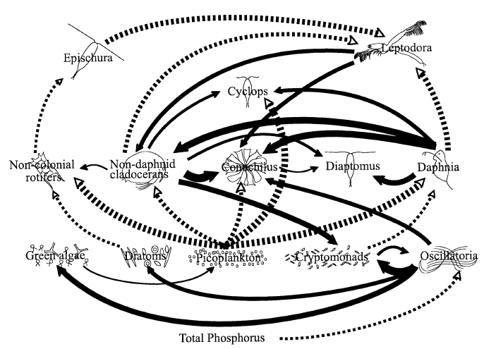
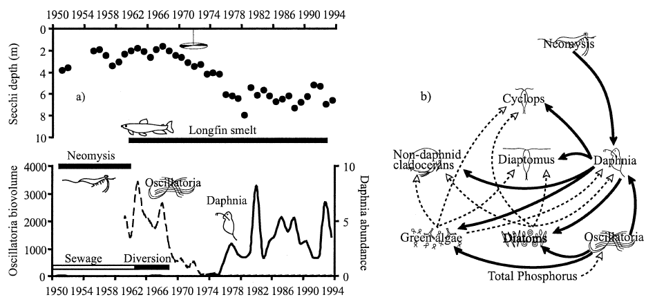

```{r echo=FALSE}
library(knitr)
library(MARSS)
```

```{r global-options, include=FALSE}
knitr::opts_chunk$set(fig.width=6, fig.height=4, out.width="500px", fig.align="center", echo=FALSE, warning=FALSE, message=FALSE)
```

##  Topics 

+ Multivariate AR(p) models
+ Modeling community species interactions with MAR models
```{r echo=FALSE}
library(png)
library(jpeg)
library(grid)
library(gridExtra)
img1 <-  rasterGrob(as.raster(readJPEG("assets/img/image2.jpeg")), interpolate = FALSE)
img2 <-  rasterGrob(as.raster(readPNG("assets/img/image1.png")), interpolate = FALSE)
grid.arrange(img1, img2, ncol = 2)
```

## Mean-reversion

```{r}
 
```


## Multivariate AR

Chapter 18 in MARSS User Guide.

A MAR(2) model is a lag-2 MAR model:
$$
\mathbf{x}^\prime_t = \mathbf{B}_1\mathbf{x}^\prime_{t-1} + \mathbf{B}_2\mathbf{x}^\prime_{t-2} + \mathbf{u} + \mathbf{w}_t, \text{ where } \mathbf{w}_t \sim \text{MVN}(0,\mathbf{Q})
$$

## MAR(2) as MARSS(1)

We rewrite this as MARSS(1) by defining 
$$
\mathbf{x}_t = \begin{bmatrix}\mathbf{x}^\prime_t \\ \mathbf{x}^\prime_{t-1}\end{bmatrix}
$$

$$
\begin{gathered}
\begin{bmatrix}\mathbf{x}^\prime_t \\ \mathbf{x}^\prime_{t-1}\end{bmatrix}
= \begin{bmatrix}\mathbf{B}_1 & \mathbf{B}_2 \\ \mathbf{I}_m & 0\end{bmatrix}
\begin{bmatrix}\mathbf{x}^\prime_{t-1} \\ \mathbf{x}^\prime_{t-2}\end{bmatrix}
+ \begin{bmatrix}\mathbf{u} \\ 0 \end{bmatrix}
+ \begin{bmatrix}\mathbf{w}_t\\ 0\end{bmatrix}\\
\begin{bmatrix}\mathbf{w}_t\\ 0\end{bmatrix} \sim  \text{MVN}\begin{pmatrix}0,\begin{bmatrix}\mathbf{Q} & 0 \\ 0 & 0 \end{bmatrix} \end{pmatrix} \\
 \begin{bmatrix}\mathbf{x}^\prime_0 \\ \mathbf{x}^\prime_{-1}\end{bmatrix} 
 \sim  \text{MVN}(\mu,\Lambda)  
\end{gathered}
$$

##

Our observations are of $\mathbf{x}_t$ only, so our observation model is
$$
\mathbf{y}_t 
= \begin{bmatrix}\mathbf{I}_m & 0 \end{bmatrix}
\begin{bmatrix}\mathbf{x}^\prime_t \\ \mathbf{x}^\prime_{t-1}\end{bmatrix}
$$

## Example AR(2): univariate data

$$
x_t = -1.5 x_{t-1} + -0.75 x_{t-2} + w_t, \text{ where } w_t \sim N(0,1)
$$

```{r, echo=TRUE}
set.seed(10)
TT <- 50
r <- 0; b1 <- -1.5; b2 <- -0.75; q <- 1
temp <- arima.sim(n = TT, 
          list(ar = c(b1, b2)), sd = sqrt(q))
sim.ar2 <- matrix(temp, nrow = 1)
```

##

Next, we set up the model in MARSS(1) form:

$$
\begin{bmatrix}x_t \\ x_{t-1}\end{bmatrix}
= \begin{bmatrix}b_1 & b_2 \\ 1 & 0\end{bmatrix}
\begin{bmatrix}x_{t-1} \\ x_{t-2}\end{bmatrix}
+ \begin{bmatrix}u \\ 0 \end{bmatrix}
+ \begin{bmatrix}w_t\\ 0\end{bmatrix}
$$

$$
\begin{bmatrix}w_t\\ 0\end{bmatrix} \sim \text{MVN}\begin{pmatrix}0,\begin{bmatrix}q & 0 \\ 0 & 0 \end{bmatrix} \end{pmatrix}
$$

$$
y_t 
= \begin{bmatrix}1 & 0 \end{bmatrix}
\begin{bmatrix}x_t \\ x_{t-1}\end{bmatrix}
$$

##

Note $x_0$.

```{r, echo=TRUE}
Z <- matrix(c(1, 0), 1, 2)
B <- matrix(list("b1", 1, "b2", 0), 2, 2)
U <- matrix(0, 2, 1)
Q <- matrix(list("q", 0, 0, 0), 2, 2)
A <- matrix(0, 1, 1)
R <- matrix(0, 1, 1)
mu <- matrix(sim.ar2[2:1], 2, 1)
V <- matrix(0, 2, 2)
model.list.2 <- list(
  Z = Z, B = B, U = U, Q = Q, A = A,
  R = R, x0 = mu, V0 = V, tinitx = 0
)
```

## Estimate the AR(2)

```{r results="hide", echo=TRUE}
ar2 <- MARSS(sim.ar2[3:TT], model = model.list.2)
```

Comparison to the true values.
```{r}
print(cbind(true = c(b1, b2, q), estimates = coef(ar2, type = "vector")))
```

## Missing values

Missing values in the data are fine.  

```{r results="hide", echo=TRUE}
gappy.data <- sim.ar2[3:TT]
gappy.data[floor(runif(TT / 2, 2, TT))] <- NA
ar2.gappy <- MARSS(gappy.data, model = model.list.2, fun.kf="MARSSkfss")
```

Estimates
```{r}
print(cbind(
  true = c(b1, b2, q),
  estimates.no.miss = coef(ar2, type = "vector"),
  estimates.w.miss = coef(ar2.gappy, type = "vector")))
```

## `arima()`

Fit with `arima()` function:
```{r, echo=TRUE}
fit <- arima(gappy.data, order = c(2, 0, 0), include.mean = FALSE)
coef(fit)
```
The estimates will be different because `arima` sets $\mathbf{x}_1^0$ as coming from the stationary distribution.  That is a non-linear constraint that MARSS cannot handle.

##

The assumption that $\mathbf{x}_1^0$ comes from the stationary distribution is fine if the initial $\mathbf{x}$ indeed comes from the stationary distribution, but if the initial $\mathbf{x}$ is well outside the stationary distribution the the estimates will be incorrect with `arima()`.


## Multivariate AR(2)

$$
\begin{bmatrix}
x_{1,t}\\
x_{1,t-1}\\
x_{2,t}\\
x_{2,t-1}
\end{bmatrix} =
\begin{bmatrix}
b_1&b_2&0&0\\
1&0&0&0\\
0&0&b_1&b_2\\
0&0&1&0
\end{bmatrix}
\begin{bmatrix}
x_{1,t-1}\\
x_{1,t-2}\\
x_{2,t-1}\\
x_{2,t-2}
\end{bmatrix}+
\begin{bmatrix}
w_{1,t}\\
0\\
w_{2,t}\\
0
\end{bmatrix}
$$

$$
\begin{bmatrix}
y_{1,t}\\
y_{2,t}
\end{bmatrix} =
\begin{bmatrix}
1&0&0&0\\
0&0&1&0
\end{bmatrix}
\begin{bmatrix}
x_{1,t}\\
x_{1,t-1}\\
x_{2,t}\\
x_{2,t-1}
\end{bmatrix}+
\begin{bmatrix}
v_{1,t}\\
v_{2,t}
\end{bmatrix}
$$

## B matrix for AR(1) errors

Detecting a signal from noisy sensors
[Chapter 14 lab book]( https://atsa-es.github.io/atsa-labs/chap-noisy-sensors-.html)

$$\begin{bmatrix}x \\ e_1 \\ e_2 \\ e_3\end{bmatrix}_t = \begin{bmatrix}1&0&0&0\\0&b_1&0&0 \\ 0&0&b_2&0 \\ 0&0&0&b_3\end{bmatrix}\begin{bmatrix}x \\ e_1 \\ e_2 \\ e_3\end{bmatrix}_{t-1} + \begin{bmatrix}w_x \\ w_1 \\ w_2 \\ w_3\end{bmatrix}_t
$$

$$\begin{bmatrix}w_x \\ w_1 \\ w_2 \\ w_3\end{bmatrix}_t \sim MVN\left(0, \begin{bmatrix}1&0&0&0\\0&q_1&0&0 \\ 0&0&q_2&0 \\ 0&0&0&q_3\end{bmatrix}\right)$$

data are demeaned. $a_t$ is the stochastic level.

$$\begin{bmatrix}y_1 \\ y_2 \\ y_3\end{bmatrix} = \begin{bmatrix}1&1&0&0 \\ 1&0&1&0 \\ 1&0&0&1\end{bmatrix} \begin{bmatrix}x \\ e_1 \\ e_2 \\ e_3\end{bmatrix}_t$$

## Using MAR(1) model species interactions

```{r}
 
```

##  Univariate Gompertz models 

$$x_t = b x_{t-1} + u + w_t$$

```{r}
 
```

##  Density dependence 

$$n_t = f(n_{t-1})$$

The shape of $f(n_{t-1})$ determines the dynamics of the system:

* stable or unstable equilibrium
* Speed at which equilibrium is approached
* Equilibrium level
* Sensitivity to perturbations


##

Exponential growth

$$n_t = n_{t-1} \text{exp}(u)$$
Density dependent growth

$$n_t = n_{t-1} \text{exp}(u + f(n_{t-1}))$$

Gompertz density dependent growth

$$n_t = n_{t-1} \text{exp}[u + (b-1)ln(n_{t-1}))]$$

##

```{r}
nt <- 1:100
b <- 0.8; u=-4
plot(nt, u+(b-1)*log(nt), type="l", ylab="growth rate", xlab="n(t)")
b <- 0.99
lines(nt, u+(b-1)*log(nt), col="red")
b <- 0.85
lines(nt, u+(b-1)*log(nt), col="blue")
text(99, u-0.1, "0.99")
text(99, u-0.6, "0.85")
```

## Gompertz model written in log space is AR(1) 

$$n_t = n_{t-1} \times \text{exp}[u + (b-1) \times ln(n_{t-1})]$$

$$ln(n_t) = ln(n_{t-1}) + u + (b-1) \times ln(n_{t-1})$$

$$ln(n_t) = u + b \times ln(n_{t-1})$$

$$x_t = u + b x_{t-1}$$

##   Properties of this model 

mean level = $u/(1-b)$


```{r}
 
```

##  Add stochasticity (process error) 

* $b=1$ random walk
* $-1<b<0$ 2-pt oscillation, mean = $u/(1-b)$
* $0<b<1$ mean reverting random walk, mean = $u/(1-b)$

```{r}
 
```

##  Equilibrium for the stochastic Gompertz process 


##  Equilibrium for the stochastic Gompertz process 

* It has a stationary distribution
* probability distribution of $X_t$ given $-1<b<1$
* Normally distributed with mean $\mu$ and variance $\sigma$

##  Basic features of the Gompertz process 


* Mean reverting, aka density-dependent
* Stationary, so it fluctuates around a mean
* Point equilibrium
   + as opposed to a cycle equilibrium like Lotka-Volterra (Lynx & hare) models you studied in Ecology 101
* Can be seen as a locally linear approximation of other types of density-dependent interaction models

"locally linear" = only holds for sure if $x$ doesn't change too much.  


##  Real systems do not necessarily have log-linear density-dependence 

If $x$ is not spanning very large values a linear model may suffice

Modern literature on Gompertz models can allow $b$ to be time-varying which allows that linear approximation to vary in time.


## Observation error

A known a problem for studies of density-dependence

obs error = spurious density-dependence 


```{r}
 
```

##  Estimating R matrix

Not so easy

```{r echo=FALSE, out.width="600px"}
library(png)
library(jpeg)
library(grid)
library(gridExtra)
img1 <-  rasterGrob(as.raster(readPNG("assets/img/image19.png")), interpolate = FALSE)
img2 <-  rasterGrob(as.raster(readPNG("assets/img/image18.png")), interpolate = FALSE)
grid.arrange(img1, img2, ncol = 2)
```


## But replication helps


```{r out.width="600px"}
 
```


## Predator-prey interactions

Moose & Wolf


```{r}
 
```

## Predator Prey interactions as a MAR(1)

$$x_m = u_m + b_{m \rightarrow m} \times x_m + b_{w \rightarrow m} \times x_w$$
$$x_w = u_w + b_{m \rightarrow w} \times x_m + b_{w \rightarrow w} \times x_w$$


##  B = interaction matrix 

MAR(1)

$$\mathbf{x}_t = \mathbf{B} \mathbf{x}_{t-1} + \mathbf{u} + \mathbf{w}_t$$

$$\mathbf{w}_t \sim MVN(0, \mathbf{Q})$$

$$\begin{bmatrix}x_m\\x_w\end{bmatrix}_t=
\begin{bmatrix}
b_{m \rightarrow m}&b_{w \rightarrow m}\\
b_{m \rightarrow 2}&b_{w \rightarrow w}
\end{bmatrix}
\begin{bmatrix}x_m\\x_w\end{bmatrix}_{t-1}+
\begin{bmatrix}u_m\\u_w\end{bmatrix}+
\begin{bmatrix}w_m\\w_w\end{bmatrix}_t$$

## Covariates

$$\begin{bmatrix}x_m\\x_w\end{bmatrix}_t=
\mathbf{B}
\begin{bmatrix}x_m\\x_w\end{bmatrix}_{t-1} +
\begin{bmatrix}u_m\\u_w\end{bmatrix} +
\mathbf{C}\mathbf{c}_t +
\begin{bmatrix}w_m\\w_w\end{bmatrix}_t$$

Now $\mathbf{w}_t$ is the variance not explained by the covariates.

##  Moose and Wolf example analysis 

Chapter 14: HWS18a Moose and Wolf example analysis

* data and images from www.isleroyalewolf.org
* Effect of winter snow and summer heat on moose and wolves.


```{r}
include_graphics("assets/img/image27.jpeg") 
```

##


```{r}
 
```

[www.isleroyalewolf.org](http://www.isleroyalewolf.org/)


##  Using MAR models to understand dynamics in larger communities 

* Hampton et al. (2006)

```{r}
 
```

## Using MAR models to  quantify stability 


```{r echo=FALSE}
library(png)
library(jpeg)
library(grid)
library(gridExtra)
img1 <-  rasterGrob(as.raster(readPNG("assets/img/image29.png")), interpolate = FALSE)
img2 <-  rasterGrob(as.raster(readJPEG("assets/img/image30.jpg")), interpolate = FALSE)
grid.arrange(img1, img2, ncol = 2)
```


##  Using MAR models to identify the important links 

* Hampton et al. (2006)

```{r}
 
```

##  MAR(1) Models 

* State equation
* Observation equation

$$\mathbf{x}_t = \mathbf{B}\mathbf{x}_{t-1} + \mathbf{u} + \mathbf{C}\mathbf{c}_t + \mathbf{w}_t, \,\, \mathbf{w}_t \sim \text{MVN}(0, \mathbf{Q})$$

$$\mathbf{y}_t = \mathbf{x}_t + \mathbf{v}_t, \,\, \mathbf{v}_t \sim \text{MVN}(0, \mathbf{R})$$
* More recent research is not restricted to Gaussian errors.


##  B matrix structure

* Intra-specific effects
* Inter-specific effects (can be set to zero)

$$\begin{bmatrix}
b_{11}&b_{12}&b_{13}&\dots&b_{1p}\\
b_{21}&b_{22}&b_{23}&\dots&b_{2p}\\
b_{31}&b_{32}&b_{33}&\dots&b_{3p}\\
\vdots&\vdots&\vdots&\ddots&\vdots\\
b_{p1}&b_{p2}&b_{p3}&\dots&b_{pp}
\end{bmatrix}$$


## MAR(1) models and plankton studies

```{r}
 
```

Many ecological applications are reviewed in
    Hampton, S.E., E.E. Holmes, D.E. Pendleton, L.P. Scheef , M.D. Scheuerell , and E.J. Ward. 2013. Quantifying effects of abiotic and biotic drivers on community dynamics with multivariate autoregressive (MAR) models. Ecology 94:2663-2669
    


##  Lake Washington

* a large change in sewage inputs in the late 1960s led to a dramatic change in the plankton community 
* Hampton et al. (2006)

```{r}
 
```

## MAR(1) Model

$p$ plankton species. Data demeaned.

$$\begin{bmatrix}x_1\\x_2\\ \vdots \\x_p\end{bmatrix}_t =
\begin{bmatrix}
b_{11}&b_{12}&\dots&b_{1p}\\
b_{21}&b_{22}&\dots&b_{2p}\\
\vdots&\vdots&\vdots&\vdots\\
b_{p1}&b_{p2}&\dots&b_{pp}
\end{bmatrix}
\begin{bmatrix}x_1\\x_2\\ \vdots \\x_p\end{bmatrix}_{t-1} +
\mathbf{C}\mathbf{c}_t +
\begin{bmatrix}w_1\\w_2\\\vdots\\w_p\end{bmatrix}_t$$

##  Multivariate AR(1) process 

Can add effects of $q$ different environmental covariates:

$$\begin{bmatrix}x_1\\x_2\\ \vdots \\x_p\end{bmatrix}_t =
\mathbf{B}
\begin{bmatrix}x_1\\x_2\\ \vdots \\x_p\end{bmatrix}_{t-1} +
\begin{bmatrix}
c_{11}&\dots&c_{1q}\\
c_{21}&\dots&c_{2q}\\
\vdots&\vdots&\vdots\\
c_{p1}&\dots&c_{pq}
\end{bmatrix}
\begin{bmatrix}c_1\\ \vdots\\c_q\end{bmatrix}_t +
\begin{bmatrix}w_1\\w_2\\\vdots\\w_p\end{bmatrix}_t$$

##  Multivariate AR(1) process 

* $\mathbf{x}_t$ is $p \times 1$ vector of species abundance at time $t$
* $\mathbf{u}$ is zero since data de-meaned.
* $\mathbf{B}$ is $p \times  p$ matrix of density-dependent effects
* $\mathbf{C}$ is $p \times  q$ matrix of covariate effects
* $\mathbf{c}_t$ is $q \times 1$ vector of covariate values at time $t$

## Extensions

*	How do community interactions change over time?
* How do we tease out interaction changes in the face of environmental changes?
* How to deal with observation errors?


##  State-space model 

$$\mathbf{x}_t = \mathbf{B} \mathbf{x}_{t-1} + \mathbf{u} + \mathbf{C} \mathbf{c}_{t} + \mathbf{w}_t, \,\,\,\, \mathbf{w}_t \sim MVN(0, \mathbf{Q})$$

$$\mathbf{y}_t = \mathbf{x}_{t} + \mathbf{v}_t, \,\,\,\, \mathbf{v}_t \sim MVN(0, \mathbf{R})$$

##  Time-varying interactions 

$$\mathbf{x}_t = \mathbf{B}_t \mathbf{x}_{t-1} + \mathbf{u} + \mathbf{C} \mathbf{c}_{t} + \mathbf{w}_t, \,\,\,\, \mathbf{w}_t \sim MVN(0, \mathbf{Q})$$


##  Multiple observations

* Multiple observations of individual species
* Multiple observations of the whole community


$$\mathbf{y}_t = \mathbf{Z}\mathbf{x}_{t} + \mathbf{a} + \mathbf{v}_t, \,\,\,\, \mathbf{v}_t \sim MVN(0, \mathbf{R})$$

## Replicate study sites

$$\begin{bmatrix}
\mathbf{x}_A\\
\mathbf{x}_B\end{bmatrix}_t = 
\begin{bmatrix}\mathbf{B}&0\\0&\mathbf{B}\end{bmatrix} \begin{bmatrix}
\mathbf{x}_A\\
\mathbf{x}_B\end{bmatrix}_{t-1} + \begin{bmatrix}
\mathbf{u}_A\\
\mathbf{u}_B\end{bmatrix} + \begin{bmatrix}
\mathbf{C}\\
\mathbf{C}\end{bmatrix}\mathbf{c}_{t} + \begin{bmatrix}
\mathbf{w}_A\\
\mathbf{w}_B\end{bmatrix}_t$$

$$\mathbf{w}_t \sim MVN\left(0, \begin{bmatrix}\mathbf{Q}_A&0\\0&\mathbf{Q}_B\end{bmatrix}\right)$$

$$\mathbf{y}_t = \mathbf{x}_{t} + \mathbf{v}_t, \,\,\,\, \mathbf{v}_t \sim MVN(0, \mathbf{R})$$

##  Stability 

Ives et al (2003) Ecology

```{r}
 
```

##  Stationary distribution for MAR(1) 

Mean vector

$$\mathbf{\mu}_\infty = (1-\mathbf{B})^{-1}\mathbf{u}$$


Covariance matrix

$$\text{vec}(\Sigma_\infty) = (1-\mathbf{B}\otimes\mathbf{B})\text{vec}(\mathbf{Q})$$


The theory in this part of the lecture draws from

*Ives AR, Dennis B, Cottingham KL, Carpenter SR. 2003. Estimating community stability and ecological interactions from time series data. Ecological Monographs 73: 301-330*

##  Stability properties of MAR(1) models 

Our interest is in stable systems
(i.e. all eigenvalues of B lie within unit circle)

Stability can be measured in several ways, but here are three that we  will use:

* **Variance** variance of the stationary distribution is low relative to that for the process error
* **Return rate** rapid approach to the stationary distribution (i.e. high return rate)
* **Reactivity** fewer departures from the mean of the stationary distribution (i.e. low reactivity)

##  Return rates


```{r}
 
```

## Return rates

In stochastic models, equilibrium is the stationary distribution

Rate of return to the stochastic equilibrium is the rate at which the transition distribution converges to the stationary distribution from an initial, known value

The more rapid the convergence, the more stable the system

Rate of return to mean governed by dominant eigenvalue of $\mathbf{B}$: `eigen(B)`.

Take home msg : If we can estimate $\mathbf{B}$, we can say something about the stability of the system as measure by return rate.


##  Reactivity

Not how fast does it return but how far does it go?


```{r}
 
```

##  Reactivity

A reactive system moves away from a stable equilibrium following a perturbation, even though the system will eventually return to equilibrium.

High reactivity occurs when species interactions greatly amplify the environmental forcing

A bit harder to compute. Function of $\mathbf{B}$ and $\mathbf{Q}$.

##  Variance comparison

Generally interested in the time spent away from equilibrium after a perturbation. Combines both return rate and reactivity.

Function of $\mathbf{B}$ and $\mathbf{Q}$

```{r}
 
```


##  Lake WA changes in stability 

Francis TB, Wolkovich EM, Scheuerell MD, Katz SL, Holmes EE, et al. (2014) Shifting Regimes and Changing Interactions in the Lake Washington, U.S.A., Plankton Community from 1962?1994. PLOS ONE 9(10): e110363. 

```{r out.width="600px"}
 
```

##


```{r}
 
```


##


```{r}
 
```

##  Finding the important structure 


```{r}
 
```

##

```{r}
 
```

##  Goal to add 0s to B 

$$\begin{bmatrix}
b_{11}&b_{12}&b_{13}&b_{14}\\
b_{21}&b_{22}&b_{23}&b_{24}\\
b_{31}&b_{32}&b_{33}&b_{34}\\
b_{41}&b_{42}&b_{43}&b_{44}
\end{bmatrix}$$

$$\begin{bmatrix}
b_{11}&0&&b_{14}\\
0&b_{22}&b_{23}&b_{24}\\
b_{31}&0&b_{33}&0\\
b_{41}&0&b_{43}&b_{44}
\end{bmatrix}$$


##  Search strategy for large model spaces 

* Exhaustive search
* Algorithms to find best model over all possible variable combinations without actually doing exhaustive search.
* Forward step-wise
    + Start with no off-diagonal $b$ terms. Add the b that most improves (reduces) model AIC
    + Stop at some step-AIC threshold
* Backward step-wise
    + Same as forward but start with full model (all $b$s)


## MARSS User Guide example

Repeat the analyses of Ives et al (2003).

```{r}
 
```

## Lab

* HMMs
* Bayesian MARSS models


