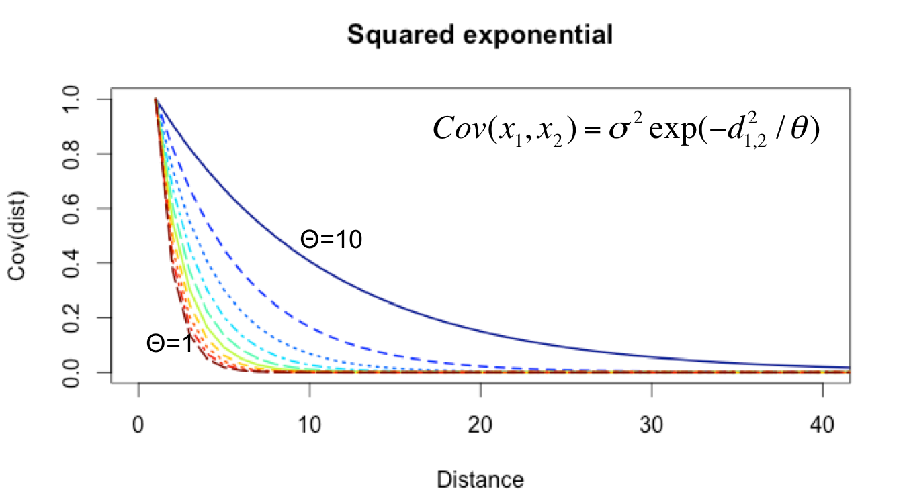
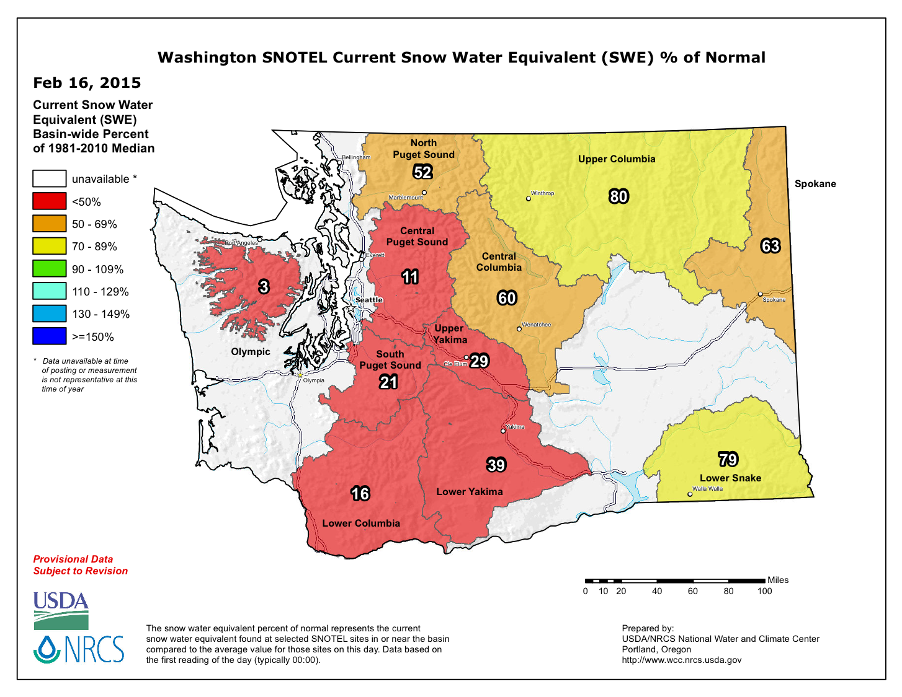
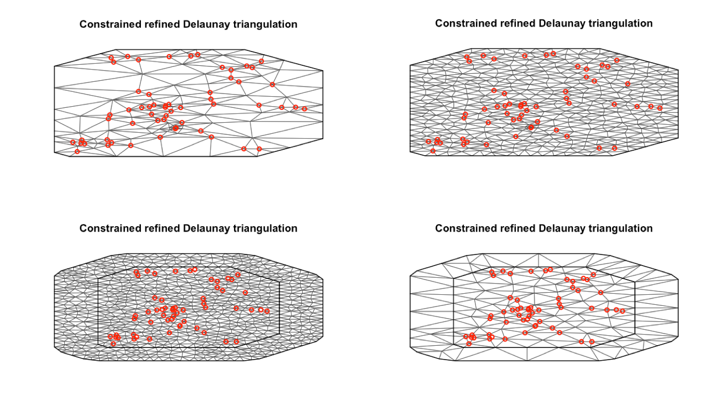

```{r setup, include=FALSE}
knitr::opts_chunk$set(echo = FALSE, warning=FALSE, 
                      message=FALSE, results='hide',
                      fig.align = 'center')
library(ggplot2)
library(dplyr)
library(forecast)
library(lubridate)
library(MARSS)
library(fields)
library(mgcv)
library(glmmfields)
library(viridis)
library(tidyr)
devtools::install_github("pbs-assess/sdmTMB")
library(sdmTMB)
```

## What we’ve learned so far

* Time series can be useful for identifying structure, improving precision, and accuracy of forecasts 

* Modeling multivariate time series
    - e.g. MARSS() function, with each observed time series mapped to a single discrete state

* Using DFA 
    - Structure determined by factor loadings

## Response generally the same variable (not separate species)

* Making inference about population as a whole involves jointly modeling 
both time series

```{r echo=FALSE, fig.height=4.2}
set.seed(123)
y = cumsum(rnorm(100))
df = data.frame("Time"=1:100,
    "y" = cumsum(rnorm(100)),
    "Series"=1)
df2 = data.frame("Time"=1:100,
    "y" = df$y + 5 + rnorm(1:100,0,1),
    "Series"=2)
df = rbind(df,df2)
df$Series = as.factor(df$Series)
ggplot(df, aes(Time,y,group=Series,col=Series)) +
  geom_line(size=2) + theme_bw() + 
  scale_color_viridis(discrete=TRUE,end=0.8) + 
  theme(legend.position = "none")

```

## Lots of time series -> complicated covariance matrices

* Last week, in talking about Gaussian process models, we showed the number of covariance matrix parameters = $m*(m+1)/2$
    - problematic for > 5 or so time series
    
* MARSS solutions: diagonal matrices or 'equalvarcov'

* DFA runs into same issues with estimating unconstrained $R$ matrix

## Potential problems with both the MARSS and DFA approach

* Sites separated by large distances may be grouped together

* Sites close to one another may be found to have very different dynamics

<div style="text-align: center">

## Are there biological mechanisms that may explain this?

* Puget Sound Chinook salmon
    - 21 populations generally cluster into 2-3 groups based on genetics
    - Historically large hatchery programs

* Hood canal harbor seals
    - Visited by killer whales

```{r echo=FALSE, fig.height = 2.5}
data(harborSealWA)
harborSealWA = pivot_longer(data = as.data.frame(harborSealWA), 
        !Year,names_to = "Region", values_to="Count")

ggplot(harborSealWA, aes(Year,Count,group=Region,col=Region)) +
  geom_line(size=2) + theme_bw() + 
  scale_color_viridis(discrete=TRUE,end=0.8) + geom_point(size=4,alpha=0.6)
```

## Motivation of explicitly including spatial structure

* Adjacent sites can be allowed to covary 

* Estimated parameters greatly reduced to 2-5

## Types of spatial data

Point referenced data (aka geostatistical)

* Typically 2-D, but could be 1-D or 3-D (depth, altitude)
* May be fixed station or random (e.g. trawl surveys)

Point pattern data

* Spatially referenced based on outcomes (e.g. presence)
* Inference focused on describing clustering (or not)

Areal data

* Locations occur in blocks
* counties, management zones, etc.

## Areal data: Seattle Council Districts


## Computationally convenient approaches

CAR (conditionally autoregressive models)

* Better suited for Bayesian methods
* Goal of both is to write the distribution of a single prediction analytically in terms of the joint (y1, y2)

SAR (simultaneous autregressive models)

* Better suited for ML methods
* Simultaneously model distribution of predicted values

‘Autoregressive’ in the sense of spatial dependency / correlation between locations

## CAR models (Besag 1991)

$${ Y }_{ i }=B{ X }_{ i }+{ \phi  }_{ i }+{ \varepsilon  }_{ i }$$

${ X }_{ i }$ are predictors (regression) 
${ \phi  }_{ i }i$ spatial component, (aka markov random field)
${ \varepsilon  }_{ i }$ residual error term

* Create spatial adjacency matrix W, based on neighbors, e.g. 
* W(i,j) = 1 if neighbors, 0 otherwise
* W often row-normalized (rows sum to 1)
* Diagonal elements W(i,i) are 0

## Adjacency matrix example


## CAR models

In matrix form, 

$$
\begin{gathered}
\phi\sim N\left( 0,{ \left( I-\rho W \right)  }^{ -1 }\widetilde { D }  \right) \\ { \widetilde { D }  }_{ ii }={ \sigma  }_{ i }
\end{gathered}
$$

* Implemented in 'spdep', 'CARBayes', etc 

## CAR models

* Each element has conditional distribution dependent on others,  

$\phi_i \mid \phi_j, \sim \mathrm{N} \left( \sum_{j = 1}^n W_{ij} \phi_j, {\sigma}^2 \right)$ for $j \neq i$

## SAR models

* Simultaneous autoregressive model

$$
\begin{gathered}
\phi \sim N\left( 0,{ \left( I-\rho W \right)  }^{ -1 }\widetilde { D } { \left( I-\rho W \right)  }^{ -1 } \right) \\ 
{ \widetilde { D }  }_{ ii }={ \sigma  }_{ i }
\end{gathered}
$$

* Remember that the CAR was

$$
\begin{gathered}
\phi \sim N\left( 0,{ \left( I-\rho W \right)  }^{ -1 }\widetilde { D }  \right) \\ 
{ \widetilde { D }  }_{ ii }={ \sigma  }_{ i }
\end{gathered}
$$  
  
  
## Example adjacency matrix

* $I-\rho W$

* Example $W$ matrix,  

```{r echo=FALSE, results='markdown'}
W = matrix(0,3,3)
W[1,2] <- W[2,1] <- 1
W[2,3] <- W[3,2] <- 1
print(W)
```  

## Example adjacency matrix

* $(I-0.3 W)$, $\rho=0.3$

```{r echo=FALSE, results='markdown'}
W = matrix(0,3,3)
W[1,2] <- W[2,1] <- 1
W[2,3] <- W[3,2] <- 1
print(diag(3)-0.3*W)
```

## Example adjacency matrix

* $(I-0.3 W)\widetilde { D }$
* Let's assume same variance ~ 0.1
* D = diag(0.1,3)
```{r echo=FALSE, results='markdown'}
W = matrix(0,3,3)
W[1,2] <- W[2,1] <- 1
W[2,3] <- W[3,2] <- 1
print((diag(3)-0.3*W)%*%diag(0.1,3))
```

## Commonalities of both approaches

* Adjacency matrix W can also instead be modified to include distance

* Models spatial dependency as a function of single parameter $\rho$

* Models don’t include time dimension in spatial field
    - One field estimated for all time steps
    - How could we do this? 

## brms() includes both approaches

```{r eval = FALSE, echo=TRUE}
?brms::sar
?brms::car
```

## General challenge with CAR and SAR models

Wall (2004) "A close look at the spatial structure implied by the CAR and SAR models". 

* Note: not a 1-to-1 mapping of distance and correlation

<div style="text-align: center">

## Alternative to CAR & SAR

* model elements of Q as functions
* Create matrix D, as pairwise distances
* This can be 1-D, or any dimension
    - We’ll use Euclidian distances for 2-D

<div style="text-align: center">

## Squared exponential covariance

```{r eval =FALSE}
set.seed(123)
theta = 1
x = seq(0,99)
mat = matrix(0, 100, 10)
for(i in 1:10) {
  mat[,i] = exp(-(i/10)*x)
}
matplot(mat,type="l",col=tim.colors(10),lwd=2,xlim=c(0,40),ylab="Cov(dist)",xlab="Distance",main="Squared exponential")
```

<div style="text-align: center">

## Squared exponential covariance

<div style="text-align: center">

## Which covariance kernel to choose? 

```{r echo=FALSE}
set.seed(123)
s1 = sim_glmmfields(n_draws = 1, covariance="squared-exponential")
set.seed(123)
s2 = sim_glmmfields(n_draws = 1, covariance="exponential")
set.seed(123)
s3 = sim_glmmfields(n_draws = 1, covariance="matern", matern_kappa=2.5)

p1 = s1$plot + theme_bw() + geom_point(size=5) + ggtitle("Gaussian")
p2 = s2$plot + theme_bw() + geom_point(size=5) + ggtitle("Exponential")
p3 = s3$plot + theme_bw() + geom_point(size=5) + ggtitle("Matern")
gridExtra::grid.arrange(p1,p2,p3,nrow=2)
```

## Which covariance kernel to choose? 

```{r}
avg = (p1$data$y+p2$data$y+p3$data$y)/3

s1$plot$data$y = s1$plot$data$y - avg
s2$plot$data$y = s2$plot$data$y - avg
s3$plot$data$y = s3$plot$data$y - avg

p1 = s1$plot + theme_bw() + geom_point(size=5) + ggtitle("Gaussian")
p2 = s2$plot + theme_bw() + geom_point(size=5) + ggtitle("Exponential")
p3 = s3$plot + theme_bw() + geom_point(size=5) + ggtitle("Matern")
gridExtra::grid.arrange(p1,p2,p3,nrow=2)

```


## Considerations for time series models

Should spatial dependency be included?
If so, how to model it? 

* Constant
* Time varying
* Autoregressive
* Random walk
* Independent variation

## Model-based geostatistical approaches

1. Generalized least squares

2. Bayesian methods in spBayes, glmmfields

3. INLA models

4. Spatial GAMs

5. TMB (VAST, sdmTMB)

## Method 1: using gls()

* Generalized least squares function
  + similar syntax to lm, glm, etc.

* Flexible correlation structures
  + corExp()
  + corGaus()
  + corLin()
  + corSpher()

* Allows irregularly spaced data / NAs
  + unlike Arima(), auto.arima(), etc.

## WA Snotel sites

<div style="text-align: center">

## Modeling WA Snotel data

We’ll use Snow Water Equivalent (SWE) data in Washington state

70 SNOTEL sites

* we’ll focus only on Cascades

1981-2013

Initially start using just the February SWE data

1518 data points (only 29 missing values!)

## Use AIC to evaluate different correlation models

```{r echo = TRUE, eval=FALSE}
mod.exp = gls(Feb ~ elev, 
  correlation = corExp(form=~lat+lon,nugget=T), 
  data = y[which(is.na(y$Feb)==F & y$Water.Year==2013),])
AIC(mod.exp) = 431.097

mod.gaus = gls(Feb ~ elev, 
  correlation = corGaus(form=~lat+lon,nugget=T), 
  data = y[which(is.na(y$Feb)==F & y$Water.Year==2013),])
AIC(mod.gaus) = 433.485

```

## Diagnostics: fitting variograms

```{r echo = TRUE, eval = FALSE}
var.exp <- Variogram(mod.exp, form =~ lat+lon)
plot(var.exp,main="Exponential",ylim=c(0,1))

var.gaus <- Variogram(mod.gaus, form =~ lat+lon)
plot(var.gaus,main="Gaussian",ylim=c(0,1))
```

## Exponential variogram

Semivariance = $0.5 \quad Var({x}_{1},{x}_{2})$  
Semivariance = Sill - $Cov({x}_{1},{x}_{2})$

<div style="text-align: center">

## Gaussian variogram

<div style="text-align: center">

## Extensions of these models

corExp and corGaus spatial structure useful for wide variety of models / R packages

Linear/non-linear mixed effect models

* lme() / nlme() in nlme package

Generalized linear mixed models

* glmmPQL() in MASS package

Generalized additive mixed models

* gamm() in mgcv package

## Method 2: GAMs

Previous approaches modeled errors (or random effects) as correlated

* Spatial GAMs generally model mean as spatially correlated

## Example with SNOTEL data

```{r}
d = read.csv("SNOTEL_Washington_1981_2013.csv")
d = d[,c("Station.Id","Station.Name","Water.Year","Feb")]
meta = read.csv("SNOTEL_metadata.csv")
d = dplyr::left_join(d, meta)
```

First a simple GAM, with latitude and longtide. 

* Note we're not transforming to UTM, but probably should
* Note we're not including tensor smooths te(), but probably should

```{r echo=TRUE}
d = dplyr::filter(d, !is.na(Water.Year), !is.na(Feb)) 
mod = gam(Feb ~ s(Water.Year) + 
    s(Longitude, Latitude), data=d)
d$resid = resid(mod)
```

## Ok, let's look at the residuals

First, residuals through time

```{r}
ggplot(d, aes(Water.Year, resid)) + geom_point(alpha = 0.5)+ 
  geom_smooth() +
  theme_bw() + 
  ylab("Residuals, Y - E[Y]")
```

## Now residuals spatially

* We'll use a subset of years here 

```{r}
ggplot(dplyr::filter(d, Water.Year %in% seq(1981,2013,4)), aes(Longitude, Latitude, col=resid)) + geom_point()+
  facet_wrap(~Water.Year) + scale_colour_gradient2() + theme_dark() + 
  ylab("Residuals, Y - E[Y]")
```

## Two ways to include spatio-temporal interactions

* What do these interactions mean in the context of our SNOTEL data?

1. First, spatial field may vary by year

```{r echo=TRUE, eval=FALSE}
mod2 = gam(Feb ~ s(Water.Year) + 
    s(Longitude, Latitude, by=as.factor(Water.Year)), data=d)
d$resid = resid(mod2)
```

## Two ways to include spatio-temporal interactions

2. Spatial effect may be continuous and we can include space-time interaction

* Why ti() instead of te() ? ti() only is the interaction where te() includes the main effects

```{r echo=TRUE, eval=FALSE}
mod2 = gam(Feb ~ s(Longitude, Latitude) + s(Water.Year) + 
    ti(Longitude, Latitude,Water.Year, d=c(2,1)), data=d)
d$resid = resid(mod2)
```

## GAM extensions and resources

Quickly evolving features for spatio-temporal models

* Random effects [gamm](https://www.rdocumentation.org/packages/mgcv/versions/1.8-34/topics/gamm)
* Interface with inla [ginla](https://www.rdocumentation.org/packages/mgcv/versions/1.8-33/topics/ginla)
* Bayesian estimation [bam](https://www.rdocumentation.org/packages/mgcv/versions/1.8-33/topics/bam)

Lots of detailed examples and resources

*e.g. ESA workshop by Simpson/Pederson/Ross/Miller

https://noamross.github.io/mgcv-esa-workshop/

## Potential limitations of spatial GAMs

* Hard to specify covariance structure explicitly

* Hard to add constraints, like making spatial field be an AR(1) process

* Motivates more custom approaches

## Bayesian: spBayes

Slightly more complicated syntax:

Specify:

* Priors on parameters
* Tuning parameters for Metropolis sampling (jumping variance)
* Starting / initial values
* Covariance structure (“exponential”, “gaussian”, “matern”, etc)
* Number of MCMC iterations / burn-in, etc.

## Example with SNOTEL data

```{r echo=TRUE, eval=FALSE}
# This syntax is dependent on model parameters. See vignette
priors <- list("beta.Norm"=list(rep(0,p), 
  diag(1000,p)), "phi.Unif"=c(3/1, 3/0.1), 
  "sigma.sq.IG"=c(2, 2), "tau.sq.IG"=c(2, 0.1))

# Phi is spatial scale parameter, sigma.sq is spatial variance, 
# tau.sq = residual
starting <- list("phi"=3/0.5, "sigma.sq"=50, "tau.sq"=1)

# variance of normal proposals for Metropolis algorithm
tuning <- list("phi"=0.1, "sigma.sq"=0.1, "tau.sq"=0.1)

m.1 <- spLM(y~X-1, coords=cords, 
  n.samples=10000, 
  cov.model = "exponential", priors=priors, 
  tuning=tuning, starting=starting)
```

## Coefficients need to be extracted

```{r echo=TRUE, eval=FALSE}
##recover beta and spatial random effects
burn.in <- 5000
m.1 <- spRecover(m.1, start=burn.in, verbose=FALSE)
```

<div style="text-align: center">

## Standard MCMC diagnostics

Output is of class ‘mcmc’

<div style="text-align: center">

## Method 3: glmmfields

* New R package that implements these models using Stan and Gaussian predictive process models

* Easy to use formula syntax like gam() or spBayes()

* Allows spatial field to be modeled with Multivariate-T field, as alternative to Multivariate-Normal to better capture extremes

* Also includes lots of non-normal responses for observation model

## glmmfields

Let's start with a simple model. This includes only 6 knots (probably way too few) and 100 iterations (too few!) for run time. 

* Time set to NULL here to fit a model with constant spatial field

```{r echo = TRUE, eval=FALSE}
m <- glmmfields(Feb ~ 0, time = NULL,
 lat = "Latitude", lon = "Longitude", data = d,
 nknots = 6, iter = 100, chains = 2, seed = 1)
```

## glmmfields

Ok, now let's change the covariance function to matern, and estimate separate spatial fields by year. 

* The 'estimate_ar' argument is important for determining whether the field is an AR(1) process or independent by year 

```{r echo = TRUE, eval=FALSE}
m <- glmmfields(Feb ~ 0, time = "Water.Year",
 lat = "Latitude", lon = "Longitude", covariance="matern",
  data = d, nknots = 6, iter = 100, chains = 2, seed = 1,
  estimate_ar=FALSE)
```

## glmmfields

Finally let's include an example with modeling the spatial field as a Multivariate-t distribution

* We do this with the 'estimate_df' argument 

```{r echo = TRUE, eval=FALSE}
m <- glmmfields(Feb ~ 0, time = "Water.Year",
 lat = "Latitude", lon = "Longitude", covariance="matern",
  data = d, nknots = 6, iter = 100, chains = 2, seed = 1,
  estimate_AR=FALSE, estimate_df= TRUE)
```

## Method 4: INLA

GP spatial models are extremely powerful

* May get overwhelmed by number of points

* Approaches to incorporate knots using sparse covariance matrices

* Integrated Nested Laplace Approximation - not on CRAN
```{r eval=FALSE}
install.packages("INLA",repos=c(getOption("repos"),
      INLA="https://inla.r-inla-download.org/R/stable"), dep=TRUE)
```


## Motivation of INLA

Some problems contain simple spatial structure
e.g. the harbor seal data in MARSS() with only 5 – 7 time series

Others are much more complex

* WA SWE data
* Fisheries survey data (1000s of points)

Including time-varying spatial fields becomes very computationally difficult

Doing all of the above in a Bayesian setting can be prohibitive, but we can use Laplace approximation

## Varying spatial fields example: eulachon-shrimp bycatch

<div style="text-align: center">

## INLA's approximation: SNOTEL data

How many points fall on vertices? Is the boundary area large enough? Choosing this must be done very carefully! 
```{r eval=FALSE, echo=TRUE}
INLA::meshbuilder
```

<div style="text-align: center">

## Estimation done via maximum likelihood

* Estimates seems similar to those from gls() and spBayes()
* Year included as numeric here (not significant)
* Alternatively, we can include year in spatial field
* Year can also be included as factor

<div style="text-align: center">

## Projecting INLA estimates to surface

<div style="text-align: center">

## Spatial SWE fields by year

<div style="text-align: center">

## Implementation in sdmTMB

```{r}
snow_spde <- make_mesh(d, c("Longitude", "Latitude"), n_knots=25)
fit <- sdmTMB(Feb ~ 1, spde = snow_spde, data=d)
```


## Modeling intervention effects with spatial models

How do we model change points / break points in the mean in regression, ARIMA models, or GAMs?

```{r echo=TRUE, eval = FALSE}
lm(Feb ~ Water.Year)
gam(Feb ~ s(Water.Year))
auto.arima(Feb, xreg=Water.Year)
```

## Modeling intervention effects with spatial models

How do we model change points / break points in the mean in regression, ARIMA models, or GAMs?

```{r echo=TRUE, eval = FALSE}
lm(Feb ~ Water.Year)
gam(Feb ~ s(Water.Year))
auto.arima(Feb, xreg=Water.Year)
```

* Use indicator functions before / after breakpoint

## Example: modeling spatiotemporal responses of fish to oil spills

[Ward et al. 2018](https://link.springer.com/article/10.1007%2Fs10661-018-6912-z)

2 approaches for looking at effects:

* indicator / change point associated with the spill

* Or post-hoc approach to look at changes in spatial variability post-spill
    - why: lagged effects, non-stationary spatial effects
    
## Example: modeling spatiotemporal responses of fish to oil spills

<div style="text-align: center">

## Example: modeling spatiotemporal responses of fish to oil spills

<div style="text-align: center">
