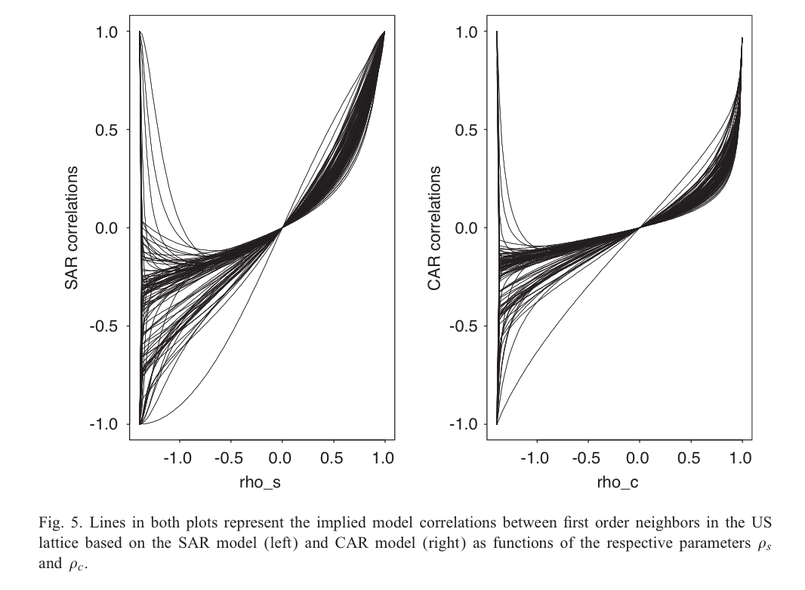

```{r setup, include=FALSE}
knitr::opts_chunk$set(echo = FALSE, warning=FALSE, 
                      message=FALSE, results='hide',
                      fig.align = 'center')
library(ggplot2)
library(dplyr)
library(forecast)
library(lubridate)
library(MARSS)
```

## What we’ve learned so far

* Time series can be useful for identifying structure, improving precision, and accuracy of forecasts 

* Modeling multivariate time series
    - e.g. MARSS() function, with each observed time series mapped to a single discrete state

* Using DFA 
    - Structure determined by factor loadings

## Response generally the same variable (not separate species)

* Making inference about population as a whole involves modeling 
pink as well as blue time series

```{r echo=FALSE, fig.height=4.2}
y = cumsum(rnorm(100))

plot(y, type="l",col="blue1",lwd=3,ylim=c(-7,15),ylab="Response", xlab= "Time")
y2 = y + 5 + rnorm(length(y),0,1)
y2[sample(seq(1,length(y2)),size=65,replace=F)]=NA
points(y2,col="tomato1",lwd=3)

```

## Lots of time series -> complicated covariance matrices

* Last week, in talking about Gaussian process models, we showed the number of covariance matrix parameters = $m*(m+1)/2$
    - problematic for > 5 or so time series
    
* MARSS solutions: diagonal matrices or 'equalvarcov'

* DFA runs into same issues with estimating unconstrained $R$ matrix

## Potential problems with both the MARSS and DFA approach

* Sites separated by large distances may be grouped together

* Sites close to one another may be found to have very different dynamics

<!-- .element height="10%" width="10%" -->

## Are there biological mechanisms that may explain this?

* Puget Sound Chinook salmon
    - 21 populations generally cluster into 2-3 groups based on genetics
    - Historically large hatchery programs

* Hood canal harbor seals
    - Visited by killer whales

```{r echo=FALSE, fig.height = 2.5}
data(harborSealWA)

matplot(harborSealWA[,1], harborSealWA[,-1],type="b", xlab="Year", ylab="ln (count)")
```

## Motivation of explicitly including spatial structure

* Adjacent sites can be allowed to covary 

* Estimated parameters greatly reduced to 2-5

## Types of spatial data

Point referenced data (aka geostatistical)

* Typically 2-D, but could be 1-D or 3-D (depth, altitude)
* May be fixed station or random (e.g. trawl surveys)

Point pattern data

* Spatially referenced based on outcomes (e.g. presence)
* Inference focused on describing clustering (or not)

Areal data

* Locations occur in blocks
* counties, management zones, etc.

## Computationally convenient approaches

CAR (conditionally autoregressive models)

* Better suited for Bayesian methods
* Goal of both is to write the distribution of a single prediction analytically in terms of the joint (y1, y2)

SAR (simultaneous autregressive models)

* Better suited for ML methods
* Simultaneously model distribution of predicted values

‘Autoregressive’ in the sense of spatial dependency / correlation between locations

## CAR models (Besag 1991)

$${ Y }_{ i }=B{ X }_{ i }+{ \phi  }_{ i }i+{ \varepsilon  }_{ i }$$

${ X }_{ i }$ are predictors (regression) 
${ \phi  }_{ i }i$ spatial component, (aka markov random field)
${ \varepsilon  }_{ i }$ residual error term

* Create spatial adjacency matrix W, based on neighbors, e.g. 
* W(i,j) = 1 if neighbors, 0 otherwise
* W often row-normalized (rows sum to 1)

## Adjacency matrix example


## CAR models

## SAR models

* Simultaneous autoregressive model


* Remember that the CAR was

$${ y\sim N\left( 0,{ \left( I-\rho W \right)  }^{ -1 }\widetilde { D }  \right) \\ { \widetilde { D }  }_{ ii }={ \sigma  }_{ i } }$$


## Commonalities of both approaches

* Adjacency matrix W can also instead be modified to include distance

* Models spatial dependency as a function of single parameter $\rho$

* Models don’t include time dimension in spatial field
    - One field estimated for all time steps

## Problems with these approaches

Wall (2004) "A close look at the spatial structure implied by the CAR and SAR models"

