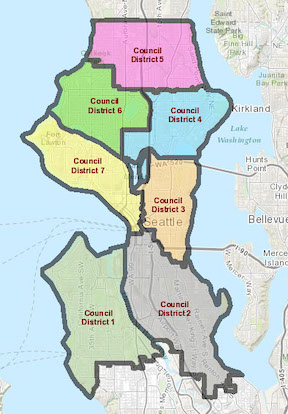

```{r setup, include=FALSE}
knitr::opts_chunk$set(echo = FALSE, warning=FALSE, 
                      message=FALSE, results='hide',
                      fig.align = 'center')
library(ggplot2)
library(dplyr)
library(lubridate)
library(MARSS)
library(viridis)
library(tidyr)
library(sdmTMB)
```

## What we’ve learned so far

-   Time series can be useful for identifying structure, improving precision, and accuracy of forecasts

-   Modeling multivariate time series

    -   e.g. MARSS() function, with each observed time series mapped to a single discrete state

-   Using DFA

    -   Structure determined by factor loadings

## Response generally the same variable (not separate species)

-   Making inference about population as a whole involves jointly modeling both time series

```{r echo=FALSE, fig.height=4.2}
set.seed(123)
y = cumsum(rnorm(100))
df = data.frame("Time"=1:100,
    "y" = cumsum(rnorm(100)),
    "Series"=1)
df2 = data.frame("Time"=1:100,
    "y" = df$y + 5 + rnorm(1:100,0,1),
    "Series"=2)
df = rbind(df,df2)
df$Series = as.factor(df$Series)
ggplot(df, aes(Time,y,group=Series,col=Series)) +
  geom_line(size=2) + theme_bw() + 
  scale_color_viridis(discrete=TRUE,end=0.8) + 
  theme(legend.position = "none")

```

## Lots of time series -\> complicated covariance matrices

-   For unconstrained covariance matrices, the number of covariance matrix parameters = $m*(m+1)/2$

    -   problematic for m \> 5 or so

-   MARSS solutions: diagonal matrices or 'equalvarcov'

-   DFA runs into same issues with estimating unconstrained $R$ matrix

## Potential problems with both the MARSS and DFA approach

-   Sites separated by large distances may be grouped together

-   Sites close to one another may be found to have very different dynamics

## Are there biological mechanisms that may explain this?

-   Puget Sound Chinook salmon
    -   21 populations generally cluster into 2-3 groups based on genetics
    -   Historically large hatchery programs
-   Hood canal harbor seals
    -   Visited by killer whales

```{r echo=FALSE, fig.height = 2.5}
data(harborSealWA)
harborSealWA = pivot_longer(data = as.data.frame(harborSealWA), 
        !Year,names_to = "Region", values_to="Count")

ggplot(harborSealWA, aes(Year,Count,group=Region,col=Region)) +
  geom_line(size=2) + theme_bw() + 
  scale_color_viridis(discrete=TRUE,end=0.8) + geom_point(size=4,alpha=0.6)
```

## Motivation of explicitly including spatial structure

-   Adjacent sites can be allowed to covary

-   Estimated parameters greatly reduced to 2-5

## Types of spatial data

Point referenced data (aka geostatistical)

-   Typically 2-D, but could be 1-D or 3-D (depth, altitude)
-   May be fixed station or random (e.g. trawl surveys)

Point pattern data

-   Spatially referenced based on outcomes (e.g. presence)
-   Inference focused on describing clustering (or not)

Areal data

-   Locations occur in blocks
-   counties, management zones, etc.

## Areal data: Seattle Council Districts



## Most of our data is geostatistical

Challenges
