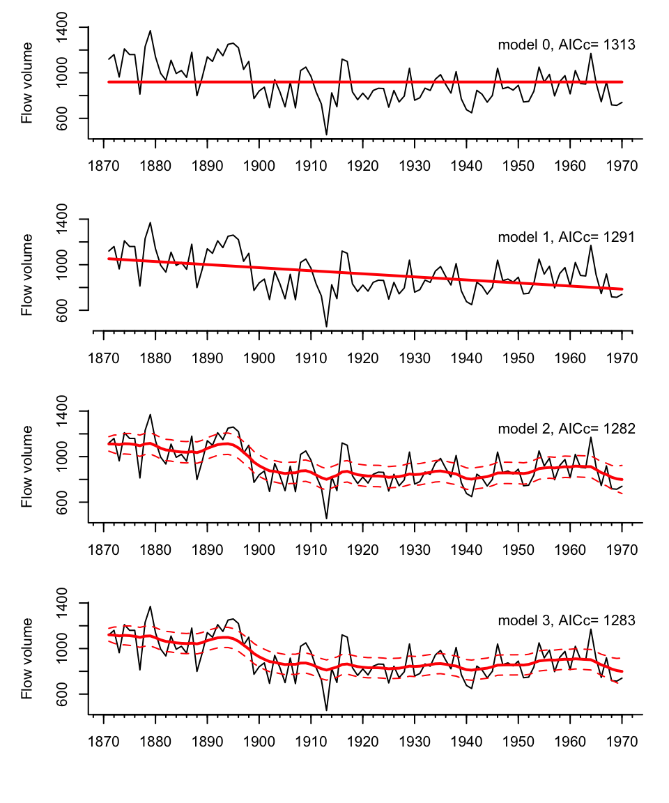

```{r setup, include=FALSE}
knitr::opts_chunk$set(echo = FALSE)
library(kableExtra)
set.seed(123)
```

## Week 3: State-Space Models

We are now starting a 5 lecture block on Gaussian state-space models.

Lectures 1 & 2: building blocks for analysis of multivariate time-series data with observation error, structure, and missing values

Lectures 3-5: Specific applications: covariates, dynamic factor analysis, dynamic linear models

<hr>

* Properties of time series data
* AR and MA models:   $x_t = b_1 x_{t-1} + b_2 x_{t-2} + e_t$
* Today: **State-space models (observation error and hidden random walks)**

## Univariate linear state-space model

$$x_t = x_{t-1}+u+w_t,  \,\,\, w_t \sim N(0,q)$$
$$y_t = x_t + v_t, \,\,\, v_t \sim N(0,r)$$
The $x$ model is the classic “random walk” with drift.  

$y$ are the observatons.  

This model is a random walk observed with (Gaussian) error.  

## Univariate linear state-space model

$$x_t = x_{t-1}+u+w_t,  \,\,\, w_t \sim N(0,q)$$
$$y_t = x_t + v_t, \,\,\, v_t \sim N(0,r)$$

There are many textbooks on this class of model.  It is used in extensively in economics and engineering.

<center>
  
</center>

## AR(1) or AR lag-1

All of these are examples:

$$x_t = x_{t-1} + u + w_t$$
$$x_{t+1} = x_t + w_t$$
$$x_t = b x_{t-1} + u + w_t$$


## Why is the random walk with drift model so important in analysis of ecological data?

**Additive random walks**

$$x_t = x_{t-1}+u+w_t, \,\,\, w_t \sim N(0,q)$$

* Movement, changes in gene frequency, somatic growth if growth is by fixed amounts

* Why Gaussian? The average of many small perturbations, regardless of their distribution, is Gaussian.

## 

**Multiplicative random walks**

$$n_t = \lambda n_{t-1}e_t, \,\,\, log(e_t) \sim N(0,q)$$

* Population growth, somatic growth if growth is by percentage

* Take the log and you get the linear additive model above.  log-normal error distribution means that 10% increase is as likely as 10% decrease

## Gompertz model

Addition of $b$ with  $0<b<1$ leads to process model with mean-reversion.

In the ecological literature on density-dependent processes, you may see this in non-log notation:

$$N_t = exp(u+w_t)N^b_{t-1}$$

$N_t$ is population size.

## Gompertz model

Take the log, and we have

$$x_t = bx_{t-1}+u+w_t$$
$$w_t \sim N(0,q)$$
It is not required that $w_t$ is Gaussian but that is a common assumption. Dynamics of processes with non-Gaussian errors, esp long-tailed errors, is a common extension.  Autocorrelated errors could be implemented with MA process or covariates.

## Gompertz model

```{r, echo=FALSE}
gompertz <- function(n, u, b, q){
  x <- rep(u/(1-b),n+100)
for(i in 2:(n+100)) x[i]=b*x[i-1]+u+rnorm(1,0,sqrt(q))
x[101:(n+100)]
}
set.seed(100)
u1 <- .6; b1 <- .9; q <- .1; n <- 100
op <- par(mfrow=c(1,2), mar=c(5, 2, 4, 1) + 0.1)
plot(exp(gompertz(n, u1, b1, q)), type="l",xlab="",ylab="",ylim=c(0,2000), bty="L")
title("Weak density-dependence (b=.9)",cex.main=.75)
for(i in 1:3) lines(exp(gompertz(n, u1, b1, q)), col="grey")
b2 <- .2; u2<- (1-b2)*u1/(1-b1)
plot(exp(gompertz(n, u2, b2, q)), type="l",xlab="",ylab="",ylim=c(0,2000), bty="L")
title("Strong density-dependence (b=.2)",cex.main=.75)
for(i in 1:3) lines(exp(gompertz(n, u2, b2, q)), col="grey")
par(op)
```

<!--
## Gompertz model is hard to fit


$$x_t = bx_{t-1}+u+e_t$$

The mean level of a long time series of this model is $u/(1-b)$ however $b$ and $u$ are confounded.  There is a ridge in the likelihood surface indicative of many $b$/$u$ combinations that will fit the data.

If you have observation error, you need either long times or replication to estimate this model or constrain the $u$ or $b$ somehow.
-->

## Simple model, great flexibility

An random walk can show a wide-range of trajectories, even for the same parameter values.  All trajectories below came from the same random walk model: $x_t= x_{t-1} -0.02+w_t$, $w_t \sim N(mean=0.0, var=0.01)$.

```{r fig.height=3, fig.align="center"}
op <- par(mfrow=c(2,3),mar=c(2,2,1,1))
for(i in 1:6)
  plot(cumsum(rnorm(20,-0.02,sqrt(0.01))),type="l",xlab="",ylab="",bty="L",ylim=c(-.6,.4))
par(op)
```

<!--

## Simple model, great flexibility

An random walk can show a wide-range of trajectories, even for the same parameter values.

<center>
Accurately estimating and conveying the uncertainty in the parameter estimates, state estimates, and predictions is critical.
</center>

-->

## Definition: state-space

The “state” is a hidden (dynamical) variable.  In this class, it will be a hidden random walk or AR(1) process.

Our data are observations of this hidden state.

Often state-space models include inputs (explanatory variables) and the state or the data may be multivariate.

The model you are seeing today is a simple univariate state-space model with no inputs.

state: $x_t = x_{t-1} + u + w_t$

observation: $y_t = x_t + v_t$

## Example: population count data

Yearly, usually, population or subpopulation counts, possibly with missing values.

```{r echo=FALSE}
library(MARSS)
dat <- wilddogs
plot(dat,ylim=c(0,70), bty="l")
title("African wild dogs population counts")
text(dat[,1][which(is.na(dat[,2]))],0,"X",col="red")
```

<!--
## Another example of population counts

```{r echo=FALSE}
library(MARSS)
dat <- harborSeal[,c("Year","Georgia.Strait")]
plot(dat,ylim=c(8,11), bty="l",ylab="density index")
title("Density of Georgia Strait Harbor Seals")
text(dat[,1][which(is.na(dat[,2]))],8,"X",col="red")
```
-->

## Example: population count data

The data are observations of a hidden 'true' population size.  The data are observations of that hidden state and have observation error. 

```{r echo=FALSE}
library(MARSS)
dat <- wilddogs
plot(dat,ylim=c(0,70), bty="l")
title("African wild dogs population counts")
text(dat[,1][which(is.na(dat[,2]))],0,"X",col="red")
fit <- MARSS(log(wilddogs[,2]), silent=TRUE)
lines(wilddogs[,1],exp(fit$states[1,]), col="blue")
```

## Observation error

This is a survey photograph for Steller sea lions in the Gulf of Alaska.  There IS some number of sea lions in our population in year $t$, but we don’t know that number precisely.  It is “hidden”.

```{r sealions, echo=FALSE,out.width = '80%',fig.align="center"}
knitr::include_graphics("images/stellersealions.png")
```

## The observation error variance is often unknowable in fisheries and ecological analyses

**Sightability** varies due to factors that may not be fully understood or measureable

* Environmental factors (tides, temperature, etc.)

* Population factors (age structure, sex ratio, etc.)

* Species interactions (prey distribution, prey density, predator distribution or density, etc.)

**Sampling variability**--due to how you actually count animals--is just one component of observation variance

## Process versus observaton variability

Suppose we have the following data (say, population density logged)

```{r, echo=FALSE, fig.align="center"}
set.seed(123)
n <- 20
x <- cumsum(rnorm(n,0,sqrt(0.02)))
y <- x+rnorm(n,0,.1)
plot(y,pch="X",type="b",ylab="log(N)",xlab="",bty="L")
```

## Fit a linear regression

The model of the hidden state in this case is $x_t = \alpha + \beta t$.
The observation model is $y_t=x_t+v_t$.
All variability = **non-process** or observation variability.

```{r, echo=FALSE, fig.align="center"}
plot(x,pch="X",type="b",ylab="log(N)",xlab="",bty="L")
dat <- data.frame(x=x,t=1:n)
fit <- lm(y~t, data=dat)
abline(fit, col="blue",lwd=2)
```

## Fit a random walk model

The model of the hidden state in this case is $x_t = \alpha + x_{t-1}+w_t$.
The observation model is $y_t=x_t$.
All variability = **process** variability.
```{r, echo=FALSE, fig.align="center"}
plot(y,pch="X",type="b",ylab="log(N)",xlab="",bty="L")
lines(y,col="blue")
```

<!--
Note if your use `arima()` or `Arima()` to fit to the data, `fitted()` does not return the state process (= the data). It returns the predicted values based on $t-1$.  This is different than `fitted()` with `lm()`.
-->


## Fit a state-space model

Autoregressive state-space models fit a random walk AR(1) through the data.  The variabilty in the data contains both process and non-process (observation) variability.

```{r, echo=FALSE, fig.align="center"}
plot(y,pch="X",type="b",ylab="log(N)",xlab="",bty="L")
fit <- MARSS(y, silent=TRUE)
lines(fit$states[1,],col="blue",lwd=2)
```

## Non-process variability

Observation or “non-process” error is the difference between the hidden state (blue line) and the observation (X).

```{r, echo=FALSE, fig.align="center"}
plot(y,pch="X",type="b",ylab="log(N)",xlab="",bty="L")
fit <- MARSS(y, silent=TRUE)
lines(fit$states[1,],col="blue",lwd=2)
lines(c(7,7),c(fit$states[1,7],y[7]),col="red",lwd=2)
```

## Process variability

Process error is the difference between the expected $x_t$ given data up to time $t-1$ (x in the plot) and the actual $x$ at time $t$.

```{r, echo=FALSE, fig.align="center"}
plot(y,pch="X",type="b",ylab="y and x", xlab="", bty="L", col="grey")
lines(fit$states[1,],col="blue",lwd=2)
points(fit$states[1,],col="blue",pch="o")
lines(c(7,8),c(fit$states[1,7],fit$states[1,7]+coef(fit)$U[,1]),col="black",lwd=2)
points(c(8),c(fit$states[1,7]+coef(fit)$U[,1]),col="black",pch="x")
lines(c(8,8),c(fit$states[1,8], fit$states[1,7]+coef(fit)$U[,1]),col="red",pch="x")
```

## PVA example

One use of univariate state-space models is “count-based” population viability analysis (chap 7 HWS2014)

```{r wilddogs, echo=FALSE,out.width = '70%',fig.align="center"}
knitr::include_graphics("images/wild_dogs.jpg")
```

##

```{r, results="hide",fig.align="center",fig.height=6, fig.width=5}
CSEGriskfigure(wilddogs)
```

## How you model your data has a large impact on your forecasts


```{r, echo=FALSE}
set.seed(123)
fit1 <- MARSS(log(wilddogs[,2]), model=list(R=matrix(0)), silent=TRUE)
fit2 <- MARSS(log(wilddogs[,2]), model=list(Q=matrix(0)), silent=TRUE)
fit3 <- MARSS(log(wilddogs[,2]), silent=TRUE)

par(mfrow=c(3,1),mar=c(2,2,2,2))
plot(wilddogs,type="l",bty="L",col="red",xlim=c(1970,2010),ylim=c(0,150))
fit1$par$x0<-fit1$states[,22,drop=FALSE]
for(i in 1:5){
  fr <- MARSSsimulate(fit1,tSteps=20)$sim.data
yrs <- (wilddogs[22,"Year"]):(wilddogs[22,"Year"]+20)
lines(yrs,c(wilddogs[22,"Count"],exp(fr)))
}
title("Process only")
plot(wilddogs,type="l",bty="L",col="red",xlim=c(1970,2010),ylim=c(0,150))
fit2$par$x0<-fit2$states[,22,drop=FALSE]
for(i in 1:10){
  fr <- MARSSsimulate(fit2,tSteps=20)$sim.data
yrs <- (wilddogs[22,"Year"]):(wilddogs[22,"Year"]+20)
lines(yrs,c(wilddogs[22,"Count"],exp(fr)))
}
title("Observation only lm()")
plot(wilddogs,type="l",bty="L",col="red",xlim=c(1970,2010),ylim=c(0,150))
fit3$par$x0<-fit3$states[,22,drop=FALSE]
for(i in 1:10){
  fr <- MARSSsimulate(fit3,tSteps=20)$sim.data
yrs <- (wilddogs[22,"Year"]):(wilddogs[22,"Year"]+20)
lines(yrs,c(wilddogs[22,"Count"],exp(fr)))
}
title("Both observation and process error")

```

## How can we separate process and non-process variance?

Wouldn’t these two variances be impossible to separate?

```{r, echo=FALSE, fig.align="center"}
plot(y,pch="X",type="b",ylab="log(N)",xlab="",bty="L")
fit <- MARSS(y, silent=TRUE)
lines(fit$states[1,],col="blue",lwd=2)
```

## They have different temporal patterns.

```{r, fig.align="center"}
set.seed(22245)
op <- par(mfcol=c(2,3),mar=c(2,2,2,2))
for(i in 1:3){
  x <- cumsum(rnorm(20, -.02, .05))
  plot(x, ylab="", xlab="", bty="L", type="l")
  if(i==1) title("process is autocorrelated")
  y <- rnorm(20, 0, .1)
  plot(y, ylab="", xlab="", bty="L", type="l")
  if(i==1) title("observation error is not")
}
```

## Nile River example

```{r nile, echo=FALSE,out.width = '60%',fig.align="center"}

```

## Kalman filter and smoother

The Kalman filter and smoother is an algorithm for computing the expected value of the $x_t$ from the data and the model parameters.

$$x_t = x_{t-1}+u+w_t,  \,\,\, w_t \sim N(0,q)$$

$$y_t = x_t + v_t, \,\,\, v_t \sim N(0,r)$$

## Diagnostics

**Innovations residuals** aka, one-step ahead residuals, same ones we used for ARMA models

data at time $t$ minus model predictions given data up to $t-1$

$$\hat{y_t} = E[Y_{t}|y_{t-1}]$$
In the MARSS package, the one-step ahead residuals are returned by
```
residuals(fit)
```
This is fairly standard for models that fit state-space models.

**Standard diagnostics**

* ACF
* Normality


## `MARSS package`

We will be using the MARSS package to fit univariate and multivariate state-space models. 

The main function is `MARSS()`:

```
fit <- MARSS(data, model=list())
```

data are a vector or a matrix with time going along the columns.

model list is a list with the structure of all the parameters.

## MARSS model notation

$$x_t = \mathbf{B}x_{t-1} + \mathbf{U} + w_t, \,\,\, w_t \sim N(0,\mathbf{Q})$$
$$y_t = \mathbf{Z}x_{t} + \mathbf{A} + v_t, \,\,\, v_t \sim N(0,\mathbf{R})$$
  
The MARSS model list follows this notation one-to-one.

##

$$x_t = x_{t-1} + u + w_t, \,\,\, w_t \sim N(0,q)$$
$$y_t = x_{t} + v_t, \,\,\, v_t \sim N(0,r)$$

Write as where everything bold is a matrix.

$$x_t = \mathbf{B}x_{t-1} + \mathbf{U} + w_t, \,\,\, w_t \sim N(0,\mathbf{Q})$$
$$y_t = \mathbf{Z}x_{t} + \mathbf{A} + v_t, \,\,\, v_t \sim N(0,\mathbf{R})$$

```
mod.list <- list(
  U = matrix("u"),
  x0 = matrix("x0"),
  B = matrix(1),
  Q = matrix("q"),
  Z = matrix(1),
  A = matrix(0),
  R = matrix("r"),
  tinitx = 0
)
```

## Diagnostics and plotting

Use
```
autoplot(fit)
```
where `fit` is returned by `MARSS()` to see the standard diagnostics.

## Output

```
fit <- MARSS()
```

* `coef(fit)` to get the estimated parameters
* `tidy(fit)` to get estimated parameters with CIs
* `tsSmooth()` to get the estimates states or use `fit$states`
* `fitted()` to get the model estimates of mean y
* `fr <- forecast(fit, h=5, interval="prediction")` predictions
* `autoplot(fr)` plot the forecast


## Let's see some examples

We will go through these in class

* [example 1](https://atsa-es.github.io/atsa/Lectures/Week%203/univariate_example_1.R)
* [example 2](https://atsa-es.github.io/atsa/Lectures/Week%203/univariate_example_2.R)
* [example 3](https://atsa-es.github.io/atsa/Lectures/Week%203/univariate_example_3.R)
* [example 4](https://atsa-es.github.io/atsa/Lectures/Week%203/univariate_example_4.R)