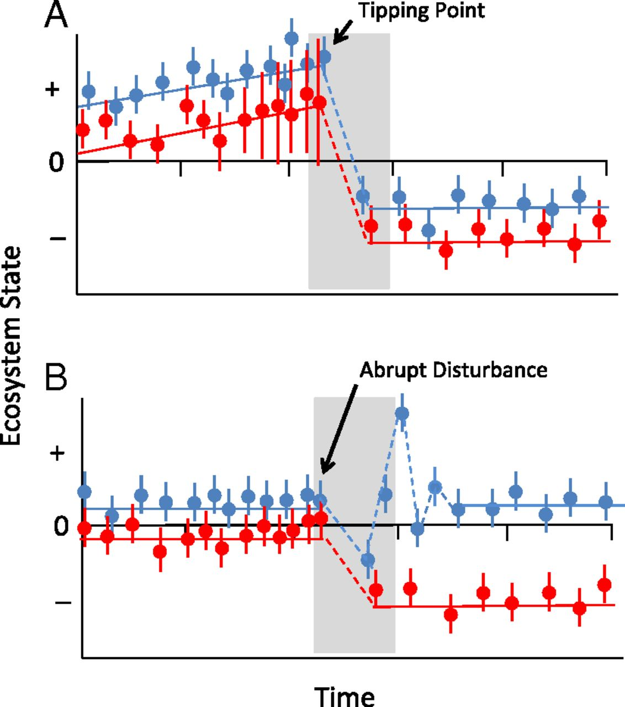

```{r setup, include=FALSE}
knitr::opts_chunk$set(echo = FALSE, warning=FALSE, 
                      message=FALSE, results='hide',
                      fig.align = 'center')
library(ggplot2)
#library(atsar)
library(datasets)
library(MARSS)
library(dplyr)
library(depmixS4)
library(rerddap)
library(lubridate)
library(reshape2)
library(gtools)
```

## Overview of today's material

* Gentle introduction to HMMs

* Theory and notation

* Examples of univariate HMMs in R

* Examples of multivariate HMMs in R

## Overview of today's material

For additional background, see

* Zucchini et al. (2008, 2016) "Hidden Markov Models for Time Series: An Introduction Using R"

* Jackson (2011) "Multi-State Models for Panel Data: The msm Package for R"

* Visser and Speekenbrink (2010) "depmixS4: An R Package for Hidden Markov Models"

* McClintock et al. (2020) "Uncovering ecological state dynamics with hidden Markov models"


## State space models 

We've already discussed state space models. These models include

* a latent process model (we don't directly observe)

* a data or observation model 

* we've generally assumed both models be normal (or multivariate normal)

## State space models 

Process model: 
$${ x }_{ t }={ x }_{ t-1 }+{ \varepsilon  }_{ t-1 }$$

Observation model: 
$${ y }_{ t }={ x }_{ t }+{ \delta  }_{ t }$$

where ${ \varepsilon  }_{ t } \sim Normal\left( 0,{ \sigma  }_{ \varepsilon  } \right)$ and ${ \delta  }_{ t } \sim Normal\left( 0,{ \sigma  }_{ \delta  } \right)$

## State space models

Adding AR coefficients can make these models stationary with respect to the mean,

$${ x }_{ t }={ p\cdot x }_{ t-1 }+{ \varepsilon  }_{ t-1 }$$

however they may not be able to explain some datasets very well. 

* Specifically, these models are not well designed to model regimes

## Regimes

{#id .class width=50% height=50%}

## Regimes / behavioral states

Many examples of time series in ecology & fisheries may alternate between multiple states (2+)

* Vert-pre et al. (2013) https://www.ncbi.nlm.nih.gov/pmc/articles/PMC3562848/

* Francis et al. (2012) https://onlinelibrary.wiley.com/doi/full/10.1111/j.1365-2486.2012.02702.x

## Additional ecological exmaples:

* Mark recapture models with latent states 

* Identifying changing behavior or habitat use:

* Tennessen et al. (2019) "Hidden Markov models reveal temporal patterns and sex differences in killer whale behavior"

* Leos-Barajas et al. (2017) "Analysis of animal accelerometer data using hidden Markov models"

* momentuHMM: R package for analysis of telemetry data using generalized multivariate hidden Markov models of animal movement

## Regimes

Lots of non-HMM approaches for detecting regimes

* STARS algorithm
    + Sequential t-test approach for detecting changes in the mean
    + Rodionov (2015) https://www.mdpi.com/2225-1154/3/3/474

* Brute force model selection approach
    + iterate through change points, evaluating data support for each
    + how do we do change points with regression? ${ Y }_{ t }=B{ X }_{ t }+{ \varepsilon  }_{ t }$
    
## Regimes: simulating data

```{r}
set.seed(123)
state = 1
probs = matrix(c(0.95,0.05,0.05,0.95),2,2)
for(i in 2:100) {
  state[i] = sample(c(1,2), prob = probs[state[i-1],])
}
mu = c(1,3)
y = rnorm(length(state), mu[state], 0.5)
plot(1:100, y, xlab="Time", ylab = "Simulated data", type="b")
```

## Fitting these data with state space models

They can actually fit the data from a regime model quite well.

* Via MARSS()
```{r}

plot(1:100, y, xlab="Time", ylab = "Simulated data", type="b")
lines(MARSS(y)$states[1,], col="blue")

```

## Limitations of state space models with continuous states

What's lacking is inference about:

* What's the probability of transition between regimes?
* How long are regimes expected to last?
* What regimes might we expect in the future?

Lots of applications: speech recognition, bioinformatics, animal movement, environmental data (rain), finance

## HMM: theory

Markov Process

* time may be discrete or continuous (we'll focus on discrete)
* Markov if at each time step, the state $x_{t}$ is only dependent on the previous state $x_{t-1}$
* $x_{t}$ does not depend on future values
* these ideas should be familiar, with the exception of states changing from continuous to discrete 

Entire history can be written as $$\left\{ { x }_{ 1 },{ x }_{ 2 },{ x }_{ 3 },...,{ x }_{ T } \right\}$$


## HMM: theory

A key piece of the Markov process are the transition probabilities.

* The probability of transitioning from state $j$ to $i$ given the current state is 
$$P\left( { x }_{ t+1 }=j | { x }_{ t }=i \right) ={ \gamma  }_{ ij }$$

* And then these probabilities can be summarized in a transition matrix, 
$$\Gamma =\left[ \begin{matrix} { \gamma  }_{ 11 } & { \gamma  }_{ 12 } & { \gamma  }_{ 13 } \\ { \gamma  }_{ 21 } & { \gamma  }_{ 22 } & { \gamma  }_{ 23 } \\ { \gamma  }_{ 31 } & { \gamma  }_{ 32 } & { \gamma  }_{ 33 } \end{matrix} \right]$$
* Elements of $\Gamma$ can be fixed a priori (0, etc)

## HMMs theory

* Let's try to simulate this in R

```{r echo=TRUE, eval=FALSE}
# initial state
x <- sample(1:2, size=1)
# transition matrix
Gamma = matrix(c(0.9,0.1,0.2,0.8),2,2)
for(t in 2:100) {
  x[t] <- sample(1:2, size=1,prob = Gamma[x[t-1],])
}
```

## HMMs theory

```{r echo=FALSE}
# initial state
x <- sample(1:2, size=1)
# transition matrix
Gamma = matrix(c(0.9,0.1,0.2,0.8),2,2)
for(t in 2:100) {
  x[t] <- sample(1:2, size=1,prob = Gamma[x[t-1],])
}
df = data.frame("Time"=1:100, "x"=x)

ggplot(df, aes(Time, x)) + geom_line(col="darkblue") + 
  geom_point(col="darkblue") + 
  theme_bw()
```

## HMM theory

Matrix $\Gamma$ is the 1-step transitions. However k-step transition probabilities can be generated, 

$\Gamma(k) = \Gamma^{k}$

* From this, we can also calculate the stationary distribution of the chain
    + See Zucchini et al. (2006) Chapter 2

## HMM theory

There are two general flavours of transition matrices:

* Homogenous (or stationary)
    + transition probabilities don't depend on $t$

* Non-homogeneous
    + transition probabilities are time-varying

* In this class, we'll mostly consider **homogeneous** cases

## HMM theory

Covariates may enter HMMs in one of two ways

* Effects on the mean

* Effects on the transition matrix $\Gamma$

* For effects on $\Gamma$, probabilities are constrained (0,1) and constrained to sum to 1
    + multivariate logit regression used to relate covariates to elements of $\Gamma$
    + reference / base case is fixed at zero (Agresti 2002)
    
## HMMs theory

* Returning to our simulation example, let's include a temporal trend in the transition probabilities
* We assume trend is linear in logit space
* For simplicity, we assume that slope is same on ${ \gamma  }_{ 12 }$ and ${ \gamma  }_{ 21 }$

```{r echo=TRUE, eval=FALSE}
plogis(logit(0.1) + 0.015*1:100)
```

```{r echo=FALSE, fig.width=5,fig.height=2}
df = rbind(data.frame("time"=1:100, "y"=plogis(logit(0.1) + 0.015*1:100),"par"="gamma_12"),
  data.frame("time"=1:100, "y"=plogis(logit(0.2) + 0.015*1:100),"par"="gamma_21"))
ggplot(df, aes(time,y,group=par,col=par)) + geom_line() + ylab("Gamma") + xlab("Time") + theme_bw()
```

## HMMs theory

```{r echo=TRUE, eval=FALSE}
# initial state
x <- sample(1:2, size=1)
# transition matrix
Gamma = matrix(c(0.9,0.1,0.2,0.8),2,2)
for(t in 2:100) {
  Gamma[1,2] = plogis(logit(0.1) + 0.015*t)
  Gamma[1,1] = 1 - Gamma[1,2]
  Gamma[2,1] = plogis(logit(0.2) + 0.015*t)
  Gamma[2,2] = 1 - Gamma[2,1]
  x[t] <- sample(1:2, size=1,prob = Gamma[x[t-1],])
}
```

## HMMs theory

```{r echo=FALSE}

# initial state
x <- sample(1:2, size=1)
# transition matrix
Gamma = matrix(c(0.9,0.1,0.2,0.8),2,2)
for(t in 2:100) {
  Gamma[1,2] = plogis(logit(0.1) + 0.015*t)
  Gamma[1,1] = 1 - Gamma[1,2]
  Gamma[2,1] = plogis(logit(0.2) + 0.015*t)
  Gamma[2,2] = 1 - Gamma[2,1]
  x[t] <- sample(1:2, size=1,prob = Gamma[x[t-1],])
}
df = data.frame("Time"=1:100, "x"=x)
ggplot(df, aes(Time, x)) + geom_line(col="darkblue") + 
  geom_point(col="darkblue") + 
  theme_bw()
```


## HMM: theory

* Observations: observable data ${Y}_{ i=1,...,N }$

* States: latent (discrete) variables that are not directly observed
    + ${x}_{ t=1,...,T }$
    + $N$ is the number of states possible

* Transition probabilities: transition matrix representing the probability of transitioning between states in the Markov chain
    + $\Gamma$ and ${ \gamma  }_{ ij }$
    
* Emission probabilities: how likely the states are at any particular timestep
    + ${ \theta  }_{ i=1,...,N }$

## HMM: theory

* Our simulations haven't yet included an observation component. Let's add observed data that's normally distributed

```{r echo=TRUE, eval=FALSE}
# initial state
x <- sample(1:2, size=1)
# transition matrix
Gamma = matrix(c(0.9,0.1,0.2,0.8),2,2)
for(t in 2:100) {
  x[t] <- sample(1:2, size=1,prob = Gamma[x[t-1],])
}

u = c(1.2, 5.4)
y = rnorm(length(x), u[x], 1)
```

## HMM: theory

```{r echo=FALSE}
# initial state
x <- sample(1:2, size=1)
# transition matrix
Gamma = matrix(c(0.9,0.1,0.2,0.8),2,2)
for(t in 2:100) {
  x[t] <- sample(1:2, size=1,prob = Gamma[x[t-1],])
}

u = c(1.2, 5.4)
y = rnorm(length(x), u[x], 1)
df = data.frame("Time"=1:100, "x"=x)
ggplot(df, aes(Time, y)) + 
  geom_point(col="darkblue") + 
  theme_bw() + ylab("Observed Y")
```

## HMM: theory

One quantity of interest from HMMs is the marginal distribution, $P(Y_{t})$

Output from the model will give us the conditional distribution, $P(Y_{t}|x_{t}=i)$. But we need to marginalize over all possible states
    
Solution: $$P(Y_{ t })=\sum _{ i=1 }^{ N }{ P({ x }_{ t }=i)P({ Y }_{ t }|{ x }_{ t }=i) }$$
which can also be expressed as 
$$P(Y_{ t })=\sum _{ i=1 }^{ N }{ { \delta  }_{ i }P({ Y }_{ t }|{ x }_{ t }=i) }$$ where 
$\delta$ represents the stationary distribution (Zucchini et al. 2006)

## HMM: theory

Estimation of HMM parameters can be quite complicated

Dealing with joint likelihood of observed data and unobserved states

$$P(x,Y)=\prod _{ i=1 }^{ T }{ P({ x }_{ t }|{ x }_{ t-1 })P({ Y }_{ t }|{ x }_{ t }) }$$


## HMM: theory

Estimation most commonly done with maximum likelihood

1. Forward-backward algorithm: calculate probability of observed data sequence
2. Viterbi algorithm: used to generate most likely states
3. EM-algorithm: estimate / update parameters

* For forward-backward algorithm we can factor conditional state probabilties

$$P\left( { x }_{ t }|{ Y }_{ 1:T } \right) =P({ x }_{ t }|{ Y }_{ 1:t },{ Y }_{ t+1:T })=P({ x }_{ t }|{ Y }_{ 1:t })P({ Y }_{ t+1:T }|{ x }_{ t })$$
* Probability of state given the data is the probability of the state given the data up to that time step multiplied by the probability of future data given state

## HMM: theory

Forward-backward algorithm has 3 steps (sometimes 2/3 combined):

1. Forward probabilities

* from the last slide, this step calculates $P({ x }_{ t }|{ Y }_{ 1:t })$

2. Backward probabilities

* from the last slide, this step calculates $P({ Y }_{ t+1:T }|{ x }_{ t })$

3. Smoothing

* compute marginal likelihood of sequence of state variables $P(x_{t}|Y)$

## Examples of univariate HMMs in R

As a first example, let's use an example of rainfall data in Seattle from the end of 2018 and beginning of 2019 (accessed from wunderground.com)

```{r, echo=FALSE, results='markdown', fig.height=3}
rain = read.csv("seattle_rain.csv")
ggplot(rain, aes(Time, Rainfall)) + 
  geom_line(col="darkblue") + 
  xlab("Days since Nov 1") + ylab("Precip (in)") + 
  theme_bw()
```

## Examples of univariate HMMs in R

We could model rainfall directly, but for starters let's just model whether or not it rained on a given day (0/1). 

```{r, echo=TRUE, results='markdown'}
rain$rained = ifelse(rain$Rainfall > 0, 1, 0)
```

```{r, echo=FALSE,fig.height=3}
ggplot(rain, aes(Time, rained)) + geom_line(col="darkblue") + 
  xlab("Days since Nov 1") + ylab("Rained?") + theme_bw()
```

## Examples of univariate HMMs in R

Questions that we might be interested in:

* Conditional probabilities
    + What's the probability of it raining tomorrow given that it's raining today?
    + What's the probability of it raining tomorrow given that it's not today?
    
* Persistence
    + On average, how long might we expect to go without rain?
    
## Examples of univariate HMMs in R

We don't really need HMMs to address these questions

* daily rainfall may be measured with a tiny amount of uncertainty
* probably safe to say that there's almost no uncertainty in whether or not it rained on a given day

## Examples of univariate HMMs in R

Transition probabilities can be just calculated directly, 

* $P(rain_{t+1} | rain_{t})$

$$\frac { \# consecutive \quad rainy \quad days }{ \# rainy \quad days }$$

For example, we can create a differenced variable to indicate no change (0), and compute
```{r echo=TRUE, eval=FALSE}
rain$diff = c(diff(rain$rained), NA)
p_rain_rain = length(which(rain$diff == 0 & 
    rain$rained==1)) / length(which(rain$rained==1))
```

## Examples of univariate HMMs in R

Ok, now let's assume that there's some minor observation or measurement error in the rain gauge data. For this case, it's best to use a HMM. 

Let's start with using the R package `depmixS4`. There's a good vignette on the package that you can refer back to, 

https://cran.r-project.org/web/packages/depmixS4/vignettes/depmixS4.pdf

## Examples of univariate HMMs in R

There's two functions we'll use to set up the HMM with `depmixS4`.

First we'll structure the model using the same formula notation you're hopefully familiar with,
```{r echo=TRUE, eval=FALSE}
mod = depmix(rained ~ 1, 
             nstates = 2, 
             transition = ~ 1,
             family = binomial(),
             data=rain)
```

## Examples of univariate HMMs in R

Stepping through this `rained` is our response (yes / no)

```{r echo=TRUE, eval=FALSE}
mod = depmix(rained ~ 1, 
             nstates = 2, 
             transition = ~ 1,
             family = binomial(),
             data=rain)
```

## Examples of univariate HMMs in R

`nstates` is the number of alternative states (> 2), specified a priori

```{r echo=TRUE, eval=FALSE}
mod = depmix(rained ~ 1, 
             nstates = 2, 
             transition = ~ 1,
             family = binomial(),
             data=rain)
```

## Examples of univariate HMMs in R

`transition` is a formula to specify whether any covariates are to be included in the transition probabilities. The default is no covariates, and that these transitions aren't time varying.

```{r echo=TRUE, eval=FALSE}
mod = depmix(rained ~ 1, 
             nstates = 2, 
             transition = ~ 1,
             family = binomial(),
             data=rain)
```

## Examples of univariate HMMs in R

`family` is family or list of families (a list for multiple response variables) of the families associated with each response. The majority of common families are supported

```{r echo=TRUE, eval=FALSE}
mod = depmix(rained ~ 1, 
             nstates = 2, 
             transition = ~ 1,
             family = binomial(), 
             data=rain)
```

For a complete list, see
```{r echo=TRUE, eval=FALSE}
?depmixS4::GLMresponse
```

## Examples of univariate HMMs in R

Ok, now that we've set up the model, we can do the estimation and look at the output

```{r}
mod = depmix(rained ~ 1, 
             nstates = 2, 
             transition = ~ 1,
             family = binomial(), 
             data=rain)
```

```{r echo=TRUE}
set.seed(123)
fitmod = fit(mod)
```

```{r echo=FALSE, results='asis'}
Gamma = matrix(0,2,2)
Gamma[1,] = fitmod@transition[[1]]@parameters$coefficients
Gamma[2,] = fitmod@transition[[2]]@parameters$coefficients
rownames(Gamma) = c("From_1","From_2")
colnames(Gamma) = c("To_1","To_2")
knitr::kable(Gamma, digits=2)
```

## Examples of univariate HMMs in R
As a warning, note that the results from the estimation are a bit sensitive to the initial seed. Look at how much the transition probabilties change,

```{r echo=TRUE}
set.seed(121)
fitmod = fit(mod)
```

```{r echo=FALSE, results='markdown'}
Gamma = matrix(0,2,2)
Gamma[1,] = fitmod@transition[[1]]@parameters$coefficients
Gamma[2,] = fitmod@transition[[2]]@parameters$coefficients
rownames(Gamma) = c("From_1","From_2")
colnames(Gamma) = c("To_1","To_2")
knitr::kable(Gamma, digits=2)
```

## Examples of univariate HMMs in R

There's a couple practical ways to try to overcome this seed issue. 

* First, we can change the control parameters 

```{r}
fitmod = fit(mod, em.control=list(maxit = 1000, tol = 1e-12))
```

*Unfortunately for this example, this doesn't solve the issue*

## Examples of univariate HMMs in R

* A second option is to run the estimation across a large number (> 100) of random starting values 

Pseudocode:

```{r echo=TRUE, eval=FALSE}
best = 1.0e10
best_model = NA
for(i in 1:iter) {
  # fit the model
  fitmod = fit(mod)
  
  # check to see if this is the best solution?
  if(AIC(fitmod) < best) {
    best_model = fitmod
    best = AIC(fitmod)
  }
}
```

## Examples of univariate HMMs in R

Let's move on to a more complex example. 

We'll pull some data from the CalCOFI ichthyoplankton cruises in Southern California. Some species have been used to indicate *cool* versus *warm* regimes. 

* http://calcofi.org/publications/calcofireports/v58/Vol58-State_of_the_Current_pages_1-55.pdf

For this example, we'll focus on the California smoothtongue (*Leuroglossus stilbius*) 

```{r}
if(!file.exists("calcofi.csv")) {

calcofi_erddap <- "ERDDAP	Species
erdCalCOFIlrvcntLBtoLI	Leuroglossus stilbius
erdCalCOFIlrvcntLBtoLI	Lipolagus ochotensis
"

calcofi = read.table(textConnection(calcofi_erddap), header=TRUE, sep="\t")

for(i in 1:nrow(calcofi)) {
  
out = info(as.character(calcofi$ERDDAP[i]))
raw_dat = tabledap(out, fields = c("station", "line", "latitude",
  "longitude","time","scientific_name", "larvae_10m2"))
raw_dat$year = lubridate::year(raw_dat$time)
raw_dat$month = lubridate::month(raw_dat$time)

raw_dat = dplyr::filter(raw_dat, scientific_name == calcofi$Species[i]) %>% 
  dplyr::filter(month %in% c(4,5)) %>% 
  dplyr::group_by(station) %>%
  dplyr::mutate(n = n()) %>% 
  dplyr::filter(n >= 20) %>%
  dplyr::group_by(year) %>% 
  summarize(m = mean(as.numeric(larvae_10m2), na.rm=T))

raw_dat$species = calcofi$Species[i]

if(i==1) {
  dat = raw_dat
} else {
  dat = rbind(dat, raw_dat)
}

}

dat = dplyr::filter(dat, year >= 1980)
write.csv(dat, file="calcofi.csv")
}
```

## Examples of univariate HMMs in R

*Caveat:* the survey is spatially gridded, and you'd want to perform index standardization or use spatial models to generate indices. For simplicty, we're just taking the mean abundance across stations in April-May. 

```{r, fig.height=3.5}
calcofi = read.csv("calcofi.csv", stringsAsFactors = FALSE)
calcofi = dplyr::filter(calcofi, species == "Leuroglossus stilbius")
ggplot(calcofi, aes(year, m)) + geom_line() + xlab("Year") + ylab("Mean CPUE") + 
  ggtitle("Leuroglossus stilbius") + theme_bw()
```

## Examples of univariate HMMs in R

We'll start with fitting a 2-state model with `depmix`. Assumptions:

* Model fit to ln transformed data, assumed Gaussian

```{r echo=TRUE}
set.seed(123)
calcofi$ln = log(calcofi$m)
mod = depmix(ln ~ 1, 
             nstates = 2, 
             data=calcofi)
fitmod = fit(mod)
```

## Examples of univariate HMMs in R

First let's look at how to get predictions out of a `depmix.fitted` object

We'll start with the state probabilities. Remember we could work with either 

* Most probable state trajectory - via the `viterbi` function
* Marginals of $P(x_{t})$ - via the `posterior` function

## Examples of univariate HMMs in R

The most probable states are 
```{r echo=TRUE}
prstates = apply(posterior(fitmod)[,c("S1","S2")], 
  1, which.max)
```
```{r echo=TRUE, fig.height=3}
plot(prstates, type="b", xlab="Time", ylab="State")
```

## Examples of univariate HMMs in R

`depmixS4` doesn't have a `predict()` or `forecast()` function, but creating estimated data is pretty straightforward. We can get the means out with 
```{r echo=TRUE}
mu = summary(fitmod)[,1]
```

```{r echo=TRUE}
pred = data.frame("year"=seq(min(calcofi$year), 
  max(calcofi$year)),
  "fit" = mu[prstates])
```

```{r, fig.height=2.7}
ggplot(calcofi, aes(year, log(m))) + geom_point(col="blue", size=1.5) + 
  geom_line(data=pred, aes(year, fit)) + ggtitle("Leuroglossus stilbius - raw data and predictions") + 
  ylab("Ln CPUE") + xlab("Year") + theme_bw()
```

## Examples of univariate HMMs in R

Some diagnostics (like autocorrelation) may not look great. What if we compared the previous model to one with 3 states? AIC from the 2-state model was 

```{r results='markdown'}
AIC(fitmod)
```

```{r echo=TRUE}
set.seed(123)
calcofi$ln = log(calcofi$m)
mod = depmix(ln ~ 1, 
             nstates = 3, 
             data=calcofi)
fitmod = fit(mod)
```
This seems like increasing the states doesn't result in lower AIC
```{r results='markdown'}
AIC(fitmod)
```

## Model selection & diagnostics

* In comparing 2 vs 3 state HMM, we found lower AIC for 2-state model

* However, opposite is often true -- more states fit better, and result in lower AIC

* How to decide? Occam's razor & metrics of predictive ability

* Pohle et al. 2017. "Selecting the Number of States in Hidden Markov Models: Pragmatic Solutions Illustrated Using Animal Movement"

## Examples of multivariate HMMs in R

If the univariate examples make sense, it's not that different to extend these models for multiple time series. 

In this setting, the assumption is that the latent state process is the same for all time series, though the time series may differ

1. their lengths
2. their error distributions 

## Examples of multivariate HMMs in R

In `depmix`, these arguments generally become lists

We'll extend our CalCOFI example to include 2 species now

```{r, fig.height=4}
calcofi = read.csv("calcofi.csv", stringsAsFactors = FALSE)
ggplot(calcofi, aes(year, m, group=species,col=species)) + geom_line() + ylab("CPUE") + xlab("Year") + theme_bw()
```

## Examples of multivariate HMMs in R

Fitting a 2-state model with 2 species as responses. First we have to reshape the data,
```{r echo=TRUE, results='markdown'}
calcofi$ln = log(calcofi$m) # ln transform
calcofi <- dcast(melt(calcofi[,c("year","ln","species")], 
            id.vars = c("year", "species")), 
            year ~ species)
names(calcofi)[2:3] = c("L_stilbius","L_ochotensis")
head(calcofi)
```

## Examples of multivariate HMMs in R
```{r echo=TRUE}
set.seed(123)
mod = depmix(list(L_stilbius ~ 1, L_ochotensis~1), 
             nstates = 2, 
             family = list(gaussian(),gaussian()),
             data=calcofi)
fitmod = fit(mod)
```

## Examples of multivariate HMMs in R

We could also have situations where the time series are of different length.

* For example, if L_ochotensis time series was missing first half of values

* The argument `ntimes` is a list that becomes particularly valuable here - representing the length of each time series

## Summary

HMMs are a useful approach at identifying latent state vectors that undergo discrete transitions 

Estimation of HMMs for time series in R generally done with ML methods

* Fast, but these algorithms may get stuck
* Robust solutions = multiple starting values

Bayesian estimation generally beyond the scope of this class

* Very straightforward to build these models in BUGS/JAGS
* More complicated with newer sofware (Stan), though examples here:  https://mc-stan.org/docs/2_26/stan-users-guide/hmms-section.html

## JAGS Examples

* Why JAGS? Categorical samplers

* Let's re-fit our CalCOFI example in JAGS. We'll step through this in small
chunks to understand what's going on in JAGS syntax

## JAGS model

* First we need to specify the initial state. We don't know it, but assume each state (1/2) is 
equally likely
```{r eval=FALSE, echo=TRUE}
model{
for(i in 1:2){initp[i] <- 0.5}
x[1] ~ dcat(initp)
```

## JAGS model

* Next we can think about parameterizing the transition matrix. $\Gamma$ is 2 x 2, but only has 2 parameters
* We'll specify uniform(0,1) priors on these
```{r eval=FALSE, echo=TRUE}
model{
for(i in 1:2){initp[i] <- 0.5}
x[1] ~ dcat(initp)
p ~ dunif(0,1)
q ~ dunif(0,1)
```

## JAGS model

* Next we specify $\Gamma$
```{r eval=FALSE, echo=TRUE}
model{
for(i in 1:2){initp[i] <- 0.5}
x[1] ~ dcat(initp)
gamma12 ~ dunif(0,1)
gamma21 ~ dunif(0,1)
Gamma[1,1] <- 1-gamma12
Gamma[1,2] <- gamma12
Gamma[2,1] <- gamma21
Gamma[2,2] <- 1-gamm21
```

## JAGS model

* Next, add in the transition model for the latent state x
```{r eval=FALSE, echo=TRUE}
model{
for(i in 1:2){initp[i] <- 0.5}
x[1] ~ dcat(initp)
p ~ dunif(0,1)
q ~ dunif(0,1)
Gamma[1,1] <- 1-p
Gamma[1,2] <- p
Gamma[2,1] <- q
Gamma[2,2] <- 1-q
for(i in 2:n){x[i] ~ dcat(Gamma[x[i-1],])}
}
```

## JAGS model

* And finally the observation model for our observed data
* We need to estimate 2 means (u) and a residual error variance term

```{r eval=FALSE, echo=TRUE}
model{
for(i in 1:2){initp[i] <- 0.5}
x[1] ~ dcat(initp)
p ~ dunif(0,1)
q ~ dunif(0,1)
Gamma[1,1] <- 1-p
Gamma[1,2] <- p
Gamma[2,1] <- q
Gamma[2,2] <- 1-q
for(i in 2:n){x[i] ~ dcat(Gamma[x[i-1],])}
resid_tau~dgamma(0.001,0.001)
for(i in 1:2) {u[i] ~ dnorm(0,1)}
for(i in 1:n){y[i] ~ dnorm(u[x[i]],resid_tau)}
}
```

## JAGS model

* To run the model, save it in a file, e.g. 'model.txt'

* Create data list
```{r echo=TRUE, eval=FALSE}
n = nrow(calcofi)
y = log(calcofi$m)
jags_data = list("n","y")
```

* Create parameter list
```{r echo=TRUE, eval=FALSE}
jags_params = c("x","u","Gamma","resid_tau")
```

## JAGS model

* Running the model 
```{r echo=TRUE, eval=FALSE}
jagsfit <- jags(data=jags_data, 
parameters.to.save=jags_params,
model.file="model.txt")
```

## JAGS model

* Next steps: thus far, we've only considered HMMs that are AR(1)

* Homework: try to modify the example above for the CalCOFI data to be AR(2)

* [hint: what are the dimensions of $\Gamma$?]

