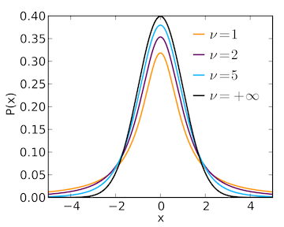

```{r setup, include=FALSE}
knitr::opts_chunk$set(echo = FALSE, warning=FALSE, 
                      message=FALSE, results='hide',
                      fig.align = 'center')
library(ggplot2)
library(rstan)
library(bayesdfa)
library(atsar)
library(broom.mixed)
library(datasets)
library(MARSS)
library(dplyr)
library(gtools)
library(tvvarss)
```

## Overview of today's material

* Using STAN for MAP estimation
* Multivariate time series models
* DFA models
* Writing our own Stan code

## MAP (maximum a posteriori) estimation

* Point estimate of unknown parameters
* Optimization algorithms: BFGS, Newton, etc
* Estimates similar to maximum likelihood, but also incorporate prior
* Quick for checking models, etc

## MAP estimation in Stan

* We left off with a Bayesian DLM with random walk in intercept
```{r cache=TRUE, echo=TRUE, warning=FALSE, results=FALSE}
bayes_fit = fit_stan(y = SalmonSurvCUI$logit.s, 
               model_name="dlm-intercept")
```

## MAP estimation in Stan

* Switching this to MAP estimation
```{r cache=TRUE, echo=TRUE, warning=FALSE, results=FALSE}
map_fit = fit_stan(y = SalmonSurvCUI$logit.s, 
               model_name="dlm-intercept", map_estimation=TRUE)
```

## MAP estimation in Stan

```{r echo=TRUE, results='markdown'}
print(map_fit)
```

## MAP estimation in Stan

* Check that model converged
```{r echo=TRUE, results='markdown'}
map_fit$return_code
```

* MAP value when converged
```{r echo=TRUE, results='markdown'}
map_fit$value
```

## MAP estimation in Stan

* grep or other string matching functions needed
```{r echo=TRUE, results='markdown'}
grep("pred",names(map_fit$par))
pred = map_fit$par[grep("pred",names(map_fit$par))]
```

## MAP estimation in Stan

* grep or other string matching functions needed
```{r echo=TRUE, results='markdown'}
grep("pred",names(map_fit$par))
pred = map_fit$par[grep("pred",names(map_fit$par))]
```

## MAP estimation in Stan

* grep or other string matching functions needed
```{r echo=TRUE, results='markdown'}
grep("pred",names(map_fit$par))
pred = map_fit$par[grep("pred",names(map_fit$par))]
```

## MAP estimation in Stan

* include SEs of estimates, via Hessian
```{r echo=TRUE, results='markdown', eval=FALSE}
map_fit = fit_stan(y = SalmonSurvCUI$logit.s, 
     model_name="dlm-intercept", 
     map_estimation=TRUE, 
     hessian=TRUE)
```
* or change algorithm ("LBFGS" default) to "BFGS" or "Newton"
```{r echo=TRUE, results='markdown', eval=FALSE}
map_fit = fit_stan(y = SalmonSurvCUI$logit.s, 
     model_name="dlm-intercept", 
     map_estimation=TRUE, 
     hessian=TRUE, 
     algorithm="BFGS")
```

## MAP estimation in Stan
* Posterior means, 95% CIs
```{r}
pars = rstan::extract(bayes_fit)
df = data.frame("Time"=1:42,
                y = SalmonSurvCUI$logit.s,
                pred = apply(pars$pred,2,mean),
                lower=apply(pars$pred,2,quantile,0.025),
                upper=apply(pars$pred,2,quantile,0.975))
ggplot(df, aes(Time, pred)) + 
  geom_ribbon(aes(ymin=lower, ymax=upper),alpha=0.3) +
  theme_bw() + 
  geom_line() + ylab("Estimate") + 
  geom_point(aes(Time,y),col="red")
```

## MAP estimation in Stan
* MAP estimates = posterior
```{r}
df$map = pred
ggplot(df, aes(Time, pred)) + 
  geom_ribbon(aes(ymin=lower, ymax=upper),alpha=0.3) +
  theme_bw() + 
  geom_line() + ylab("Estimate") + 
  geom_point(aes(Time,y),col="red") + 
  geom_line(aes(Time,pred),col="blue")
```

## Multivariate time series models

* Multivariate state space models
* Stan package for fitting models similar to MARSS

```{r echo=TRUE}
devtools::install_github("atsa-es/tvvarss")
```

## Multivariate time series models

* Most models in tvvarss() are exactly the same as MARSS
* Takes in data matrix y
* `family` argument defaults to Gaussian, but can be many others

```{r echo=TRUE, eval=FALSE}
tvvarss::tvvarss(y = y, family = "poisson",...)
```

## Multivariate time series models

* Like MARSS, variances can be shared (default) or unique by species, or time series

```{r echo=TRUE, eval=FALSE}
tvvarss::tvvarss(y = y, shared_r = R, shared_q = Q,...)
```

## Multivariate time series models

* Optional 'process' argument acts as `Z` in MARSS and maps time series to latent state
processes

```{r echo=TRUE, eval=FALSE}
tvvarss::tvvarss(y = y, shared_r = R, shared_q = Q,...)
```

## Multivariate time series models

* Perhaps most exciting feature is time-varying interactions (AR coefficients)
* Time-varying vector autoregressive models
* AR coefficients behave like a DLM

```{r echo=TRUE, eval=FALSE}
tvvarss::tvvarss(y = y, dynamicB = TRUE,...)
```
* Time-varying parameters are data hungry! We'll dive into this more later in the quarter

## Bayesian DFA models

* DFA models from `atsar` bundled with other DFA code we've developed
```{r echo=TRUE}
devtools::install_github("fate-ewi/bayesdfa")
```

## Bayesian DFA models

* DFA poses interesting identifiability challenges
* Bayesian models generally involve > 1 MCMC chain
* Direction of DFA loadings / trends don't have meaning

## Bayesian DFA models

```{r}
df = data.frame("iter"=rep(1:1000,3), "chain" = sort(rep(as.factor(1:3),1000)),
                "Parameter"=c(rnorm(1000,-3), rnorm(1000,-3), rnorm(1000,3)))
ggplot(df, aes(iter,Parameter,group=chain,col=chain)) + 
  geom_line(alpha=0.7) + theme_bw() + xlab("MCMC iteration")
```

## Bayesian DFA models

* Solution 1: priors for identifiability

* Solution 2: post-hoc 'chain flipping' before convergence tests run

## Bayesian DFA models

* Fitting DFA models will give very similar answers to using MARSS
```{r echo=TRUE}
data("harborSealWA")
```
```{r fig.height=4}
matplot(harborSealWA[,-1], 
        type="l", 
        lwd=3, 
        ylab="Ln (abundance)")
```

## Bayesian DFA models

We'll extract predictions from the best model, 
```{r echo=TRUE, cache=TRUE, fig.height=2, fig.align="center",eval=TRUE}
fit = bayesdfa::fit_dfa(y = t(harborSealWA[,-1]), num_trends = 1)
```
And as an `stanfit` object, we can extract summaries of states `x`
```{r echo=TRUE}
pars = extract(fit$model)
```


## Bayesian DFA models
```{r echo=TRUE}
bayesdfa::plot_fitted(fit) + theme_bw()
```

## Bayesian DFA models

* DFA extension 1: long format data (optional), replicate observations

```{r, fig.height=4}
x = matrix(0, 2, 40)
x[1,] = as.numeric(scale(cumsum(rnorm(ncol(x)))))
x[2,] = as.numeric(scale(cumsum(rnorm(ncol(x)))))

df = data.frame(Time = sample(1:ncol(x),size=100, replace=TRUE),
  Pop = as.factor(sample(1:3, size=100, replace=TRUE)))
df$x = 1
df$x[which(df$Pop != "1")] = 2

df$y = NA
for(i in 1:nrow(df)) {
  df$y[i] = rnorm(1, x[df$x[i], df$Time[i]], sd=0.1)
}
ggplot(df, aes(Time, y, col=Pop)) + 
  geom_point() + xlab("Time") + 
  ylab("Observation") + theme_bw()
```

## Bayesian DFA models

* DFA extension 2: temporal extremes

$$x_{t}=x_{t-1}+\delta_{t-1}$$
$$\delta_{t-1} \sim Normal(0,q)$$

* But do these deviations have to be normal? NO!

$$\delta_{t-1} \sim Student-t(\nu,0,q)$$  
  
## Bayesian DFA models

```{r, fig.height=4}
x = matrix(0, 2, 40)
x[1,] = as.numeric(scale(cumsum(rnorm(ncol(x)))))

set.seed(121)
x[2,] = as.numeric(scale(cumsum( rt(ncol(x),2) )))

df = data.frame(Time = c(1:ncol(x), 1:ncol(x)),
                Pop = as.factor(c(rep(1,ncol(x)), rep(2,ncol(x)))),
                y = c(x[1,], x[2,]))

ggplot(df, aes(Time, y, col=Pop)) + 
  geom_point() + 
  geom_line() + 
  xlab("Time") + 
  ylab("Observation") + theme_bw()
```

## Bayesian DFA models

* Extremes example: coho salmon body size in coastal fisheries
```{r}
coho = readRDS("coho_mean_length.rds")
ggplot(coho, aes(recovery_year,mean_length,group=fishery,col=fishery)) + 
  geom_line() +
  theme_bw() + xlab("Recovery year") + ylab("Average length (mm)")
```

## Bayesian DFA models

* Fitting the model

```{r echo=TRUE, cache=TRUE, results="hide", warning=FALSE,message=FALSE}
coho = readRDS("coho_mean_length.rds")
# rename variables
coho=dplyr::rename(coho, obs=mean_length,time=recovery_year,ts=fishery)
fit = fit_dfa(y = coho, data_shape="long",estimate_nu = TRUE)
```

## Bayesian DFA models

* Let's look at df parameter, $\nu$
* Mean ~ 19.5, median ~ 16.3
```{r echo=TRUE}
pars = extract(fit$model)
```

```{r, fig.height=3.5}
df = data.frame("nu"=pars$nu)
df$iter = seq(1,nrow(df))
ggplot(df, aes(nu)) + 
  geom_density(col="darkblue",size=1) + 
  xlab("Student-t df") + ylab("Density") + 
  geom_vline(aes(xintercept=median(df$nu))) + theme_bw()
```

## Bayesian DFA models

* $\nu$ parameter ranges from 2 (heavy tails) to normal (30)  


(source: Wikipedia)

## Bayesian DFA models

* DFA extension 2: increased flexibility in trends
* Sampling might be 'chunky'

```{r, fig.height=4}
set.seed(123)
x = matrix(0, 2, 40)
x[1,] = as.numeric(scale(cumsum(rnorm(ncol(x)))))
x[2,] = as.numeric(scale(cumsum(rnorm(ncol(x)))))

df = data.frame(Time = sample(1:ncol(x),size=100, replace=TRUE,
                              prob=rep(c(0.1,0.1,0.1,0.1,0.8),8)),
  Pop = as.factor(sample(1:3, size=100, replace=TRUE)))
df$x = 1
df$x[which(df$Pop != "1")] = 2

df$y = NA
for(i in 1:nrow(df)) {
  df$y[i] = rnorm(1, x[df$x[i], df$Time[i]], sd=0.1)
}
ggplot(df, aes(Time, y, col=Pop)) + 
  geom_point() + xlab("Time") + 
  ylab("Observation") + theme_bw()
```

## Bayesian DFA models

* AR models (conventional DFA) may not be well suited 

* Alternative approach: use Gaussian Process models to model smooth trends

* Feddern et al. 2021 (Global Change Biology)

```{r fig.height=3.5}
ggplot(df, aes(Time, y, col=Pop)) + 
  geom_point() + xlab("Time") + 
  ylab("Observation") + theme_bw() + geom_smooth()
```

## Bayesian DFA models

* What's a Gaussian Process model?

* Instead of modeling process
$$x_{t} = x_{t-1}...$$

* We model the covariance of the $\textbf{x}$

* But there are a lot of $\textbf{x}$!!

## Bayesian DFA models

* For model with $T$ timesteps

* $\Sigma$ has $T*(T-1)/2$ parameters

* GP models implement covariance functions, e.g. exponential, Gaussian, Matern

* Model covariance as function of space or distance in time

## Bayesian DFA models

* Example: Gaussian covariance (aka 'squared exponential')

$$\Sigma_{t,t+3} = \sigma^2exp(\frac{(t-(t+3))^2}{2\tau^2})$$  

* $\sigma^2$ controls variability  
* $\tau$ controls how quickly covariance decays between points  


## Bayesian DFA models

* Implementation

```{r echo=TRUE, eval=FALSE}
fit_dfa(y= y, num_trends = 2, ..., trend_model = c("gp"))
```

## Bayesian DFA models

* DFA extension 3: alternate constraints on loadings matrix

* Conventional constraints on loadings matrix
```{r results='markdown'}
set.seed(123)
m = matrix(rnorm(15), 5, 3)
m[1,2:3]=0
m[2,3]=0
print(m)
#knitr::kable(m, digits=2)
```

## Bayesian DFA models

* Alternative: compositional DFA model

```{r results='markdown'}
set.seed(123)
m = matrix(rnorm(15), 5, 3)
for(i in 1:nrow(m)) {
  m[i,]=rdirichlet(1,alpha=rep(1,3))
}
print(m)
#knitr::kable(m, digits=2)
```

## Bayesian DFA models

* Under compositional DFA model, time series are true mixtures of underlying trends

$$\textbf{Y} = \textbf{Zx}$$
```{r echo=TRUE, eval=FALSE}
fit_dfa(y = y, num_trends = 2, ..., z_model = "proportion")
```


* When might this be useful? 
* Stable isotope data, environmental monitoring, pollutant data, etc

## Writing our own Stan scripts

* Stan scripts always start with a data block
* Data needs to be typed 

```{r echo=TRUE, eval=FALSE}
data {
  int<lower=0> N;
  int<lower=0> K;
  real y[N];
  int P;
  int y_int[N];
  matrix[N, K] x;
}
```
* [Stan manual](https://mc-stan.org/docs/2_26/reference-manual/index.html)

## Writing our own Stan scripts

* transformed data block is optional

```{r echo=TRUE, eval=FALSE}
transformed data {
  int zeros[N];
  for(i in 1:N) {
    zeros[i] = 0;
  }
}
```

## Writing our own Stan scripts

* parameters block containts any parameters
```{r echo=TRUE, eval=FALSE}
parameters {
  real x0;
  vector[K] beta0;
  vector[K] pro_dev[N-1];
  real<lower=0> sigma_process[K];
  real<lower=0> sigma_obs;
}
```

## Writing our own Stan scripts

* parameters block containts any parameters
```{r echo=TRUE, eval=FALSE}
parameters {
  real x0;
  vector[K] beta0;
  vector[K] pro_dev[N-1];
  real<lower=0> sigma_process[K];
  real<lower=0> sigma_obs;
}
```

## Writing our own Stan scripts

* transformed parameters block contains derived quantities
* examples: predicted states for state space time series model
```{r echo=TRUE, eval=FALSE}
transformed parameters {
  vector[N] pred;
  pred[1] = x0;
  for(i in 2:N) {
    pred[i] = phi*pred[i-1] + sigma_process*pro_dev[i-1];
  }
}
```

## Writing our own Stan scripts

* model block contains priors on parameters 
* likelihood (or data model)
```{r echo=TRUE, eval=FALSE}
model {
  x0 ~ normal(0,10);
  phi ~ normal(0,1);
  sigma_process ~ student_t(3,0,2);
  sigma_obs ~ student_t(3,0,2);
  pro_dev ~ std_normal();
  for(i in 1:N) {
    y[i] ~ normal(pred[i], sigma_obs);
  }
}
```

## Writing our own Stan scripts

* generated data block (optional)
* includes quantities useful for model selection, prediction, forecasts, etc
```{r echo=TRUE, eval=FALSE}
generated quantities {
  vector[N] log_lik;
  for (n in 1:N) log_lik[n] = normal_lpdf(y[n] | pred[n], sigma_obs);
}
```

## Writing our own Stan scripts

* Ok -- let's do this in practice

* Problem # 1: let's take our state space random walk model and modify it to 
better handle extreme events with the Student - t distribution

* Mathematically

$$\delta_{t-1} \sim Normal(0,q)$$ 
becomes 

$$\delta_{t-1} \sim Student-t(\nu,0,q)$$  
  
  
## Writing our own Stan scripts

```{r}
gme = read.csv("yahooGME.csv", stringsAsFactors = FALSE)
gme$Date = lubridate::parse_date_time(gme$Date,orders="ymd")
gme$year = lubridate::year(gme$Date)
gme = dplyr::filter(gme, year == 2021)
ggplot(gme, aes(Date, Close)) + geom_point() + geom_line() + 
  theme_bw() + ylab("Closing GME price")
```


## Writing our own Stan scripts

* You could do this in RStudio (File -> New File -> Stan File)

* Scripts for the `atsar` package linked below

[https://github.com/atsa-es/atsar/tree/master/inst/stan](https://github.com/atsa-es/atsar/tree/master/inst/stan)

* We're just going to modify this code (ss_ar.stan) rather than start from scratch

## Writing our own Stan scripts

* 2 things need to change

* Change process error deviations from Normal to Student-t distribution
* Add $\nu$ as a parameter, with constraints (> 2)

## Writing our own Stan scripts

```{r echo=TRUE, eval=FALSE}
parameters {
real<lower=2> nu;
...
}
```

## Writing our own Stan scripts

```{r echo=TRUE, eval=FALSE}
model{
...
nu ~ student_t(3, 2, 3);
pro_dev ~ student_t(nu, 0, 1);
//pro_dev ~ std_normal();
...
}
```

## Writing our own Stan scripts

* Done! Now we can fit the model 
```{r echo=TRUE, cache = TRUE}
y = gme$Close
N = length(y)
n_pos = length(which(!is.na(y)))
pos_indx = c(which(!is.na(y)),0,0)

fit = stan(file = "ss_ar_t.stan", 
  data = list(y = y, N = N, n_pos = n_pos, pos_indx = pos_indx))
```

## Writing our own Stan scripts

```{r, fig.height=3.5}
pars = rstan::extract(fit)
df = data.frame("nu"=pars$nu)
df$iter = seq(1,nrow(df))
ggplot(df, aes(nu)) + 
  geom_density(col="darkblue",size=1) + 
  xlab("Student-t df") + ylab("Density") + 
  geom_vline(aes(xintercept=median(df$nu))) + theme_bw()
```

