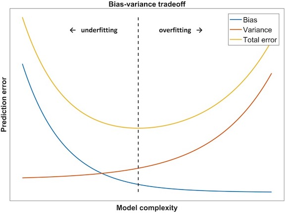

```{r setup, include=FALSE}
knitr::opts_chunk$set(echo = FALSE, warning=FALSE, 
                      message=FALSE, results='hide',
                      fig.align = 'center')
library(ggplot2)
library(rstan)
library(atsar)
library(broom)
library(datasets)
library(MARSS)
library(dplyr)
library(caret)
library(forecast)
library(atsar)
library(jpeg)
library(astsa)
```

## Overview of today's material

* Approaches for model selection 
* Cross validation
* Quantifying forecast performance
  
## How good are our models? 

Several candidate models might be built based on

* hypotheses / mechanisms
* diagnostics / summaries of fit

Models can be evaluated by their ability to explain data

* OR by the tradeoff in the ability to explain data, and ability to predict future data
* OR just in their predictive abilities
    + Hindcasting
    + Forecasting
  
## How good are our models? 

We can illustrate with an example to the `harborSealWA` dataset in MARSS

$y_{t} = b_{0}+b_{1}*t+e_{t}$
```{r fig.height=3}
data(harborSealWA)
harborSealWA = harborSealWA[,c(1,3)]
harborSealWA=as.data.frame(harborSealWA)
ggplot(harborSealWA, aes(Year, SJI)) + 
  geom_point(col="darkblue",size=3) + 
  geom_line() + ylab("Ln abundance (San Juan Islands)") +
  theme_bw() + geom_smooth(method = lm, se = FALSE)
```

## How good are our models?

```{r, echo=FALSE, results='markup'}
summary(lm(SJI~Year, data=harborSealWA))
```

## How good are our models?
Our regression model had a pretty good SS

$$SS=\sum _{ i=1 }^{ n }{ { \left( y_{ i }-E[{ y }_{ i }] \right)  }^{ 2 } } $$

* But SS is problematic
    + as we consider more complex models, they'll inevitably reduce SS
    + there's no cost or penalty for having too many parameters

## Model selection

Lots of metrics have been developed to overcome this issue and penalize complex models

* **Occam's razor**: "the law of briefness"

* **Principle of parsimony**: choose the simplest possible model that explains the data pretty well
    + choose a model that minimizes bias *and* variance

## Model selection

<center>

</center>

https://www.ncbi.nlm.nih.gov/books/NBK543534/figure/ch8.Fig3/

## Model selection: AIC

Akaike's Information Criterion (**AIC**, Akaike 1973)

* Attempts to balance the goodness of fit of the model against the number of parameters

* Based on deviance = minus twice negative log likelihood

Deviance = $$-2\cdot ln\left( L(\underline { \theta } |\underline { y  } ) \right)$$

* Deviance is a measure of model fit to data
    + lower values are better
    + Maximizing likelihood is equivalent to minimizing negative likelihood

## Model selection: AIC

* Why the large focus on AIC? 

* Heavily used in ecology (Burnham and Anderson 2002)[https://www.springer.com/gp/book/9780387953649]

* Also the default in many stepwise model selection procedures in R
+ [forecast](https://cran.r-project.org/web/packages/forecast/forecast.pdf), [glmulti](https://www.jstatsoft.org/article/view/v034i12/v34i12.pdf), [bestglm](https://cran.r-project.org/web/packages/bestglm/), [AICcmodavg](https://cran.r-project.org/web/packages/AICcmodavg/AICcmodavg.pdf), [MuMIn](https://cran.r-project.org/web/packages/MuMIn/MuMIn.pdf)

## Model selection: AIC

Many base functions in R support the extraction of AIC

```{r eval=FALSE, echo=TRUE}
y = cumsum(rnorm(20))
AIC(lm(y~1))
AIC(glm(y~1))
AIC(mgcv::gam(y~1))
AIC(glmmTMB::glmmTMB(y~1))
AIC(lme4::lmer(y~1))
AIC(stats::arima(y))
AIC(forecast::Arima(y))
AIC(MARSS:MARSS(y))
```

## Model selection: AIC

Many *IC approaches to model selection also rely on deviance. Where they differ is how they structure the penalty term. 

For AIC, the penalty is 2 * number of parameters ($k$),

$$AIC = -2\cdot ln\left( L(\underline { \theta } |\underline { y  } ) \right) + 2k$$

* This is not affected by sample size, $n$ 

## Model selection: AIC

Small sample AIC

$$AICc=AIC+\frac { 2k(k+1) }{ n-k-1 }$$

* What happens to this term as n increases? 

## Model selection: AIC

AIC aims to find the best model to predict data generated from the same process that generated your observations

Downside: AIC has a tendency to overpenalize, especially for more complex models

* Equivalent to significance test w/ $\alpha$ = 0.16

Alternative: Schwarz/Bayesian Information Criterion (SIC/BIC)

* Not Bayesian!
* Relies on Laplace approximation to posterior
* $\alpha$ becomes a function of sample size
 
## Model selection: AIC 

BIC is measure of explanatory power (rather than balancing explanation / prediction)

$$BIC = -2\cdot ln\left( L(\underline { \theta } |\underline { y  } ) \right) + k\cdot ln(n)$$

* Tendency of BIC to underpenalize

## Model selection: AIC

Philosophical differences between AIC / BIC

* AIC / AICc tries to choose a model that approximates reality
    + does not assume that reality exists in your set of candidate models
    + One 

* BIC assumes that one of your models is truth
    + This model will tend to be favored more as sample size increases

## AIC and BIC for time series forecasting

* Smallest AIC similar to minimizing one-step ahead forecasts using MSE [Rob Hyndman's blog](https://robjhyndman.com/hyndsight/aic/)

* AIC approximates LOOCV [Stone (1977)](https://www.jstor.org/stable/2984877?seq=1)

* BIC approximates k-fold cross validation [Shao (1997)](https://www.jstor.org/stable/24306073?seq=1)

## Bayesian model selection

The big difference between the Bayesian and maximum likelihood approaches are that

* ML methods are maximizing the likelihood over the parameter space
* Bayesian methods are integrating over the parameter space, asking 'what values are best, on average?'

Many of the ML methods discussed were designed for models with only fixed effects.

* What about correlated parameters, nested or hierarchical models?

## Bayesian model selection 

Again, lots of options that have evolved quickly over the last several decades

* Bayes factors (approximated by BIC)
    + can be very difficult to calculate for complex models

* Deviance Information Criterion (DIC)
    + Spiegelhalter et al. (2002) 
    + DIC is easy to get out of some programs (JAGS)
    + DIC is also attempting to balance bias and variance

* Widely applicable information criterion (WAIC)
    + [Watanabe (2010)](https://www.jmlr.org/papers/volume11/watanabe10a/watanabe10a.pdf)

* Leave One Out Information Criterion (LOOIC)
    + [Vehtari et al. 2017](https://link.springer.com/article/10.1007/s11222-016-9696-4), [Vehtari et al. 2019](https://arxiv.org/abs/1507.02646)

## Cross validation

Recent focus in ecology & fisheries on prediction

[Dietze et al. 2017](https://esajournals.onlinelibrary.wiley.com/doi/full/10.1002/eap.1589)  

[Maris et al. 2017](https://onlinelibrary.wiley.com/doi/full/10.1111/oik.04655)  

[Pennekamp et al. 2017](https://www.sciencedirect.com/science/article/pii/S1476945X16301106)  

[Pennekamp et al. 2018](https://www.biorxiv.org/content/early/2018/06/19/350017)  

[Szuwalkski & Thorson 2017](https://onlinelibrary.wiley.com/doi/abs/10.1111/faf.12226)

[Anderson et al. 2017](https://onlinelibrary.wiley.com/doi/abs/10.1111/faf.12200)

## Resampling techniques

**Jackknife**

* Hold out each data point, recomputing some statistic (and then average across 1:n)

**Bootstrap**

* Similar to jackknife, but with resampling

**Cross-validation (k-fold)**

* Divide dataset into k-partitions
* How well do (k-1) partitions predict kth set of points?
* Relationship between LOOCV and AIC / BIC

**Data split**: test/training sets (e.g. holdout last 5 data pts)

## Resampling techniques: bootstrap

Bootstrap or jackknife approaches are useful

* generally used in the context of time series models to generate new or pseudo-datasets
+ posterior predictive checks in Bayesian models generate new data from posterior draws

* state space models: use estimated deviations / errors to simulate, estimate CIs

Examples
```{r echo=TRUE, eval=FALSE}
MARSS::MARSSboot()
MARSS::MARSSinnovationsboot()
forecast::bld.mbb.bootstrap()
forecast::forecast(..., bootstrap=TRUE)
```


## Resampling techniques: K-fold cross validation

As an example, we'll use a time series of body temperature from the `beavers` dataset

```{r echo=TRUE}
data(beavers)
beaver = dplyr::filter(beaver2, time>200)
```

```{r echo=FALSE, fig.height=3}
ggplot(beaver, aes(time, temp)) + 
  geom_point() + geom_line() + 
  ylab("Temperature") + 
  xlab("Time") + 
  theme_bw()
```

## Resampling techniques: K-fold cross validation

* Choose model (e.g. State space model w/MARSS)
* Partition data
* Fit & prediction

## Resampling techniques: K-fold cross validation

```{r echo=TRUE, cache=TRUE}
set.seed(123)
K = 5 
beaver$part = sample(1:K, size=nrow(beaver), replace=T)
beaver$pred = 0
beaver$pred_se = 0
for(k in 1:K) {
  y = beaver$temp
  y[which(beaver$part==k)] = NA
	mod = MARSS(y, model=list("B"="unequal"))
	beaver$pred[beaver$part==k] = 
	  mod$states[1,which(beaver$part==k)]
	beaver$pred_se[beaver$part==k] = 
	  mod$states.se[1,which(beaver$part==k)]
}
```

## Resampling techniques: K-fold cross validation

```{r}
ggplot(beaver, aes(time,pred)) + 
  geom_point(col="red",size=2,alpha=0.6) + 
  geom_point(aes(time,temp),col="grey30",size=2) + 
  theme_bw() + ylab("Beaver body temperature") + 
  xlab("Time") + ggtitle("Predicted (red) and obs (grey)")
```


## Resampling techniques: K-fold cross validation

* How large should K be?

* Bias/variance tradeoff:

* Low K: low variance, larger bias, quicker to run. ML approaches recommend 5-10

* High K (LOOCV): low bias, high variance, computationally expensive

## Resampling techniques: K-fold cross validation

```{r echo=FALSE, cache=TRUE}
set.seed(123)
K = 20 
beaver$part20 = sample(1:K, size=nrow(beaver), replace=T)
beaver$pred20 = 0
beaver$pred20_se = 0
for(k in 1:K) {
  y = beaver$temp
  y[which(beaver$part20==k)] = NA
	mod = MARSS(y, model=list("B"="unequal"))
	beaver$pred20[beaver$part20==k] =mod$states[1,which(beaver$part20==k)]
	beaver$pred20_se[beaver$part20==k] =mod$states.se[1,which(beaver$part20==k)]
}
```

```{r}
ggplot(beaver, aes(time, pred)) + 
  geom_ribbon(aes(ymin=pred-2*pred_se,ymax=pred+2*pred_se), fill="red",col=NA,alpha=0.4) + 
  geom_ribbon(aes(ymin=pred20-2*pred20_se,ymax=pred20+2*pred20_se), fill="blue",col=NA,alpha=0.5) +
  geom_line(aes(time,pred), col="red",alpha=0.4,size=1) + 
  geom_line(aes(time,pred20), col="blue",alpha=0.4,size=1) + 
  geom_point(aes(time,temp),col="grey30",size=2) + 
  theme_bw() + ylab("Beaver body temperature") + 
  xlab("Time") + ggtitle("5-fold (red) vs 20-fold (blue)")
```


## Resampling techniques: repeated K-fold cross validation

* To remove effect of random sampling / partitioning, repeat K-fold cross validation and average predictions for a given data point

* caret() package in R does this for some classes of models

* [Data splitting for time series](https://topepo.github.io/caret/data-splitting.html#data-splitting-for-time-series)

## Resampling techniques: repeated K-fold cross validation

* Need to specify repeats

```{r echo=TRUE}
train_control = caret::trainControl(method="repeatedcv", 
                number=5, repeats=20)
```

* Again this is extendable across many widely used models

```{r eval=TRUE}
model = train(temp~time, 
              data=beaver, 
              trControl=train_control, method="lm")
```

## Resampling techniques

What about for time series data?

* Previous resampling was random
* No preservation of order (autocorrelation)

## Resampling techniques: LTOCV

* Leave Time Out Cross Validation = leave each year out in turn

* Predict using historical and future data

* Re-analyze the beaver data using LTOCV

```{r echo=FALSE, cache=TRUE}
K = nrow(beaver) 
beaver$part = seq(1,nrow(beaver))
beaver$pred = 0
beaver$pred_se = 0
for(k in 1:K) {
  y = beaver$temp
  y[which(beaver$part==k)] = NA
	mod = MARSS(y, model=list("B"="unequal"))
	beaver$pred[beaver$part==k] =mod$states[1,which(beaver$part==k)]
	beaver$pred_se[beaver$part==k] =mod$states.se[1,which(beaver$part==k)]
}
```

## Resampling techniques: LTOCV

```{r}
ggplot(beaver, aes(time, pred)) + 
  geom_ribbon(aes(ymin=pred-2*pred_se,ymax=pred+2*pred_se), fill="red",col=NA,alpha=0.4) + 
  geom_line(col="red",alpha=0.4,size=1) + 
  geom_point(col="grey30",size=2) + 
  theme_bw() + ylab("Beaver body temperature") + 
  xlab("Time") + ggtitle("LTOCV")
```

## Resampling techniques: LTOCV

* Compare fit to full dataset 

```{r}
y = beaver$temp
mod = MARSS(y, model=list("B"="unequal"))
beaver$pred_full = mod$states[1,]
beaver$pred_full_se = mod$states.se[1,]

ggplot(beaver, aes(time, pred)) + 
  geom_ribbon(aes(ymin=pred-2*pred_se,ymax=pred+2*pred_se), fill="red",col=NA,alpha=0.4) + 
  geom_line(col="red",alpha=0.4,size=1) + 
  geom_ribbon(aes(ymin=pred_full-2*pred_full_se,ymax=pred_full+2*pred_full_se), fill="blue",col=NA,alpha=0.4) + 
  geom_point(aes(time,temp),col="grey30",size=2) + 
  theme_bw() + ylab("Beaver body temperature") + 
  xlab("Time")
```

## Resampling techniques: future (aka forward chain) CV

Leave Future Out Cross Validation: only evaluate models on future data

* Fold 1: training[1], test[2]
* Fold 2: training[1:2], test[3]
* Fold 3: training[1:3], test[4]
* Fold 4: training[1:4], test[5]

## Resampling techniques: LFOCV

* Apply MARSS model to beaver dataset 

* Assign partitions in order, 1:5

```{r echo=TRUE}
beaver$part = ceiling(5*seq(1,nrow(beaver)) / (nrow(beaver)))
```

* iterate through 2:5 fitting the model and forecasting

## Resampling techniques: LFOCV

```{r echo=FALSE, cache=TRUE}
beaver$pred = NA
beaver$pred_se = NA
for(k in 2:K) {
  y = beaver$temp
  y[which(beaver$part>=k)] = NA
	mod = MARSS(y, model=list("B"="unequal"))
	beaver$pred[beaver$part==k] =mod$states[1,which(beaver$part==k)]
	beaver$pred_se[beaver$part==k] =mod$states.se[1,which(beaver$part==k)]
}

ggplot(beaver, aes(time, pred)) + 
  geom_ribbon(aes(ymin=pred-2*pred_se,ymax=pred+2*pred_se), fill="red",col=NA,alpha=0.4) + 
  geom_line(col="red",alpha=0.4,size=1) + 
  geom_point(aes(time,temp), col="grey30",size=2) + 
  theme_bw() + ylab("Beaver body temperature") + 
  xlab("Time")
```


## Bayesian cross validation

LOOIC (Leave-one out cross validation) 
    + preferred over alternatives

WAIC (widely applicable information criterion)

* Both available in `loo::loo()`

Additional reading:
https://cran.r-project.org/web/packages/loo/vignettes/loo2-example.html

##  Bayesian cross validation

* Why do we need to use anything BUT `loo::loo()`?

* LOOIC is an approximation (based on importance sampling) that can be unstable for flexible (read: state space) models

* Diagnostic: Pareto-k diagnostic, 1 value per point. 
+ "measure of each observation's influence on the posterior of the model"
+ [?diagnostics](https://mc-stan.org/loo/reference/pareto-k-diagnostic.html)
+ [Stan forums](https://discourse.mc-stan.org/t/a-quick-note-what-i-infer-from-p-loo-and-pareto-k-values/3446) or [or here](https://discourse.mc-stan.org/t/recommendations-for-what-to-do-when-k-exceeds-0-5-in-the-loo-package/3417)

* Often need to write code ourselves 

## Bayesian cross validation 

* ELPD (Expected log posterior density)

$$log[p(y^*)]=log[\int p(y^*|\theta)p(\theta)d\theta]$$

* Useful for calculating predictive accuracy for out of sample point (LTOCV, LFOCV)

* Should act similar to AIC when posterior ~ MVN [(more here)](http://mc-stan.org/rstanarm/reference/loo.stanreg.html)

## Prediction and forecast evaluations

* Let’s fit an ARMA(1,1) model to the global temperature data, after 1st differencing to remove trend
```{r echo=FALSE}
ar.global.1 = Arima(globtemp, order = c(1,1,1),
              seasonal=list(order=c(0,0,0),
              period=12))
f1 = forecast(ar.global.1, h = 10)
```

```{r echo=TRUE}
plot(f1)
```

## Quantifying forecast performance

One of the most widelty used metrics is mean square error (MSE)

$$MSE=E\left[ { e }_{ t }^{ 2 } \right] =E\left[ { \left( { x }_{ t }-{ \hat { x }  }_{ t } \right)  }^{ 2 } \right]$$

* Root mean squared error (RMSE) also very common

## Quantifying forecast performance

Like with model selection, the bias-variance tradeoff is important

* principle of parsimony

MSE can be rewritten as 

$$MSE=Var\left( { \hat { x }  }_{ t } \right) +Bias{ \left( { x }_{ t },{ \hat { x }  }_{ t } \right)  }^{ 2 }$$
* Smaller MSE = lower bias + variance

## Quantifying forecast performance

MSE and all forecast metrics can be calculated for 

* single data points
* entire time series
* future forecasts

$$MSE={ \frac { \sum _{ t=1 }^{ n }{ { \left( { x }_{ t }-{ \hat { x }  }_{ t } \right)  }^{ 2 } }  }{ n }  }$$

* Do you care just about predicting the final outcome of a forecast, or also the trajectory to get there? 

## Variants of MSE

Root mean square error, RMSE (quadratic score)

* RMSE = $\sqrt { RMSE }$
* on the same scale as the data
* also referred to as RMSD, root mean square deviation

Mean absolute error, MAE (linear score)
$$E\left[ \left| { x }_{ t }-{ \hat { x }  }_{ t }  \right|  \right]$$

Median absolute error, MdAE

$$median\left[ \left| { x }_{ t }-{ \hat { x }  }_{ t } \right|  \right]$$

## Scale independent measures of performance

Better when applying statistics of model(s) to multiple datasets
MSE or RMSE will be driven by time series that is larger in magnitude 
```{r fig.height=4}
set.seed(123)
df = data.frame("Year"=1:20, "Abundance"=10+cumsum(rnorm(20)), 
                "Population"=1, stringsAsFactors = FALSE)
df2 = data.frame("Year"=1:20, "Abundance"=5+cumsum(rnorm(20)), 
                "Population"=2, stringsAsFactors = FALSE)
df = rbind(df, df2)
df$Population = as.factor(df$Population)
ggplot(df, aes(Year, Abundance, group=Population, color=Population)) + 
  geom_line(size=2) + 
  theme_bw()
```

## 

```{r, out.width = "800px", results="markdown"}
knitr::include_graphics(path="wing_sales.jpg")
```

## Percent Error Statistics

Percent Error: 

$${ p }_{ t }=\frac { { e }_{ t }\cdot 100 }{ { Y }_{ t } }$$

Mean Absolute Percent Error (MAPE):

$$MAPE\quad =\quad E\left[ \left| { p }_{ t } \right|  \right]$$
Root Mean Square Percent Error (RMSPE):

$$RMSPE\quad =\quad \sqrt { E\left[ { p }_{ t }^{ 2 } \right]  }$$

## Issues with percent error statistics

$${ p }_{ t }=\frac { { e }_{ t }\cdot 100 }{ { Y }_{ t } }$$

* What happens when Y = 0? 

* Distribution of percent errors tends to be highly skewed / long tails

* MAPE tends to put higher penalty on positive errors 

* See Hyndman & Koehler (2006)

## Scaled error statistics

Define scaled error as 

$${ q }_{ t }=\frac { { e }_{ t } }{ \frac { 1 }{ n-1 } \sum _{ i=2 }^{ n }{ \left( { Y }_{ i }-{ Y }_{ i-1 } \right)  }  }$$

* denominator is MAE from random walk model, so performance is gauged relative to that
* this does not allow for missing data

Absolute scaled error (ASE)

$$ASE=\left| { q }_{ t } \right|$$
Mean absolute scaled error (MASE) 

$$MASE=E\left[ \left| { q }_{ t } \right|  \right]$$

## Interpreting ASE and MASE

All values are relative to the naïve random walk model

* Values < 1 indicate better performance than RW model

* Values > 1 indicate worse performance than RW model


## Implementation in R

* Fit an ARIMA model to ‘airmiles’,holding out last 3 points

```{r echo=TRUE}
n = length(airmiles)
air.model = auto.arima(log(airmiles[1:(n-3)]))
```


## Implementation in R

* Forecast the fitted model 3 steps ahead
* Use holdout data to evaluate accuracy 

```{r echo=TRUE, results='markdown'}
air.forecast = forecast(air.model, h = 3)
plot(air.forecast)
```


## Implementation in R

Evaluate RMSE / MASE statistics for 3 holdouts

```{r echo=TRUE, results='markdown'}
accuracy(air.forecast, log(airmiles[(n-2):n]), test = 3)
```

Evaluate RMSE / MASE statistics for only last holdout
```{r echo=TRUE, results='markdown'}
accuracy(air.forecast, log(airmiles[(n-2):n]), test = 1)
```

## MSE vs MAPE vs MASE

Raw statistics (e.g. MSE, RMSE) shouldn’t be applied for data of different scale

Percent error metrics (e.g. MAPE) may be skewed & undefined for real zeroes

Scaled error metrics (ASE, MASE) have been shown to be more robust meta-analyses of many datasets
    + Hyndman & Koehler (2006)

## Scoring rules

* Metrics (RMSE, etc.) evaluate point estimates of predictions vs. observations 

* But what if we also care about how uncertain our predictions / forecasts are?
+ limited to applications of parametric methods

* Scoring rules 
+ [Draper (2005)](https://users.soe.ucsc.edu/~draper/draper-BMIP-dec2005.pdf)
+ [Gneting and Raftery (2012)](https://www.tandfonline.com/doi/abs/10.1198/016214506000001437)
+ R packages: [scoring](https://cran.r-project.org/web/packages/scoring/scoring.pdf), [scoringRules](https://cran.r-project.org/web/packages/scoringRules/scoringRules.pdf)

## Scoring rules

```{r echo=FALSE}
df = data.frame(y = rnorm(100000,2.4,1), iter=1:100000)

ggplot(df, aes(y)) + geom_density() + 
  theme_bw() + xlab("Prediction") + 
  ylab("Probability") + 
  geom_vline(aes(xintercept=3),col="red",size=1.2) + 
  ggtitle("Height (~ likelihood) incorporates bias & precision")

```

## Scoring rules

```{r echo=FALSE}
df = data.frame(y = rnorm(100000,2.4,1), 
                y2 = rnorm(100000,3,2),
                iter=1:100000)

ggplot(df, aes(y)) + geom_density() + 
  geom_density(aes(y2),col="blue") + 
  theme_bw() + xlab("Prediction") + 
  ylab("Probability") + 
  geom_vline(aes(xintercept=3),col="red",size=1.2) + 
  ggtitle("Second model (blue) less biased, more imprecise")

```

## Questions?