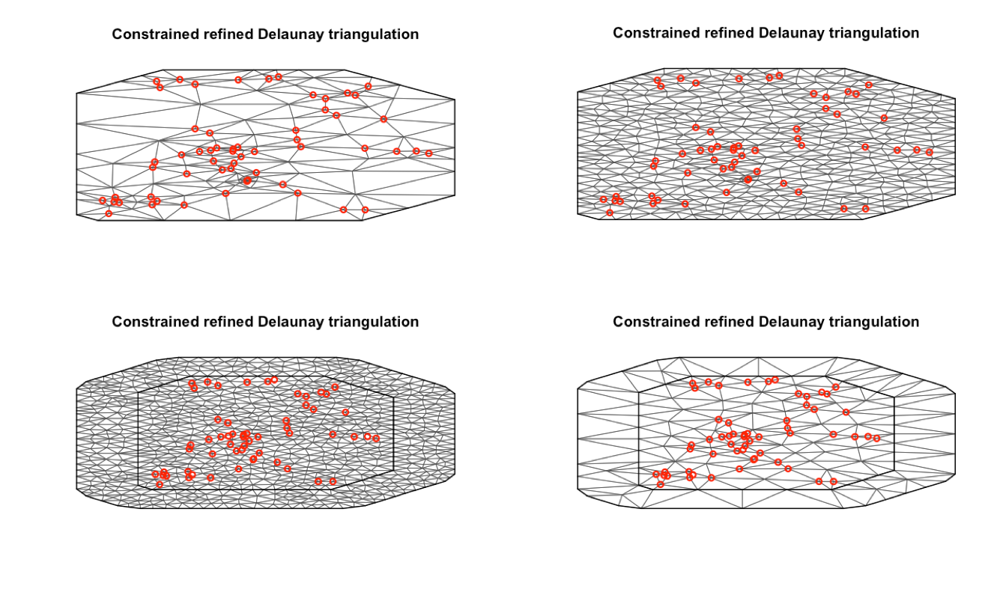
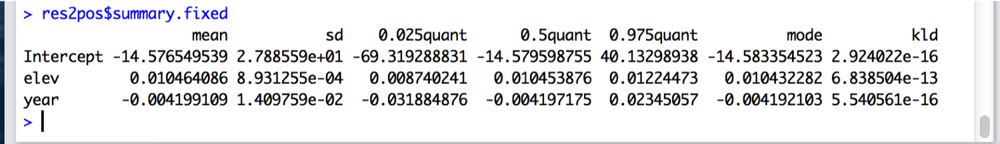
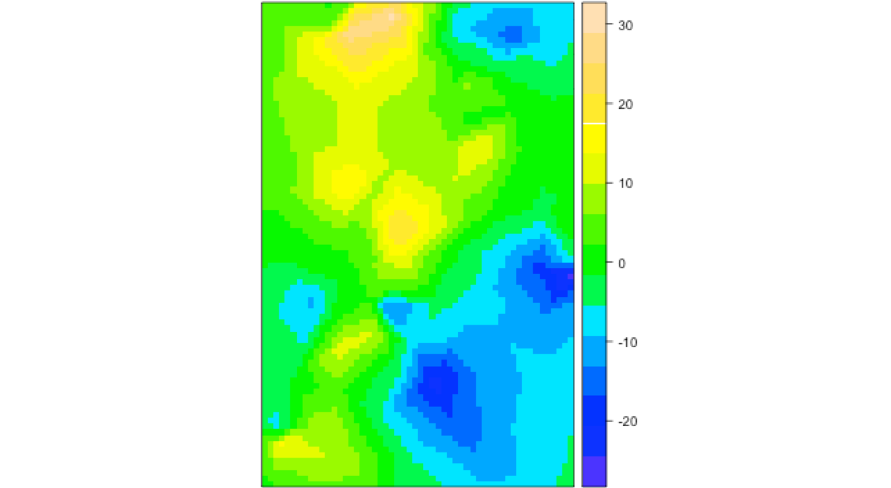
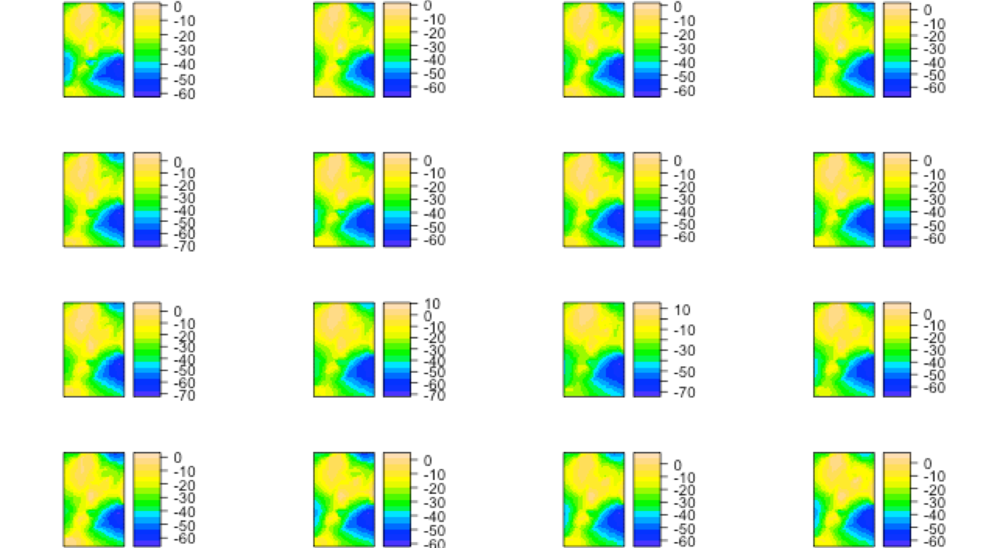

```{r setup, include=FALSE}
knitr::opts_chunk$set(echo = FALSE, warning=FALSE, 
                      message=FALSE, results='hide',
                      fig.align = 'center')
library(ggplot2)
library(dplyr)
library(forecast)
library(lubridate)
library(MARSS)
library(fields)
library(mgcv)
library(glmmfields)
library(viridis)
library(tidyr)
# install sdmTMB and INLA
#devtools::install_github("pbs-assess/sdmTMB")
#install.packages("INLA",repos=c(getOption("repos"),INLA="https://inla.r-inla-download.org/R/stable"), dep=TRUE)
library(sdmTMB)

d <- read.csv("SNOTEL_Washington_1981_2013.csv")
d <- d[, c("Station.Id", "Station.Name", "Water.Year", "Feb")]
meta <- read.csv("SNOTEL_metadata.csv")
d <- dplyr::left_join(d, meta) %>%
  dplyr::filter(!is.na(Water.Year), !is.na(Feb))
```

## Where we left off

* Many approaches we've talked about were forms of spatial regression

$${ Y }_{ i }=\textbf{b}{ X }_{ i }+{ \phi  }_{ i }+{ \varepsilon  }_{ i }$$

* $\phi$ is a vector of random effects describing a spatial field / process

* Is this a state space model? 

## Gaussian predictive process model

* Instead of estimating giant covariance matrix describing $\phi$,

* Estimate smaller random effects at a subset of points $\phi^*$

* Use some covariance kernel, and distances between points describing $\phi$ and $\phi^*$ to project estimates

* Can be done in ML or Bayesian framework, [Latimer et al. 2009](http://www.stat.tamu.edu/~huiyan/SangEL09.pdf)

## Method 3: glmmfields

* 'glmmfields' implements these models using Stan backend

* Easy to use formula syntax like gam() or spBayes()

* Allows spatial field to be modeled with Multivariate-T field, as alternative to Multivariate-Normal to better capture extremes

* Also includes lots of non-normal families for observation model

## glmmfields

Let's start with a simple model. This includes only 6 knots (probably way too few) and 100 iterations (too few!) for run time. 

* Time set to NULL here to fit a model with constant spatial field

```{r echo = TRUE, eval=FALSE}
m <- glmmfields(Feb ~ 0, time = NULL,
 lat = "Latitude", lon = "Longitude", data = d,
 nknots = 6, iter = 100, chains = 2, seed = 1)
```

## glmmfields

Ok, now let's change the covariance function to matern, and estimate separate spatial fields by year. 

* The 'estimate_ar' argument is important for determining whether the field is an AR(1) process or independent by year 

```{r echo = TRUE, eval=FALSE}
m <- glmmfields(Feb ~ 0, time = "Water.Year",
 lat = "Latitude", lon = "Longitude", covariance="matern",
  data = d, nknots = 6, iter = 100, chains = 2, seed = 1,
  estimate_ar=FALSE)
```

## glmmfields

Finally let's include an example with modeling the spatial field as a Multivariate-t distribution

* We do this with the 'estimate_df' argument 

```{r echo = TRUE, eval=FALSE}
m <- glmmfields(Feb ~ 0, time = "Water.Year",
 lat = "Latitude", lon = "Longitude", covariance="matern",
  data = d, nknots = 6, iter = 100, chains = 2, seed = 1,
  estimate_AR=FALSE, estimate_df= TRUE)
```

## Method 4: INLA

GP spatial models like glmmfields are extremely powerful

* May get overwhelmed by number of points

* Approaches to incorporate knots using sparse covariance matrices

* Integrated Nested Laplace Approximation - not on CRAN
```{r eval=FALSE}
install.packages("INLA",repos=c(getOption("repos"),
      INLA="https://inla.r-inla-download.org/R/stable"), dep=TRUE)
```

## Motivation of INLA

* Some problems contain simple spatial structure
  + e.g. the harbor seal data in MARSS() with only 5 – 7 time series

* Others are much more complex

  + WA SWE data
  + Fisheries survey data (1000s of points)

* Including time-varying spatial fields becomes very computationally difficult
* Doing all of the above in a Bayesian setting can be prohibitive, but we can use Laplace approximation

## INLA's approximation: SNOTEL data

* INLA meshes describe resolution of surface to estimate spatial process
```{r eval=FALSE, echo=TRUE}
INLA::meshbuilder
```

<div style="text-align: center">

## INLA's approximation: SNOTEL data

* How many points fall on vertices? 
* Is the boundary area large enough? 
* Choosing this must be done very carefully! 
  
## Estimation done via maximum likelihood

* Estimates seems similar to those from gls() and spBayes()
* Year included as numeric here (not significant)
* Alternatively, we can include year in spatial field
* Year can also be included as factor

<div style="text-align: center">

* splines, AR coefficients also possible for time-varying effects

## Projecting INLA estimates to surface

<div style="text-align: center">

## Spatial SWE fields by year

<div style="text-align: center">

## Implementation in sdmTMB

* Start with the built in make_mesh function
```{r echo=TRUE, cache=FALSE}
snow_spde <- make_mesh(d, c("Longitude", "Latitude"), n_knots=50)
plot(snow_spde)
```
## Estimation in INLA

* Can be slow for very large models 
  + but can also generate approximate Bayesian estimates 

* Alternatively using automatic differentiation / TMB to maximize likelihood
  + VAST
  + sdmTMB

## Implementation in sdmTMB

* This would fit a model with static spatial field
```{r eval=FALSE, echo=TRUE}
fit <- sdmTMB(Feb ~ 1, mesh = snow_spde, data=d)
```
* Versus this one, where the field is independent by year
```{r eval=FALSE, echo=TRUE}
fit <- sdmTMB(Feb ~ 1, mesh = snow_spde, time="Water.Year", data=d)
```

## Diagnostics: residuals for a given time slice
```{r echo=TRUE}
fit <- sdmTMB(Feb ~ 1, mesh = snow_spde, data=d)
qqnorm(residuals(fit))
```

## Diagnostics: residuals over time: are they stationary?

```{r echo=FALSE}
d$resid = residuals(fit)
ggplot(d, aes(Water.Year,resid)) + geom_point() + geom_smooth() + theme_bw()
```
  
  
## INLA & TMB references:

[Lindgren 2013](https://www.maths.ed.ac.uk/~flindgre/rinla/isbaspde.pdf)

[Lindgren & Rue 2015](https://www.jstatsoft.org/article/view/v063i19)

[INLA book](https://becarioprecario.bitbucket.io/spde-gitbook/)

[Kristensen et al. 2016](https://www.jstatsoft.org/article/view/v070i05)