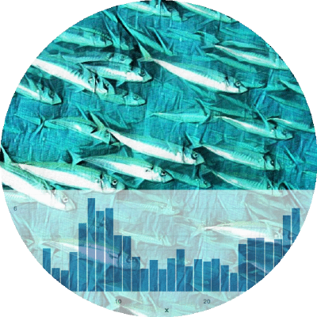

<h2>FISH 550 &nbsp; &nbsp; University of Washington &nbsp; &nbsp; Spring Qtr 2023</h2>

 

    

 

&copy; EE Holmes, EJ Ward & MD Scheuerell 2023

 

*This site was last updated at `r format(Sys.time(), "%H:%M")` on `r format(Sys.Date(), "%d %b %Y")`*

